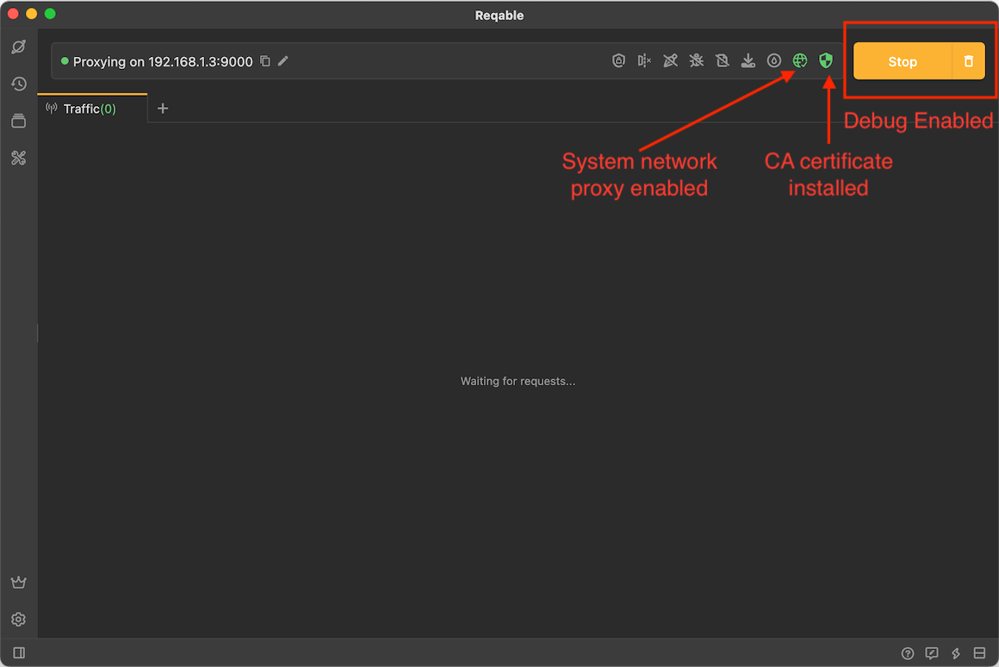
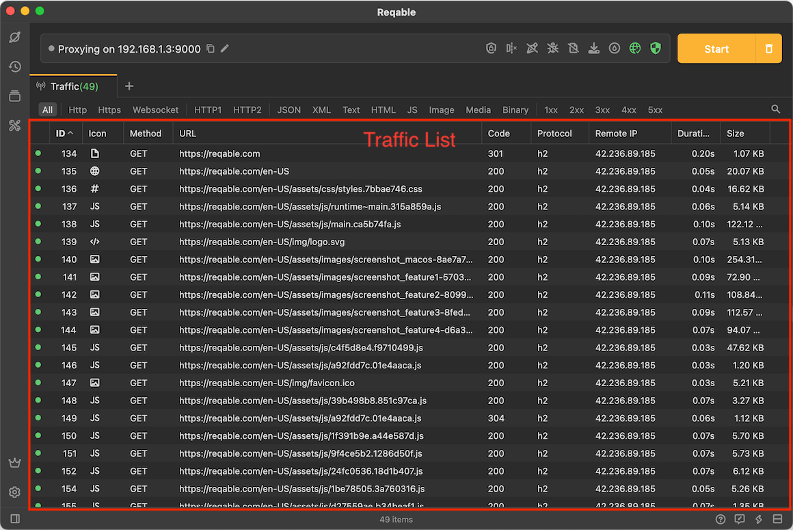
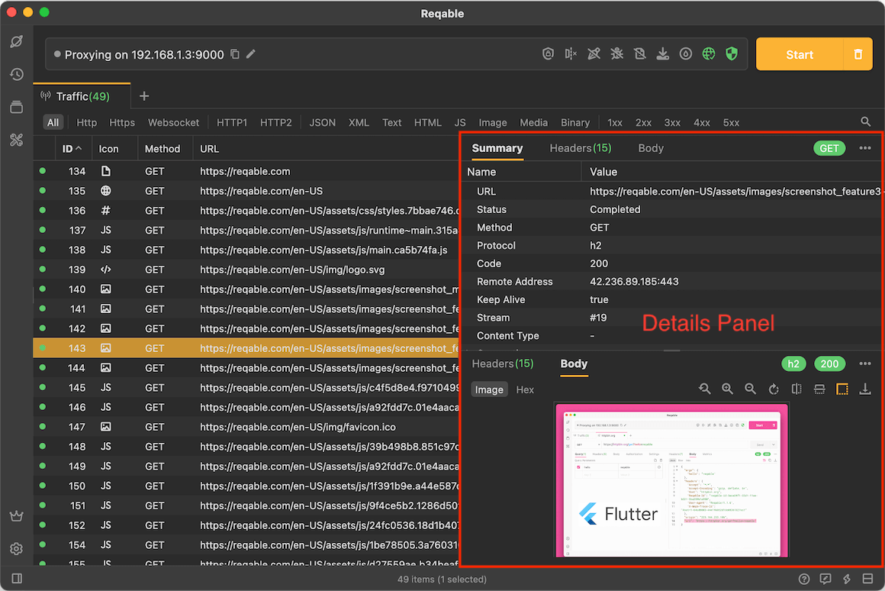
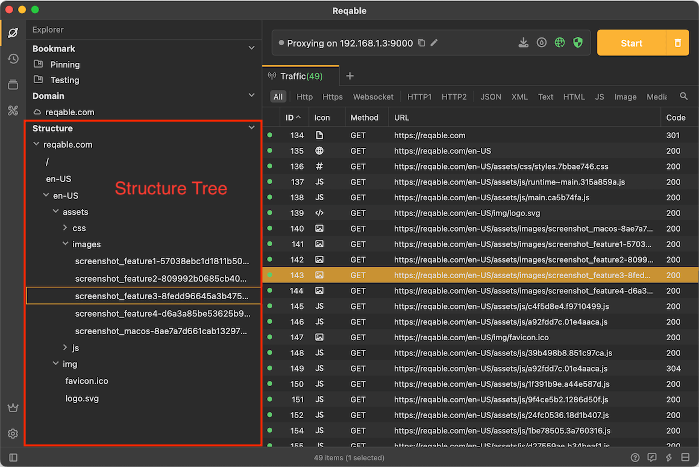

import Shortcut from '@site/src/components/Shortcut';

In API debugging, capturing traffic is the first step and the most basic operation. Here we explain how to use Reqable to capture the traffic.

## Enable Capture

First, you need to enable the debugging, and tap the `Start` button in the `QuickBar` to enter the debugging mode. In the debugging mode, any HTTP request passing through Reqable's MITM proxy server will be displayed on the traffic list.

To ensure that traffic passes through Reqable's MITM proxy server and trusts Reqable's CA certificate, please check the following two items:

- System network proxy status

If the system proxy has been overwritten, the network icon is green; if the system proxy is not set, the network icon is yellow, click the network icon to automatically set the system proxy.

- CA certificate status

If the CA certificate is installed successfully, the shield icon is green; if the CA certificate is not installed successfully, the network icon is yellow, tap the shield icon to enter the CA certificate installation page, for detailed steps, please read [Install Certificate](../installation) .

After everything is ready, we can see the following:

## Broswer Testing

Open a browser, enter the address `https://reqable.com` and go, here uses the Chrome. Back to Reqable, requests of the website has been captured in the traffic list.

We can select an image request, double-click to open the details panel, and see the detailed information of the request. Note that double-clicking the request again will close the details panel.

Tap the `Explorer` icon in the sidebar to the explorer panel of the traffic list. Then expand the structure tree of `reqable.com`, you can view the directory structure of all requests under this website, and select to view the details of the request.

:::info
Tap the trash can icon in the upper right corner (shortcut key <Shortcut>Control + Shift + R</Shortcut> ) to clear the list.
:::

Here, we have completed the most basic operation of capturing traffic.