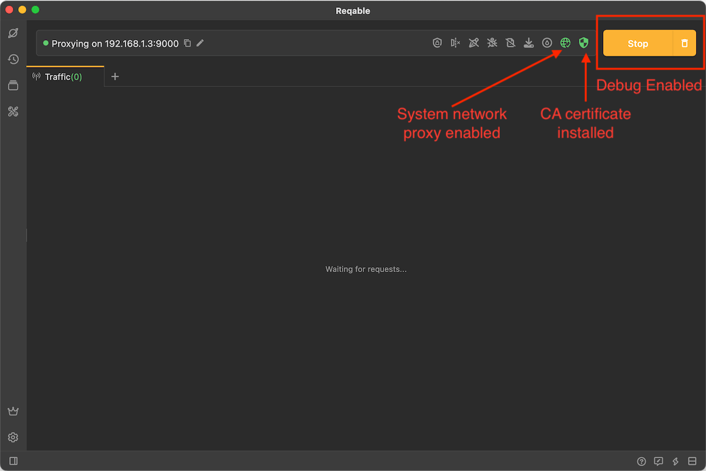
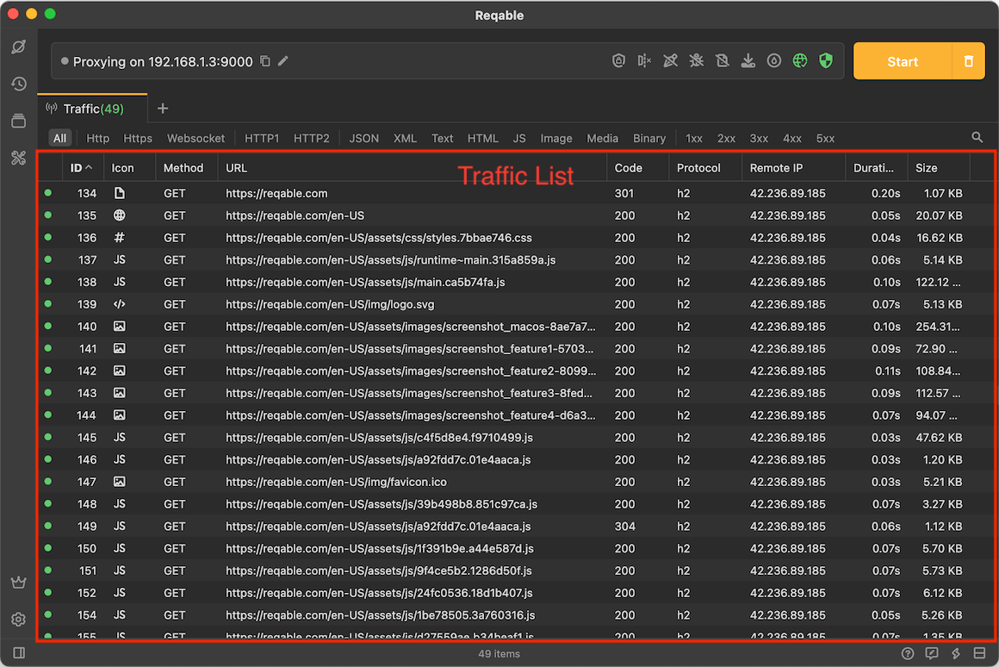
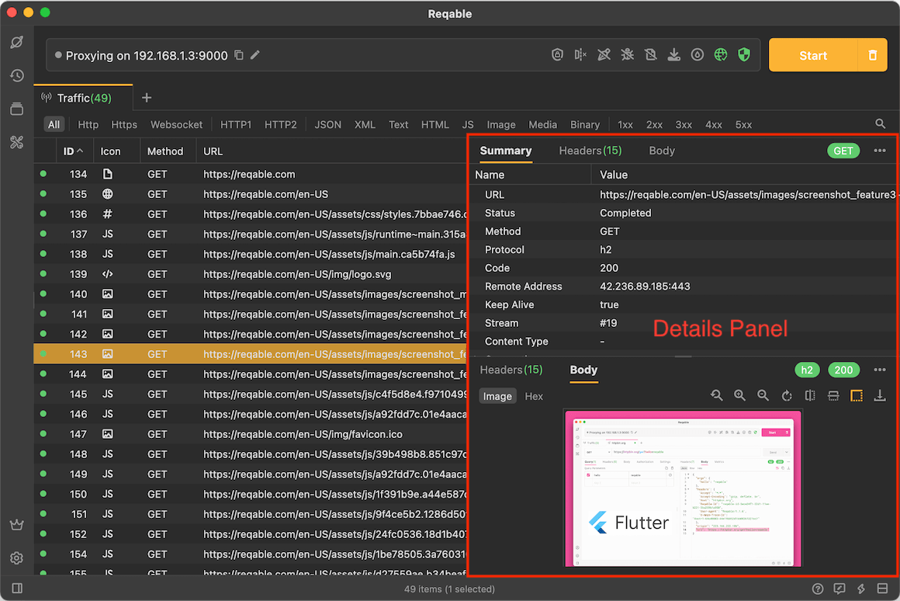
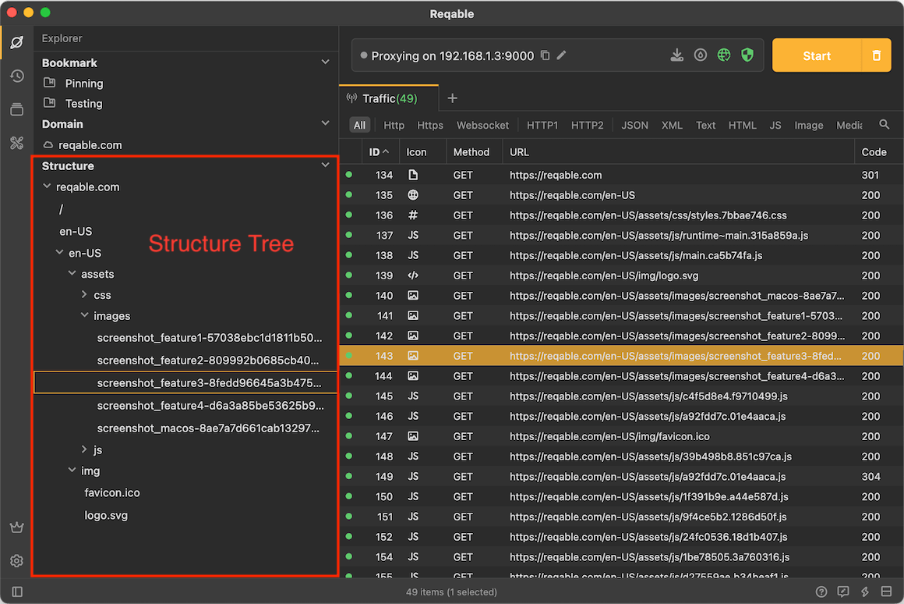

import Shortcut from '@site/src/components/Shortcut';

In API debugging, capturing traffic is the first and most basic step. This tutorial shows how to capture traffic with Reqable.

## Enable Capture

First, enable debugging and tap the `Start` button in the toolbar. In debugging mode, any HTTP request that passes through Reqable's MITM proxy server appears in the traffic list.

To ensure that traffic passes through Reqable's MITM proxy server and trusts Reqable's CA certificate, please check the following two items:

- System network proxy status

If the system proxy has been overwritten, the network icon is green; if the system proxy is not set, the network icon is yellow, click the network icon to automatically set the system proxy.

- CA certificate status

If the CA certificate is installed successfully, the shield icon is green; if the CA certificate is not installed successfully, the shield icon is yellow, tap the shield icon to enter the CA certificate installation page, for detailed steps, please read [Install Certificate](../installation) .

When setup is complete, you should see:

:::caution

If you are debugging a remote device such as a mobile phone, please check the following checklist:
- [x] Both mobile phone and PC are connected to the same LAN.
- [x] The mobile Wi-Fi proxy has set the IP address and port number of Reqable (see the top of the Reqable window), or use SocksDroid for forwarding.
- [x] The CA certificate has been correctly installed on the phone.
- [x] The PC network firewall has opened the port address of Reqable.

:::

## Browser Testing

Open Chrome and go to `https://reqable.com`. Back in Reqable, requests from the site appear in the traffic list.

Select an image request and double-click to open the details panel. Double-click the same request again to close it.

Tap the `Explorer` icon in the sidebar to open the explorer panel. Expand the `reqable.com` structure tree to browse requests under that site and open their details.

:::info
Tap the trash can icon in the upper right corner (shortcut key <Shortcut>Shift + Control + R</Shortcut>) to clear the list.
:::

That covers the basics of capturing traffic.