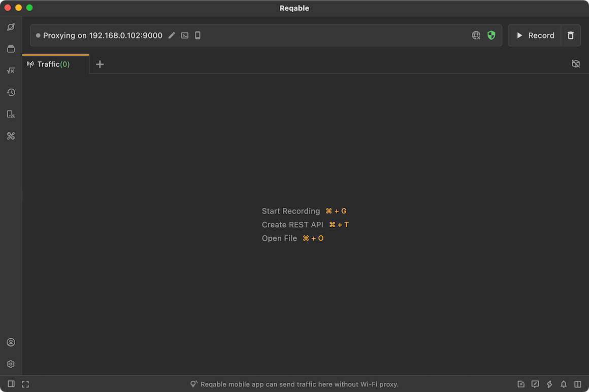
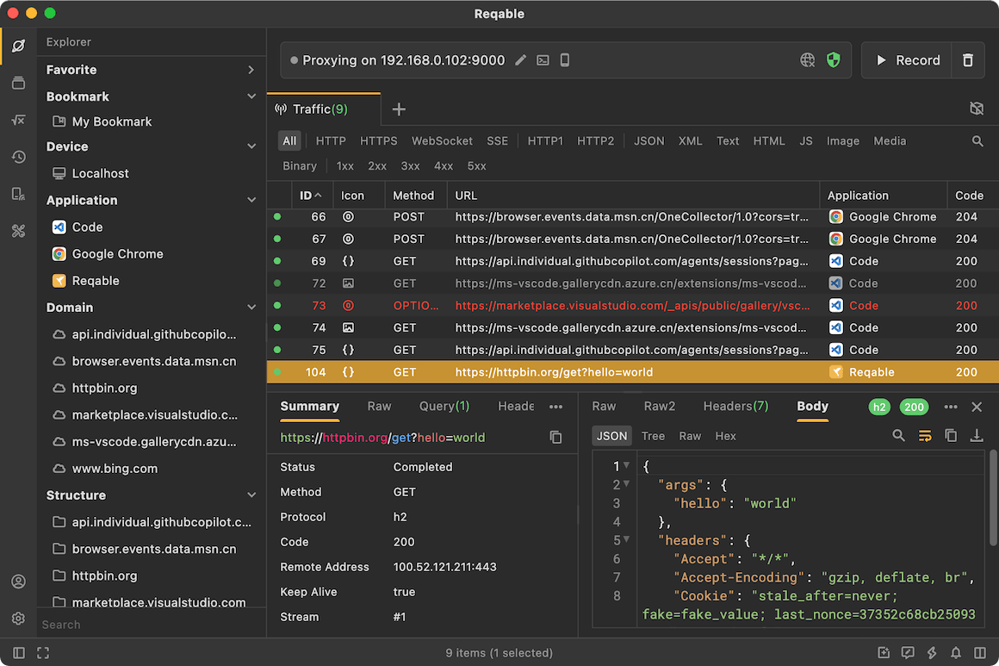
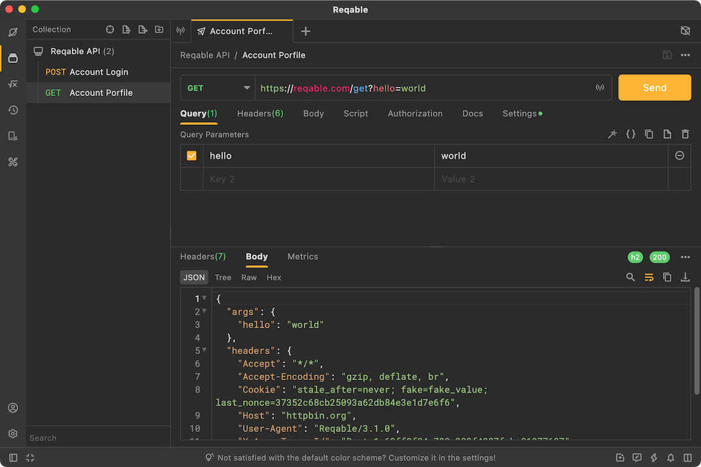

# Introduction

Reqable is a modern cross-platform project, designed for API development, testing, and debugging. Reqable fully supports HTTP1 and HTTP2 and partially supports HTTP3(QUIC).

## Features

The features of Reqable are simple, beautiful, free, no login is required, and it can be used immediately after installation.

- The volume of the installation package is about 20M.
- Cross-platform, based on Flutter and C++ development.
- Both light and dark theme modes are supported.
- 11 different accent colors are supported.
- Support Atom One code highlighting.

#### 1. API Debugging {#capture}

Reqable uses the classic MITM proxy method for debugging and supports such as rewriting, scripting (Python), breakpoints, and replay.

- [x] Support HTTP/1.x and HTTP2 protocol, HTTP3 (QUIC) is not supported yet.
- [x] Support HTTP/HTTPS/Socks4/Socks4a/Socks5 proxy mode.
- [x] Support HTTPS, TLSv1.1, TLSv1.2 and TLSv1.3 protocols.
- [x] Support WebSocket upgraded based on HTTP1.
- [x] Support HTTP/HTTPS secondary proxy.
- [x] Search and filter: Different filtering methods, such as bookmarks, domains, quick filter, and searchs with multiple conditions.
- [x] Gateway: Perform operations such as shielding and suspending for requests or responses.
- [x] Rewriting: Perform redirection, map local, map remote, modification for requests or responses.
- [x] Breakpoint: Perform real-time breakpoint operations on requests or responses.
- [x] Scripting: Support for writing Python scripts to process requests or responses.
- [x] Mirroring: Configure mirror mapping for the specified domain name and port.
- [x] API testing: Compose APIs from the recording list.
- [x] History: Automatically save the recording list for easy retrospective viewing.
- [x] Replay: Support single or multiple requests for playback testing.
- [x] Auto-Highlighting: Support preset rules to highlight requests.
- [x] HAR: Automatically associate HAR files, and support HAR export and open.

#### 2. API Testing {#rest}

Reqable can compose API for testing and also supports features such as API collection and history.

- [x] Supports HTTP/1.1, HTTP2 and HTTP3 (QUIC) protocols.
- [x] Multiple sessions: Support creating multiple Tabs for API testing.
- [x] Batch editing: Support batch editing of query parameters, request headers, forms, etc.
- [x] Authorization settings: Support authorization methods such as API KEY, Basic Auth, and Bearer Token.
- [x] Proxy settings: Support custom proxy, system proxy and debugging proxy, etc.
- [x] Performance: You can view the time-consuming data of requests at different stages.
- [x] Cookie management: Automatically save cookies or add cookies.
- [x] History: Automatically save the request and response for easy retrospective viewing.
- [x] cURL support: cURL can be imported and exported.

#### 3. Toolbox {#toolbox}

Reqable provides some commonly used tools.

- [x] Base64 Codec.
- [x] URL Codec
- [x] Md5 Calculator.
- [x] Timestamp Tool.
- [x] JSON Viewer.
- [x] XML Viewer.
- [x] HEX Viewer.
- [x] Image Viewer.
- [x] Color Picker.
- [x] Qrcode Generator.

## History

The predecessor of Reqable was HttpCanary (an Android platform application), but we overturned all the technology stacks and rewritten it with C++ and Flutter, only keeping the logo and theme color, so the two are not much related. Of course, one of Reqable's missions is to completely replace HttpCanary. It is expected that by the end of 2023, Reqable will launch a desktop + mobile multi-platform independent application.
