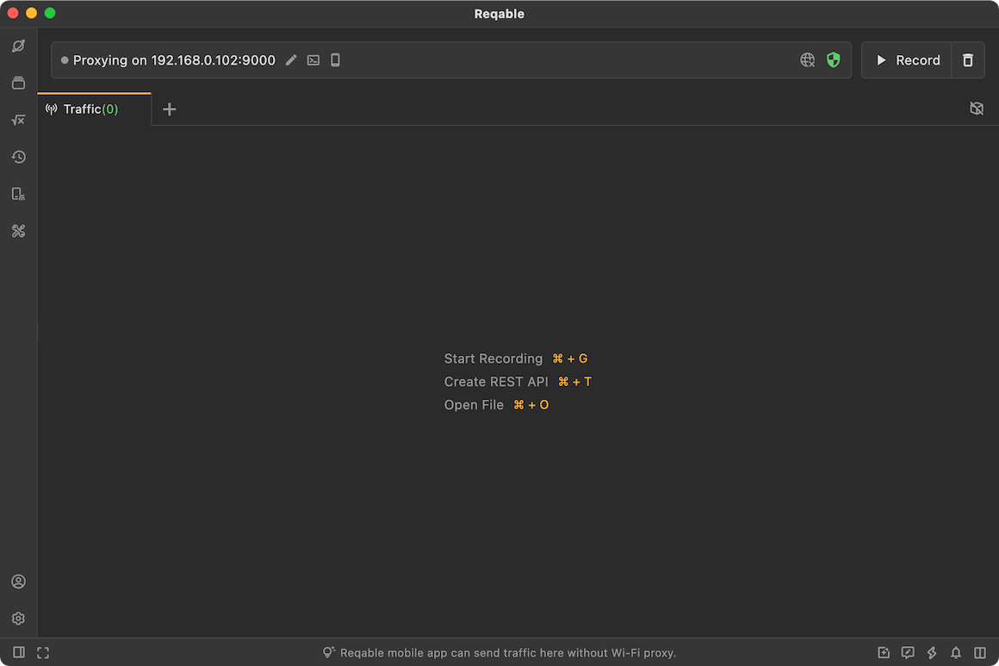
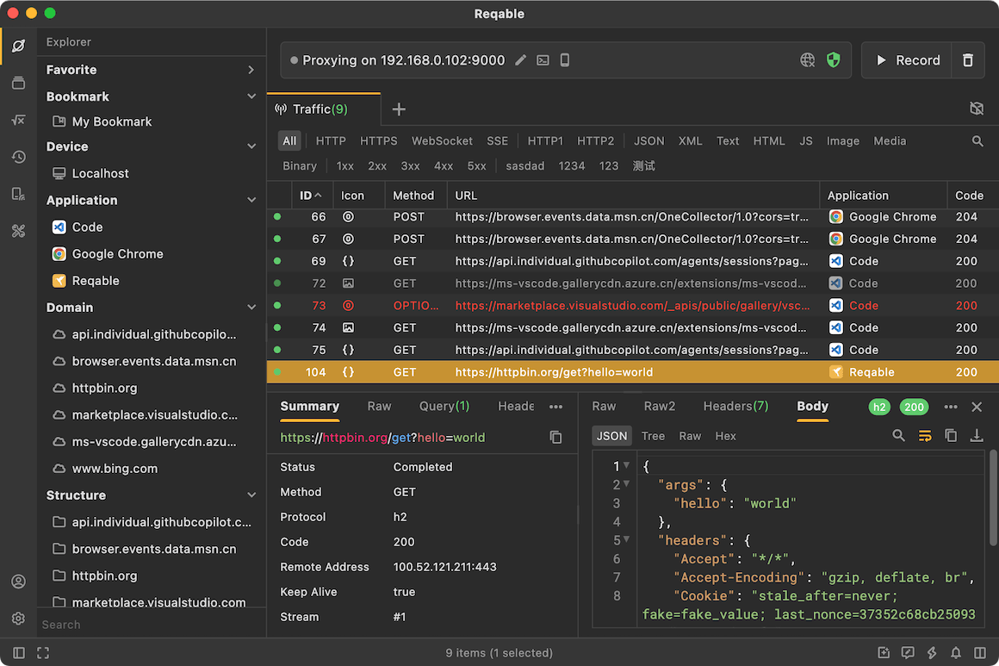
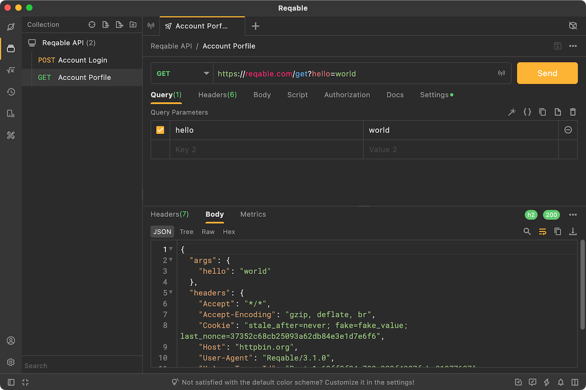

# Introduction

Reqable is a professional cross-platform HTTP development and debugging tool. It supports HTTP/1, HTTP/2, and HTTP/3 (QUIC) across all major platforms. It is easy to use, feature-rich, and high-performance, helping developers and testers improve productivity. This product requires a certain level of networking knowledge and is intended for professionals in development, testing, networking, security, web scraping, and related engineering fields, or for use under the guidance of qualified professionals.

# Features

Reqable provides two core capabilities: [API Debugging](#api-debugging) and [API Testing](#api-testing). It also bridges the gap between debugging and testing. For example, you can create APIs for testing directly from captured traffic, or capture and inspect traffic while testing APIs.

## 1. API Debugging {#api-debugging}

Reqable uses the classic MITM (man-in-the-middle) approach to capture HTTP requests. On desktop platforms, it intercepts traffic through the system proxy; on mobile platforms, it intercepts traffic through a VPN tunnel. Reqable also supports debugging operations on captured traffic, including breakpoints, request rewriting, and response modification.

:::caution Mobile Limitations
To prevent abuse, the Reqable mobile app does not provide debugging-related features such as rewrite, breakpoint, and script. If you need debugging capabilities, use the Reqable desktop app.
:::

### 1.1 Protocol Support

- Supports `HTTP/1.x` and `HTTP/2`. `HTTP/3 (QUIC)` is not yet supported.
- Supports `TLSv1.1`, `TLSv1.2`, and `TLSv1.3`.
- Supports `HTTP`, `HTTPS`, `Socks4`, `Socks4a`, and `Socks5` proxy protocols.
- Supports `WebSocket` (upgraded from `HTTP/1.1`).
- Supports `Server-Sent Events (SSE)`.
- Supports `IPv4` and `IPv6` addresses.

### 1.2 Certificate Installation

The API debugging feature requires a CA certificate to be installed. See [Install Certificate](../getting-started/installation) for setup instructions.

### 1.3 Features

For the full set of API debugging capabilities, see [API Debugging](../capture).

## 2. API Testing {#api-testing}

Reqable can edit, send, and manage REST API requests. It also supports features such as API collections, environment variables, and cloud sync.

### 2.1 Protocol Support

- Supports `HTTP/1.1`, `HTTP/2`, and `HTTP/3 (QUIC)`.
- Supports `WebSocket` (upgraded from `HTTP/1.1`).
- Supports `Server-Sent Events (SSE)`.
- Supports `IPv4` and `IPv6` addresses.

### 2.2 API Collections

Reqable supports importing files in `Postman`, `Swagger`, `Insomnia`, `Hoppscotch`, `ApiFox`, `ApiPost`, `RapidAPI (Paw)`, `cURL`, and `HAR` formats.

If you are not signed in to a Reqable account, API collections are stored locally offline and can only be accessed on the current device. If you want to store collection data in the cloud and sync it across multiple devices, you need to sign up for and sign in to a Reqable account.

For more about using API collections, see [Collection](../rest/15_collection).

### 2.3 Features

For the full set of API testing capabilities, see [API Testing](../rest).
