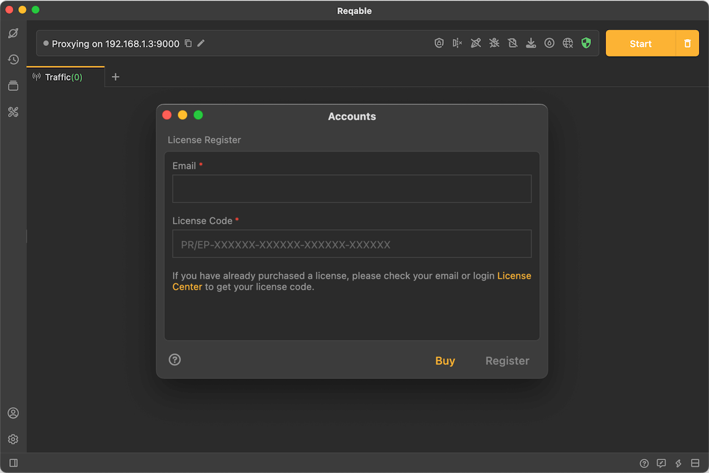
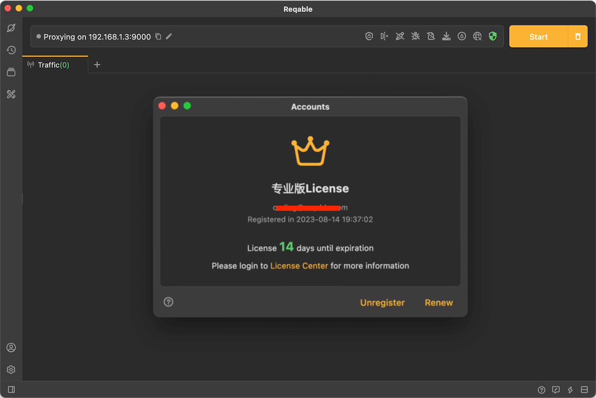
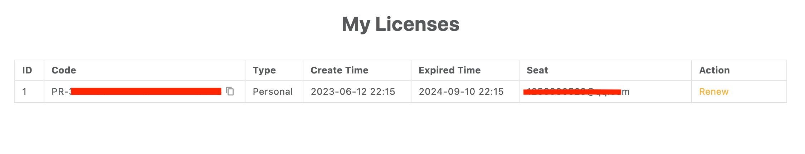

# License

Reqable provides a free community version. Almost all features are free, but the number of usage is limited, such as the number of API collections, the number of API tabs. But a good product needs financial support, for the long-term and sustainable development of the product. We hope everyone can support the professional and enterprise subscriptions to help us make a better software.

There are two types of licenses: Professional and Enterprise. The professional edition is suitable for personal teams or independent developers. The enterprise edition is suitable for multiple people or large-scale teams to purchase. The professional version is more expensive, but the number of devices that can be used at the same time is more, see [Pricing](https://reqable .com/pricing).

The subscription period of the license can be yearly or monthly. We recommend annual subscription more, you can enjoy technical consulting services, and the price is more favorable.

### License Register

If you have purchased a license or have been assigned a seat by an enterprise administrator, you can use the purchased email or the assigned email to register the license in Reqable. Registration path: tap the account icon in sidebar, and enter the email and license code.

After successful registration, the icon in sidebar will change to a crown, and you can see the valid remaining time of the license in the account page.

:::info
The code of the professional edition starts with **PR-**, and enterprise edition license begins with **EP-**.
:::

### License Management

As long as you have purchased a license, you can login to Reqable's [License Management](https://license.reqable.com/) to view, renew and manage seats. For enterprise license accounts, seat management is also available.

:::caution
Note: If you are assigned a seat, will not able to login to the license center, you must login with the email of the purchased account. The initial login password can be found in your purchase email receipt.
:::