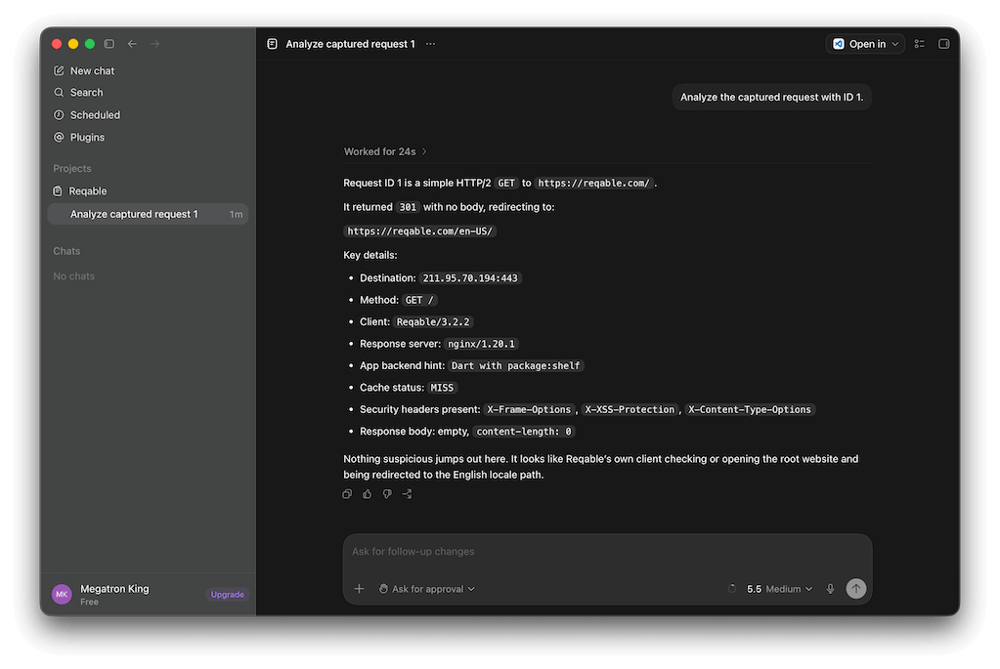
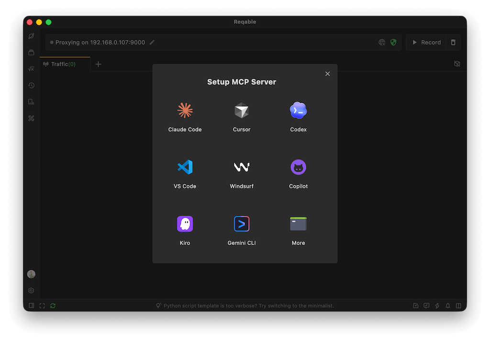

:::info
This feature requires Reqable v3.2.0 or later.
:::

### What Is the MCP Server

Reqable MCP (Model Context Protocol) is a feature that allows AI assistants, such as Claude, Cursor, Codex, and other MCP-compatible tools, to interact directly with the Reqable application. The MCP server provided by Reqable is built directly into the Reqable installation package, so no separate download or installation is required. It can be configured in AI assistants using `stdio`.

After configuring the Reqable MCP server in your AI assistant, you can let the assistant operate Reqable for tasks such as:

- Analyze the captured request with ID 1.
- Analyze requests related to `reqable.com`.
- Create breakpoints for all requests to the `reqable.com` domain.
- Create a new script rule to AES-decrypt the response of captured request ID 2 and print the decrypted data to the console.
- Create a new rewrite rule to replace all occurrences of `123` with `456` in the response body of `https://reqable.com`.
- Create an API collection named `Development`, save all APIs used by this project into it, and add documentation.
- Predict which stock will rise tomorrow (this is not supported 🐶).

### How to Use

Open the MCP server setup guide from the application's `Tools` menu. We provide configuration instructions and one-click installation for several commonly used AI assistants.

Once configured in your AI assistant, the assistant can control Reqable on your local machine.

If you want the AI assistant to control Reqable on another device, such as a phone, you can use the `--host` and `--port` parameters when configuring MCP.

| Parameter | Short | Description | Default |
| --- | --- | --- | --- |
| `--host` | `-h` | Optional, Reqable API host. | `127.0.0.1` |
| `--port` | `-p` | Optional,Reqable API port. | Uses `proxyPort` from local Reqable config when available, otherwise falls back to `9000` |
| `--scope` | `-s` | Optional, control which tools are registered. `minimal` will register necessary tools, `all` will register all tools. | `minimal` |

### MCP Tools

Reqable MCP providers more than one hundred MCP tools. They are grouped by capability below.

#### HTTP Testing

| Tool | Description | Included in `minimal` |
| --- | --- | --- |
| `rest_http_create_from_url` | Create a new HTTP API tab from a URL. | ✅ |
| `rest_http_create_from_curl` | Create a new HTTP API tab from a cURL command. | ✅ |
| `rest_http_update` | Update an HTTP API using a full JSON payload. | ✅ |

#### WebSocket Testing

| Tool | Description | Included in `minimal` |
| --- | --- | --- |
| `rest_websocket_create_from_url` | Create a new WebSocket API tab from a URL. | ✅ |
| `rest_websocket_update` | Update a WebSocket API using a full JSON payload. | ✅ |

#### Environments

| Tool | Description | Included in `minimal` |
| --- | --- | --- |
| `environment_list` | List all environments and indicate the active one. | ❌ |
| `environment_get_by_id` | Get environment details by ID. | ❌ |
| `environment_get_active` | Get the currently active environment. | ❌ |
| `environment_create` | Create a new environment. | ❌ |
| `environment_update` | Update an environment payload. | ❌ |
| `environment_delete` | Delete an environment. | ❌ |
| `environment_select` | Select an environment by ID. | ❌ |
| `environment_builtin_variables` | List built-in variables exposed by Reqable. | ❌ |

#### Collections

| Tool | Description | Included in `minimal` |
| --- | --- | --- |
| `collection_list` | List all collection IDs. | ✅ |
| `collection_structure` | Get the tree structure for all collections. | ✅ |
| `collection_get` | Get collection properties by collection ID. | ✅ |
| `collection_create` | Create a new collection. | ✅ |
| `collection_update` | Update collection properties. | ✅ |
| `collection_delete` | Delete a collection. | ✅ |
| `collection_folder_get` | Get folder properties by collection ID and folder ID. | ✅ |
| `collection_folder_create` | Create a folder in a collection. | ✅ |
| `collection_folder_update` | Update collection folder properties. | ❌ |
| `collection_folder_delete` | Delete a collection folder. | ❌ |
| `collection_api_get` | Get a specific HTTP or WebSocket API in a collection. | ✅ |
| `collection_api_create` | Create a new API in a collection from cURL. | ✅ |
| `collection_api_add` | Add an existing HTTP or WebSocket API into a collection. | ✅ |
| `collection_api_update` | Update an existing API in a collection. | ✅ |
| `collection_api_delete` | Delete an API from a collection. | ✅ |
| `collection_api_generate_curl` | Generate a cURL command for a HTTP API in a collection by collection ID and API ID. | ✅ |

#### Script Resources

| Tool | Description | Included in `minimal` |
| --- | --- | --- |
| `script_framework` | Get the Reqable Python script framework before creating or updating script code. | ✅ |
| `script_template` | Get the Reqable Python script template before creating or updating script code. | ✅ |

#### Proxy Configuration

| Tool | Description |  Included in `minimal` |
| --- | --- |--- |
| `proxy_set` | Configure the proxy for Reqable, such as turning on/off the system proxy. | ✅ |

#### Live Capture

| Tool | Description | Included in `minimal` |
| --- | --- | --- |
| `capture_live_status` | Get the current live capture status. | ❌ |
| `capture_live_set_enabled` | Start or stop live capture. | ✅ |
| `capture_live_filter` | Filter live capture records and return matching record IDs. | ✅ |
| `capture_live_get_by_id` | Get live capture record details by numeric ID. | ✅ |
| `capture_live_clear` | Clear retained live capture records. | ❌ |
| `capture_live_generate_curl` | Generate a cURL command from a live capture record. | ✅ |
| `capture_live_compose` | Compose a live capture record into a new HTTP or WebSocket API tab. | ✅ |
| `capture_live_collection_add` | Add a live capture record to a collection. | ✅ |

#### SSL Proxying

| Tool | Description | Included in `minimal` |
| --- | --- | --- |
| `capture_ssl_proxying_get_config` | Get the current SSL proxying configuration. | ❌ |
| `capture_ssl_proxying_get_active` | Get the active SSL proxying profile. | ❌ |
| `capture_ssl_proxying_lookup` | Get SSL proxying profile details by ID. | ❌ |
| `capture_ssl_proxying_select` | Select an SSL proxying profile by ID. | ❌ |
| `capture_ssl_proxying_create` | Create a new SSL proxying profile. | ❌ |
| `capture_ssl_proxying_delete` | Delete one or more SSL proxying profiles. | ❌ |
| `capture_ssl_proxying_update` | Update an SSL proxying profile. | ❌ |

#### Breakpoints

| Tool | Description | Included in `minimal` |
| --- | --- | --- |
| `capture_breakpoint_get_config` | Get the current breakpoint configuration. | ✅ |
| `capture_breakpoint_set_enabled` | Enable or disable breakpoint interception. | ✅ |
| `capture_breakpoint_list` | List all breakpoint rules. | ❌ |
| `capture_breakpoint_set_item_enabled` | Batch enable or disable specific breakpoints. | ❌ |
| `capture_breakpoint_get_by_id` | Get breakpoint details by ID. | ✅ |
| `capture_breakpoint_create` | Create a new breakpoint rule. | ✅ |
| `capture_breakpoint_create_folder` | Create a breakpoint folder. | ❌ |
| `capture_breakpoint_delete` | Delete one or more breakpoints. | ✅ |
| `capture_breakpoint_delete_folder` | Delete one or more breakpoint folders. | ❌ |
| `capture_breakpoint_update` | Update a breakpoint rule. | ✅ |
| `capture_breakpoint_update_folder_name` | Rename a breakpoint folder. | ❌ |

#### Gateways

| Tool | Description | Included in `minimal` |
| --- | --- | --- |
| `capture_gateway_get_config` | Get the current gateway configuration. | ✅ |
| `capture_gateway_set_enabled` | Enable or disable the gateway feature. | ✅ |
| `capture_gateway_list` | List all gateway rules. | ❌ |
| `capture_gateway_set_item_enabled` | Batch enable or disable specific gateways. | ❌ |
| `capture_gateway_get_by_id` | Get gateway details by ID. | ✅ |
| `capture_gateway_create` | Create a new gateway rule. | ✅ |
| `capture_gateway_create_folder` | Create a gateway folder. | ❌ |
| `capture_gateway_delete` | Delete one or more gateways. | ✅ |
| `capture_gateway_delete_folder` | Delete one or more gateway folders. | ❌ |
| `capture_gateway_update` | Update a gateway rule. | ✅ |
| `capture_gateway_update_folder_name` | Rename a gateway folder. | ❌ |

#### Mirrors

| Tool | Description | Included in `minimal` |
| --- | --- | --- |
| `capture_mirror_get_config` | Get the current mirror configuration. | ✅ |
| `capture_mirror_set_enabled` | Enable or disable the mirror feature. | ✅ |
| `capture_mirror_list` | List all mirror rules. | ❌ |
| `capture_mirror_set_item_enabled` | Batch enable or disable specific mirrors. | ❌ |
| `capture_mirror_get_by_id` | Get mirror details by ID. | ✅ |
| `capture_mirror_create` | Create a new mirror rule. | ✅ |
| `capture_mirror_create_folder` | Create a mirror folder. | ❌ |
| `capture_mirror_delete` | Delete one or more mirrors. | ✅ |
| `capture_mirror_delete_folder` | Delete one or more mirror folders. | ❌ |
| `capture_mirror_update` | Update a mirror rule. | ✅ |
| `capture_mirror_update_folder_name` | Rename a mirror folder. | ❌ |

#### Rewrites

| Tool | Description | Included in `minimal` |
| --- | --- | --- |
| `capture_rewrite_get_config` | Get the current rewrite configuration. | ✅ |
| `capture_rewrite_set_enabled` | Enable or disable the rewrite feature. | ✅ |
| `capture_rewrite_list` | List all rewrite rules. | ❌ |
| `capture_rewrite_set_item_enabled` | Batch enable or disable specific rewrite rules. | ❌ |
| `capture_rewrite_get_by_id` | Get rewrite details by ID. | ✅ |
| `capture_rewrite_create` | Create a new rewrite rule. | ✅ |
| `capture_rewrite_create_folder` | Create a rewrite folder. | ❌ |
| `capture_rewrite_delete` | Delete one or more rewrites. | ✅ |
| `capture_rewrite_delete_folder` | Delete one or more rewrite folders. | ❌ |
| `capture_rewrite_update` | Update a rewrite rule. | ✅ |
| `capture_rewrite_update_folder_name` | Rename a rewrite folder. | ❌ |

#### Capture Scripts

| Tool | Description | Included in `minimal` |
| --- | --- | --- |
| `capture_script_get_config` | Get the current capture script configuration. | ✅ |
| `capture_script_set_enabled` | Enable or disable the capture script feature. | ✅ |
| `capture_script_list` | List all script rules. | ❌ |
| `capture_script_set_item_enabled` | Batch enable or disable specific script rules. | ❌ |
| `capture_script_get_by_id` | Get script details by ID. | ✅ |
| `capture_script_create` | Create a new Python capture script rule. | ✅ |
| `capture_script_create_folder` | Create a script folder. | ❌ |
| `capture_script_delete` | Delete one or more script rules. | ✅ |
| `capture_script_delete_folder` | Delete one or more script folders. | ❌ |
| `capture_script_update` | Update a script rule. | ✅ |
| `capture_script_update_folder_name` | Rename a script folder. | ❌ |

#### Network Throttling

| Tool | Description | Included in `minimal` |
| --- | --- | --- |
| `capture_network_throttling_get_config` | Get the current network throttling configuration. | ❌ |
| `capture_network_throttling_set_enabled` | Enable or disable network throttling. | ❌ |
| `capture_network_throttling_get_active` | Get the active network throttling profile. | ❌ |
| `capture_network_throttling_lookup` | Get network throttling profile details by ID. | ❌ |
| `capture_network_throttling_select` | Select a network throttling profile by ID. | ❌ |
| `capture_network_throttling_create` | Create a new network throttling profile. | ❌ |
| `capture_network_throttling_delete` | Delete one or more network throttling profiles. | ❌ |
| `capture_network_throttling_update` | Update a network throttling profile. | ❌ |

#### Report Servers

| Tool | Description | Included in `minimal` |
| --- | --- | --- |
| `capture_report_server_get_config` | Get the current report server configuration. | ❌ |
| `capture_report_server_set_enabled` | Enable or disable the report server feature. | ❌ |
| `capture_report_server_lookup` | Get report server details by ID. | ❌ |
| `capture_report_server_set_item_enabled` | Batch enable or disable specific report server items. | ❌ |
| `capture_report_server_create` | Create a new report server definition. | ❌ |
| `capture_report_server_delete` | Delete one or more report server definitions. | ❌ |
| `capture_report_server_update` | Update a report server definition. | ❌ |

#### Reverse Proxies

| Tool | Description | Included in `minimal` |
| --- | --- | --- |
| `capture_reverse_proxy_get_config` | Get the current reverse proxy configuration. | ❌ |
| `capture_reverse_proxy_set_enabled` | Enable or disable the reverse proxy feature. | ❌ |
| `capture_reverse_proxy_list` | List all reverse proxy rules. | ❌ |
| `capture_reverse_proxy_set_item_enabled` | Batch enable or disable specific reverse proxy rules. | ❌ |
| `capture_reverse_proxy_lookup` | Get reverse proxy details by ID. | ❌ |
| `capture_reverse_proxy_create` | Create a new reverse proxy rule. | ❌ |
| `capture_reverse_proxy_create_folder` | Create a reverse proxy folder. | ❌ |
| `capture_reverse_proxy_delete` | Delete one or more reverse proxies. | ❌ |
| `capture_reverse_proxy_delete_folder` | Delete one or more reverse proxy folders. | ❌ |
| `capture_reverse_proxy_update` | Update a reverse proxy rule. | ❌ |
| `capture_reverse_proxy_update_folder_name` | Rename a reverse proxy folder. | ❌ |

#### Secondary Proxies

| Tool | Description | Included in `minimal` |
| --- | --- | --- |
| `capture_secondary_proxy_get_config` | Get the current secondary proxy configuration. | ❌ |
| `capture_secondary_proxy_set_enabled` | Enable or disable the secondary proxy feature. | ❌ |
| `capture_secondary_proxy_get_active` | Get the active secondary proxy profile. | ❌ |
| `capture_secondary_proxy_lookup` | Get secondary proxy details by ID. | ❌ |
| `capture_secondary_proxy_select` | Select a secondary proxy profile by ID. | ❌ |
| `capture_secondary_proxy_create` | Create a new secondary proxy definition. | ❌ |
| `capture_secondary_proxy_delete` | Delete one or more secondary proxy definitions. | ❌ |
| `capture_secondary_proxy_update` | Update a secondary proxy definition. | ❌ |

#### Access Control

| Tool | Description | Included in `minimal` |
| --- | --- | --- |
| `capture_access_control_get_config` | Get the current access control configuration. | ❌ |
| `capture_access_control_set_enabled` | Enable or disable access control. | ❌ |
| `capture_access_control_get_active` | Get the active access control profile. | ❌ |
| `capture_access_control_lookup` | Get access control details by ID. | ❌ |
| `capture_access_control_select` | Select an access control profile by ID. | ❌ |
| `capture_access_control_create` | Create a new access control profile. | ❌ |
| `capture_access_control_delete` | Delete one or more access control profiles. | ❌ |
| `capture_access_control_update` | Update an access control profile. | ❌ |

### Customizing the MCP Server

The Reqable MCP server project is fully open source on GitHub. You can modify and rebuild it, and pull requests and issues are welcome.

Project URL: https://github.com/reqable/reqable-mcp-server