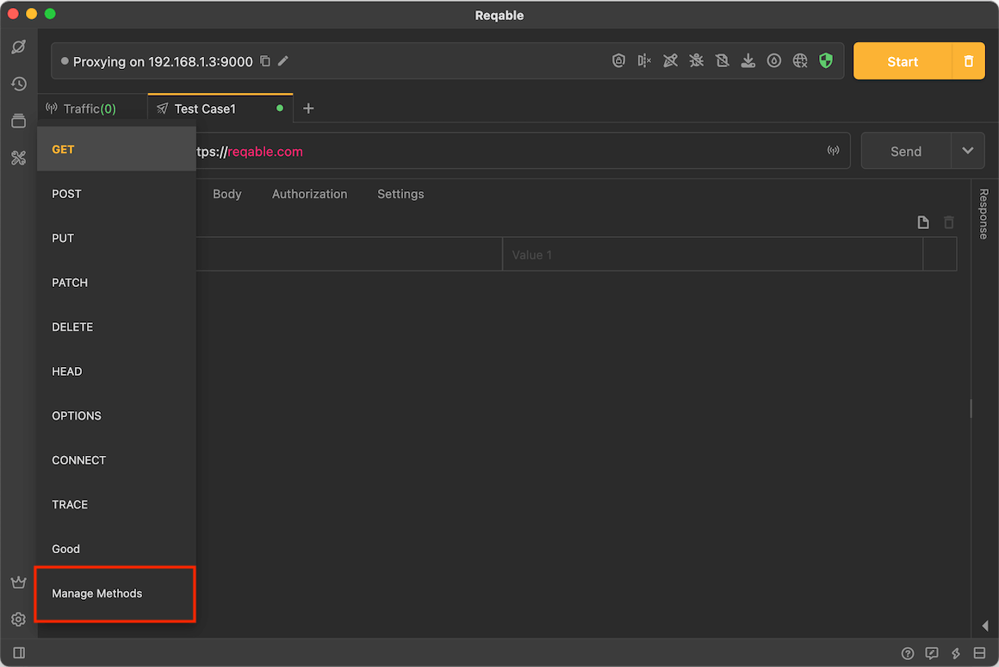
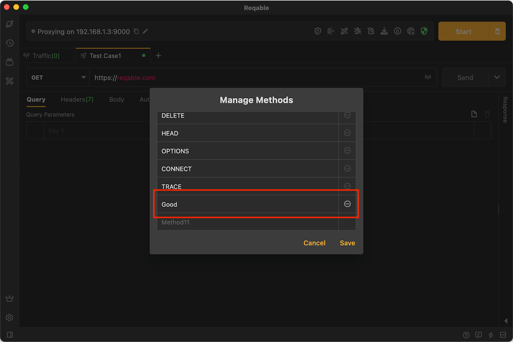
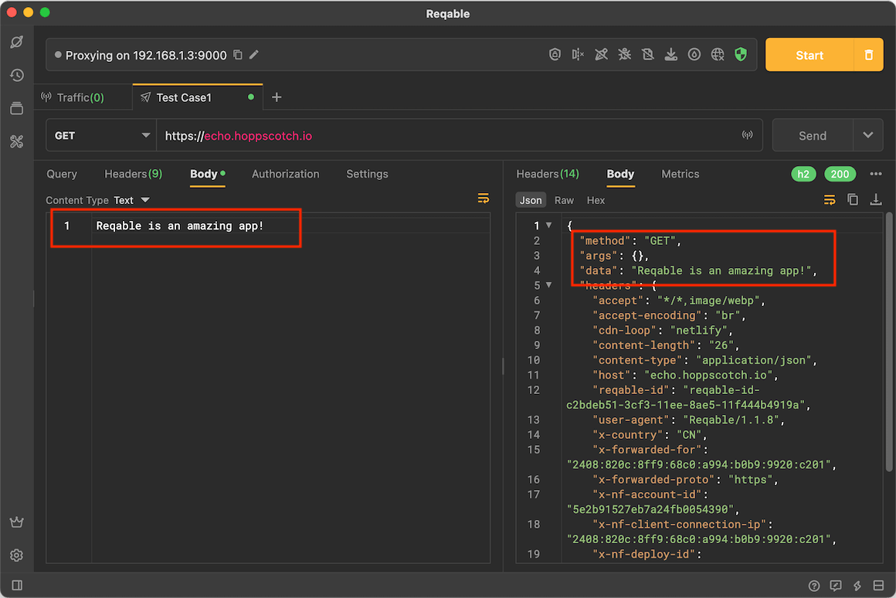

# Method

Reqable supports the use of built-in methods and custom methods. The 9 built-in methods are as follows:

- [GET](https://developer.mozilla.org/zh-CN/docs/Web/HTTP/Methods/GET)
- [POST](https://developer.mozilla.org/zh-CN/docs/Web/HTTP/Methods/POST)
- [PUT](https://developer.mozilla.org/zh-CN/docs/Web/HTTP/Methods/PUT)
- [PATCH](https://developer.mozilla.org/zh-CN/docs/Web/HTTP/Methods/PATCH)
- [DELETE](https://developer.mozilla.org/zh-CN/docs/Web/HTTP/Methods/DELETE)
- [HEAD](https://developer.mozilla.org/zh-CN/docs/Web/HTTP/Methods/HEAD)
- [OPTIONS](https://developer.mozilla.org/zh-CN/docs/Web/HTTP/Methods/OPTIONS)
- [CONNECT](https://developer.mozilla.org/zh-CN/docs/Web/HTTP/Methods/CONNECT)
- [TRACE](https://developer.mozilla.org/zh-CN/docs/Web/HTTP/Methods/TRACE)

In addition, custom method is supported.

After expanding the drop-down menu, tap **Manage Method** to open the editing page:

:::info About GET method

Most network frameworks implement the GET method without request body, but Reqable supports sending request body!

:::

