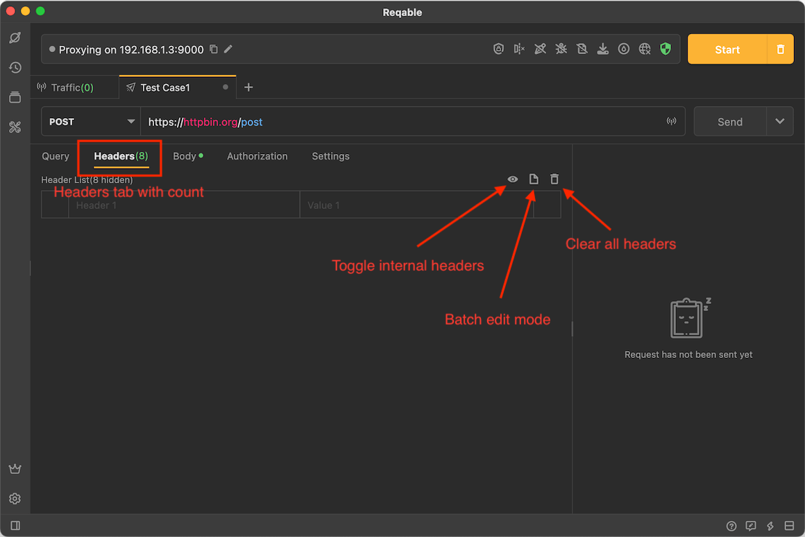
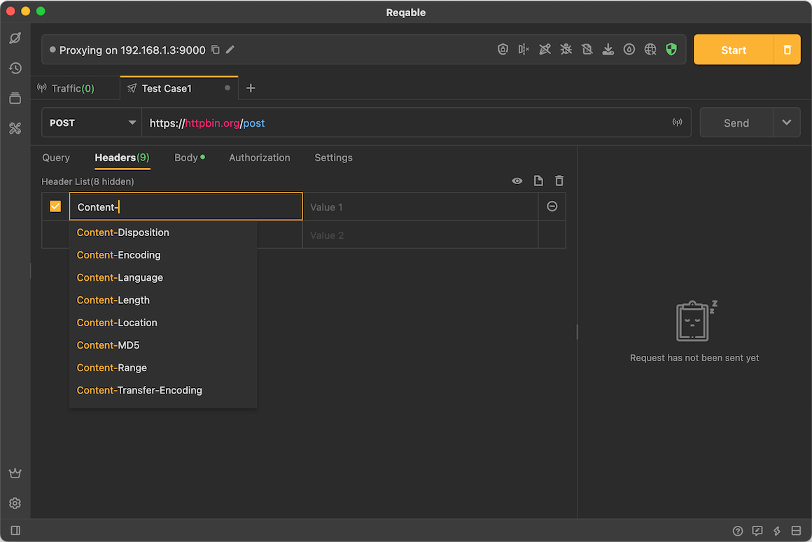
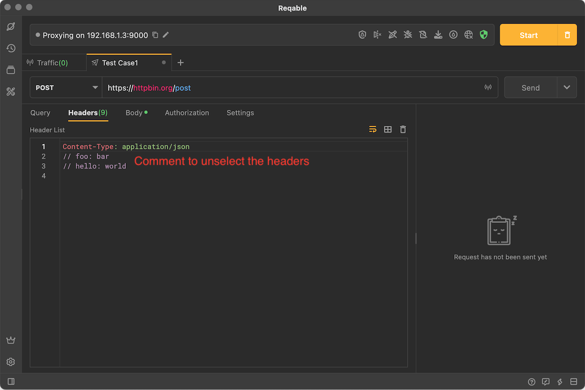

# Headers

import Shortcut from '@site/src/components/Shortcut';

Reqable can edit HTTP request headers, and provides table editing mode and text editing mode.

### Table Mode

Table mode is the default editing mode, the advantage of this mode is that it supports viewing [Built-in Headers](#builtin-headers) and input autofill. The disadvantage is that request headers cannot be operated in batches.

### Text Mode

Tap the text button to switch to the text editing mode. The advantage of this mode is that it supports batch editing.

:::info Comment headers

Use the `//` comment at the head of the request header to uncheck it.
The shortcut keys for commenting and uncommenting are both <Shortcut>Control + /</Shortcut> .

:::

### Built-in Headers {#builtin}

By default, Reqable hides some necessary request headers that developers don't need to care about, which are called built-in request headers. In table mode, click the eye icon to display the built-in request headers.

:::info Update built-in request headers

The built-in request header cannot be deleted directly, but the value without the lock icon can be modified and overwritten!

:::

Description of built-in request headers:

- **[Reqable-Id](request_id)** Request unique ID, can be disabled in settings.
- **Host** The host automatically added in the request header, note that it is represented by `:authority` in the HTTP2 and HTTP3 protocols.
- **User-Agent** Use Reqable's version number by default.
- **Connection** The connection is kept or closed. Note that it is invalid in the HTTP2 and HTTP3 protocols.
- **Content-Length** If a request body is used, this value is automatically calculated when the request is sent.
- **Content-Type** If a request body is used, the type (MIME) will be automatically appended to the list of built-in request headers.
- **[Cookie](cookie)** When cookies are enabled, they will be automatically appended to the list of built-in request headers.
- **[Authorization](authorization)** When authorization is enabled, it will be automatically appended to the list of built-in request headers.