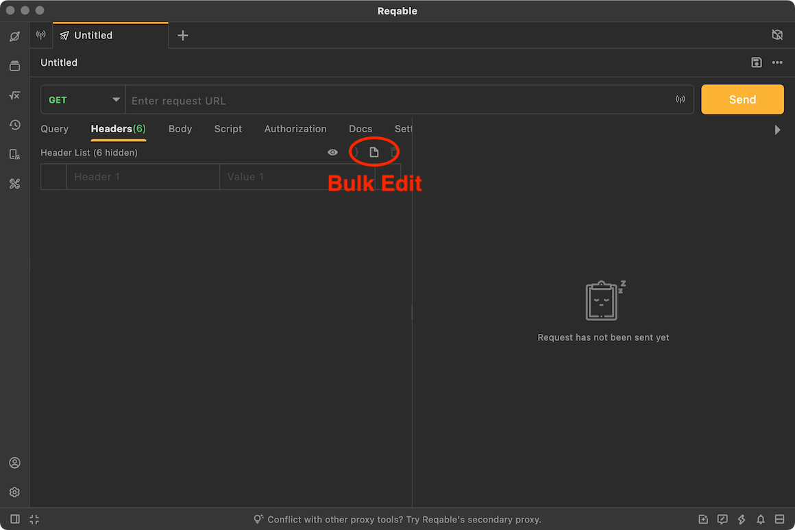
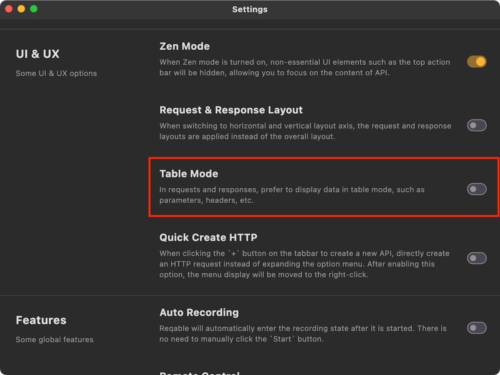
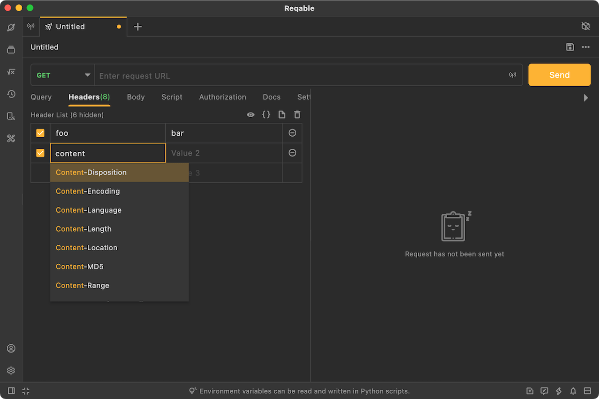
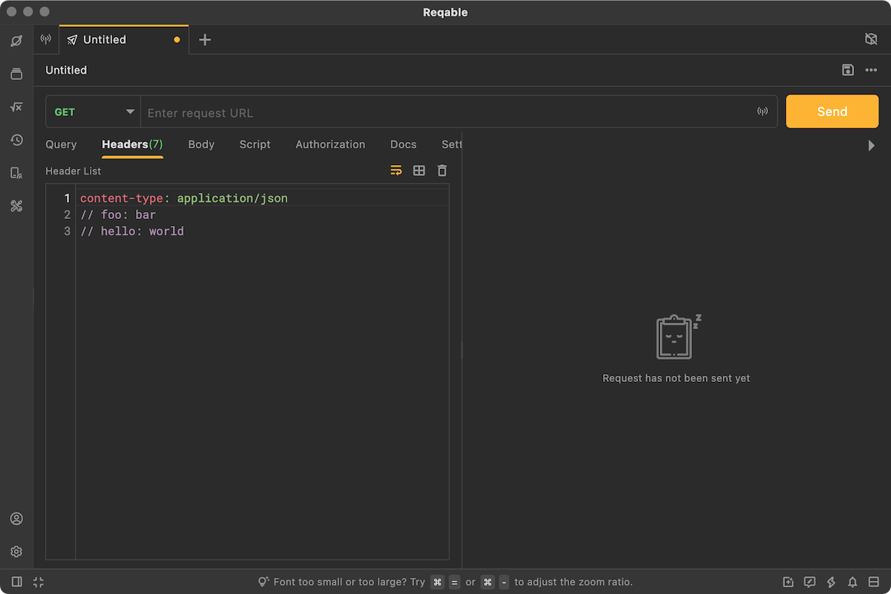
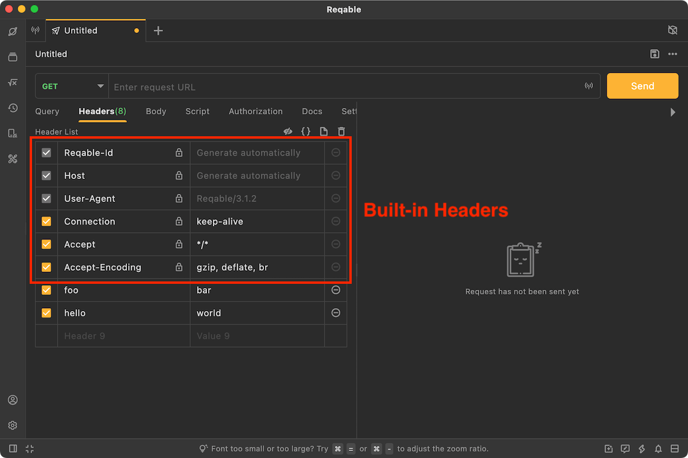

# Header

import Shortcut from '@site/src/components/Shortcut';

Reqable supports editing HTTP request headers and provides both table editing mode and text editing mode.

By default, table editing mode is used. You can disable this option in settings to use text editing mode by default.

:::info
Request headers support the use of [Environment Variables](../environment).
:::

### Table Mode

Table editing mode supports input suggestions and auto-completion.

### Text Mode

Text editing mode supports batch editing of request headers.

Using `//` comments at the beginning of a request header line will uncheck that header. You can also use the shortcut <Shortcut>Control + /</Shortcut>.

### Built-in Headers {#builtin}

Reqable hides some necessary request headers that usually do not need developer attention by default. These are called built-in request headers. In table mode, click the eye icon to toggle whether built-in request headers are shown.

Common built-in request headers:

- **[Reqable-Id](request_id)** A unique request ID identifier, which can be disabled in settings tab.
- **Host** Domain information automatically added to the request headers. Note that in HTTP/2 and HTTP/3, `:authority` is used instead.
- **User-Agent** Uses Reqable's application version by default.
- **Connection** Controls whether the connection is kept alive or closed. Note that it is invalid in HTTP/2 and HTTP/3.
- **Content-Length** If a request body is used, this value is calculated automatically when the request is sent.
- **Content-Type** If a request body is used, the type (MIME) is automatically appended to the built-in request header list.
- **[Cookie](cookie)** When Cookie is enabled, it is automatically appended to the built-in request header list.
- **[Authorization](authorization)** When authorization is enabled, it is automatically appended to the built-in request header list.
