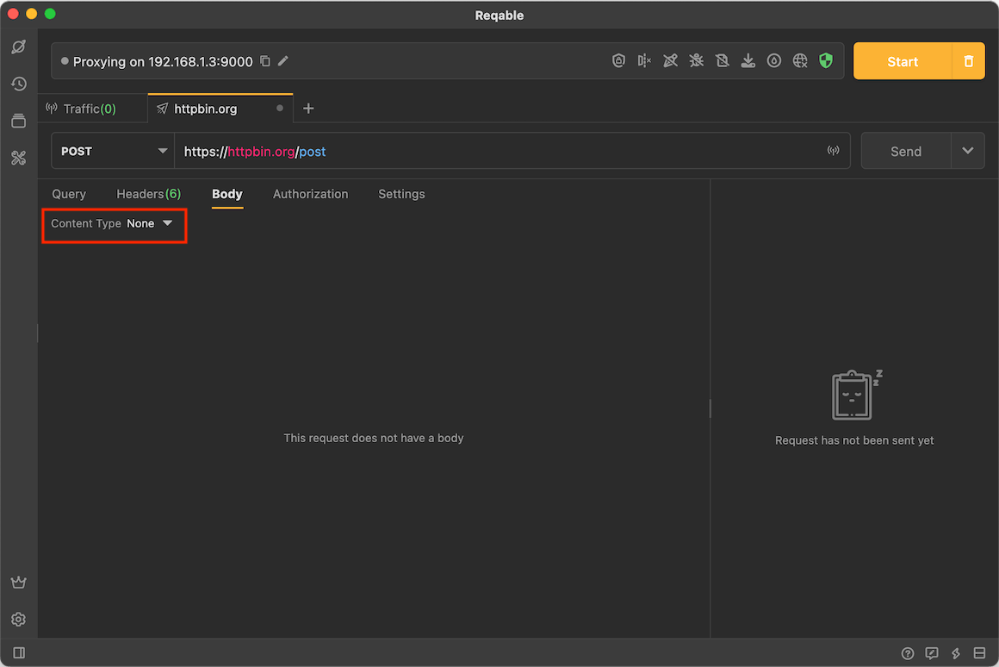
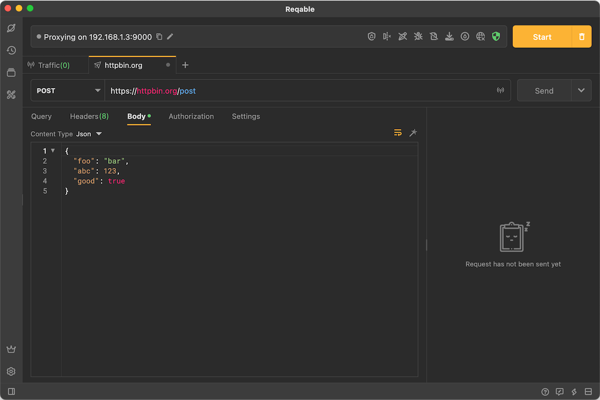
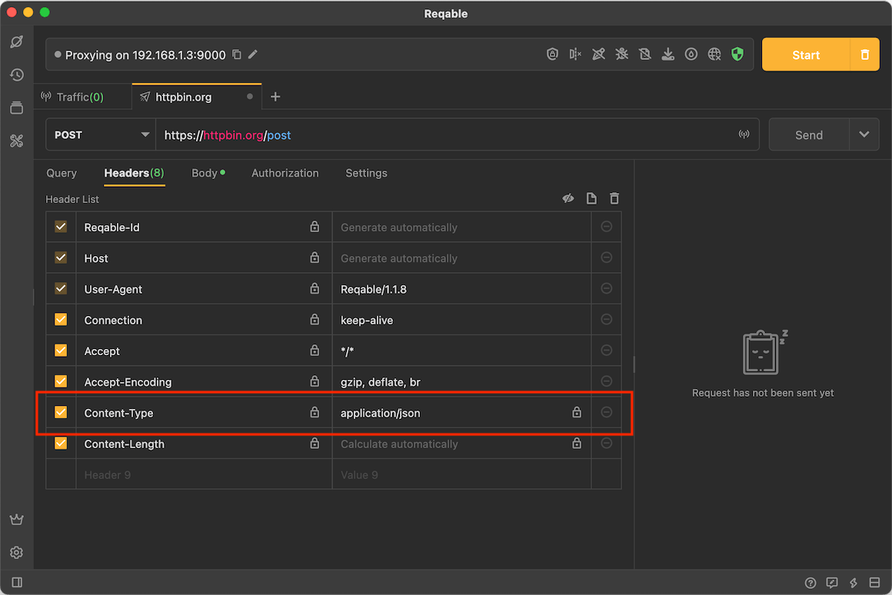
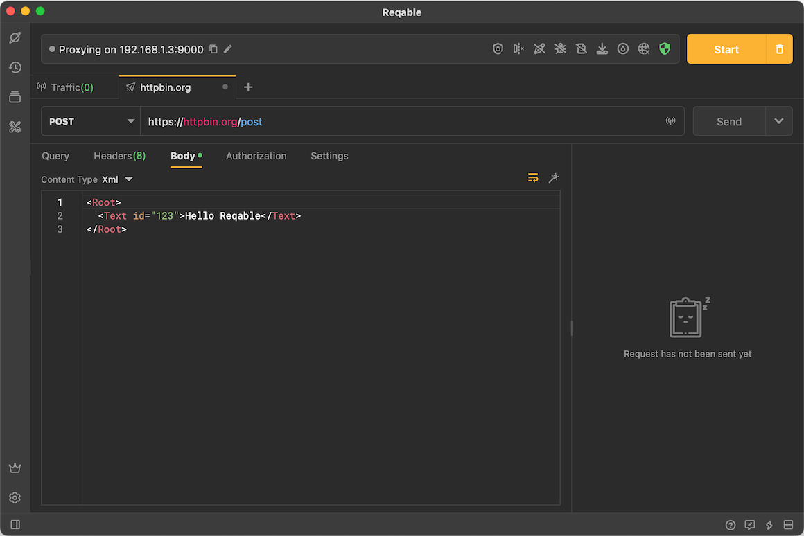
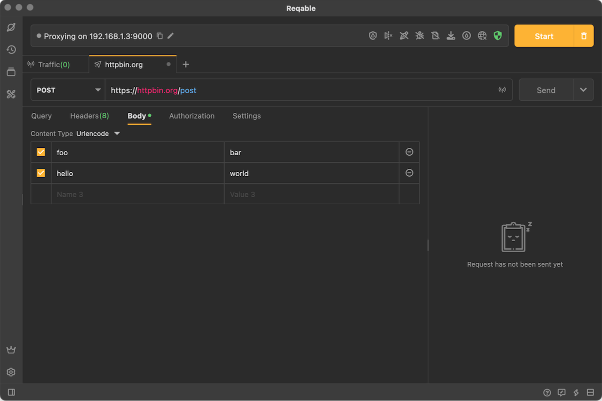
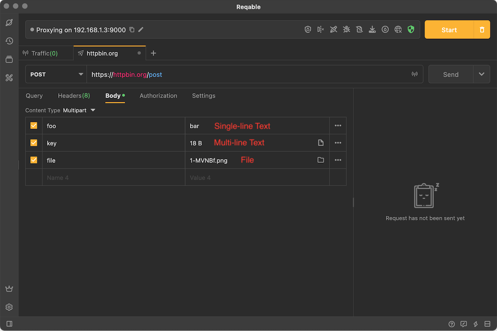
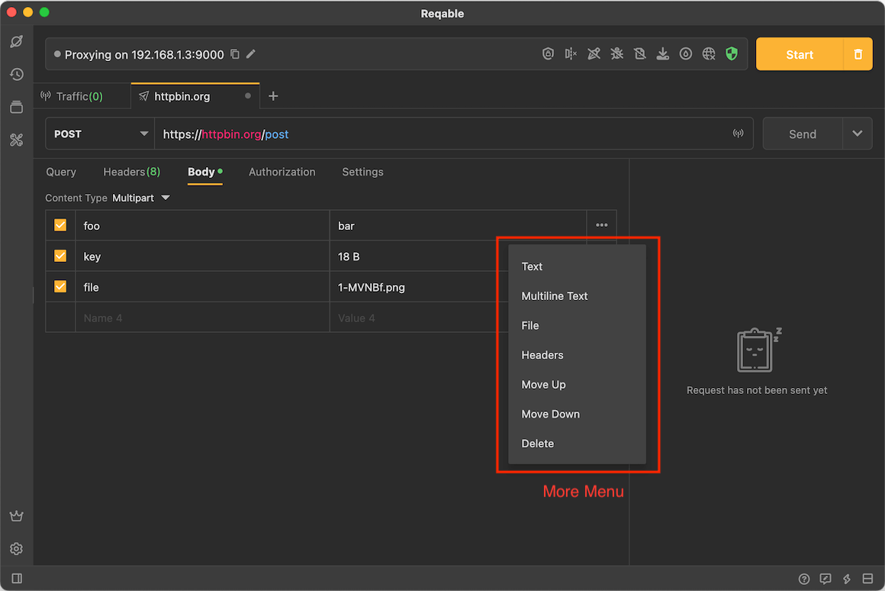
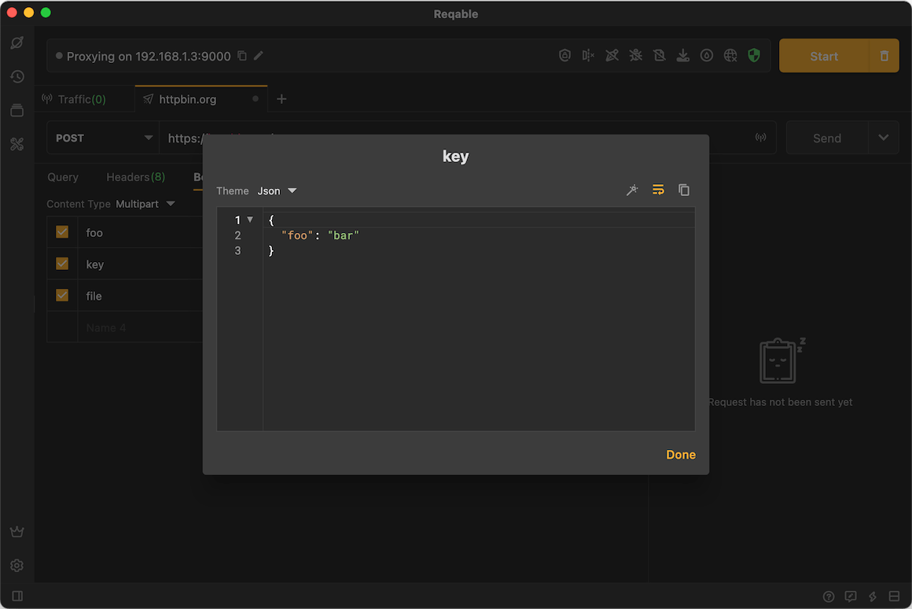
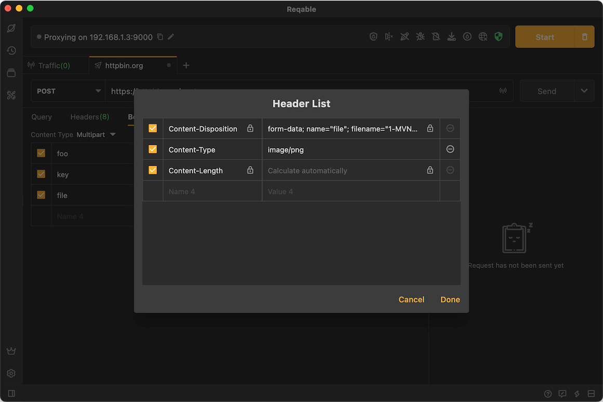

# Body

Reqable supports editing multiple types of request bodies, including [JSON](#json), [text](#text), [XML](#xml), [form](#urlencode), [Multipart](#multipart) and [file](#binary). If you use a body, `Content-Type` will be automatically appended to [Built-in Request Header](header#builtin).

Tap the **Content Type** drop-down menu to switch the type:



### JSON {#json}

JSON type request body supports automatic syntax highlighting and formatting.



JSON type will automatically append `Content-Type: application/json` to [Built-in Request Header](header#builtin).



:::info Custom Content-Type

The value of the built-in request header Content-Type cannot be modified, but you can uncheck it and add a new Content-Type to headers.

:::

### Text {#text}

Text is the simplest request body type.


Text type will automatically append `Content-Type: text/plain` to [Built-in Request Header](header#builtin).

:::info Raw Type

Reqable also provides a type **Raw** similar to text, the difference is that the Raw type will not automatically append any Content-Type in [Built-in Request Header](header#builtin).

:::

### XML {#xml}

XML type request body supports automatic syntax highlighting and formatting.



XML type will automatically append `Content-Type: application/xml` to [Built-in Request Header](header#builtin).

### Urlencode {#urlencode}

Urlencode is composed of a set of key-value pairs.

```
foo=bar&hello=reqable
```

Reqable provides editing modes similar to query parameters:



Urlencode type will automatically append `Content-Type: application/x-www-form-urlencoded` to [Built-in Request Header](header#builtin).

### Multipart {#multipart}

Multipart supports three types: **Single-line Text**, **Multi-line Text** and **File**.



Tap the more button on the right to open the context menu, including changing type, moving position, editing headers and deleting, etc.



Multi-line text needs to be clicked to expand the edit pop-up window for modification.



Reqable also supports editing the headers of each part.



Multipart type will automatically append `Content-Type: multipart/form-data` to [Built-in Request Header](header#builtin).

:::info Boundary

No need to add `Boundary` header manually, Reqable will automatically generate and set Boundary when the request is sent.

:::

### Binary {#binary}

The file type supports selecting a file as the request body. In order to simplify the operation, Reqable provides the function of dragging and dropping the file, just drag the file directly into the dotted layout.


:::info Content-Type Guess

Binary type will automatically append `Content-Type` to [Built-in Request Header](header#builtin).

:::