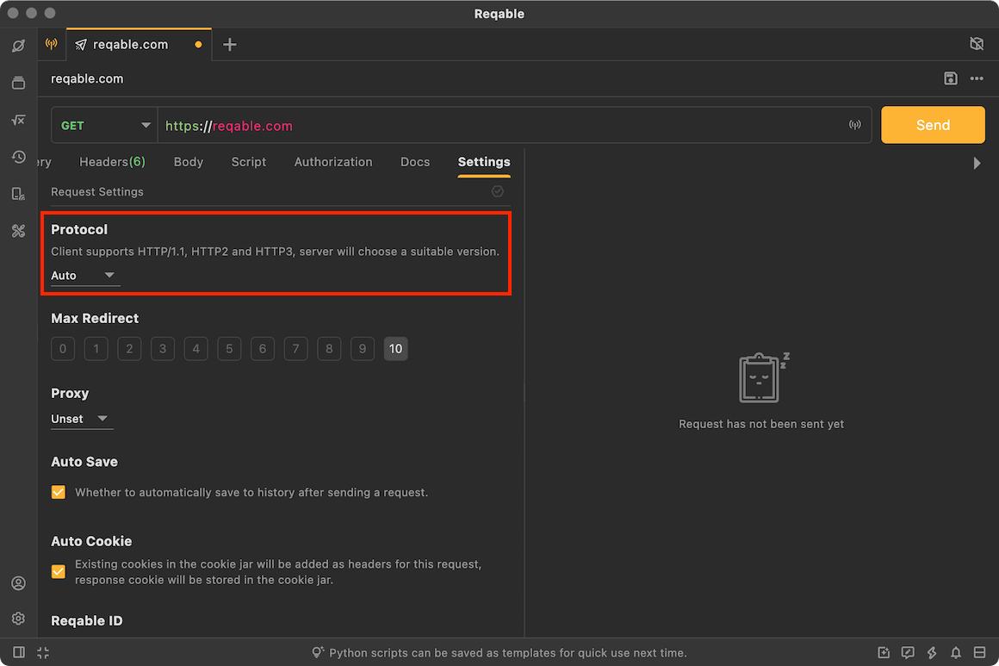
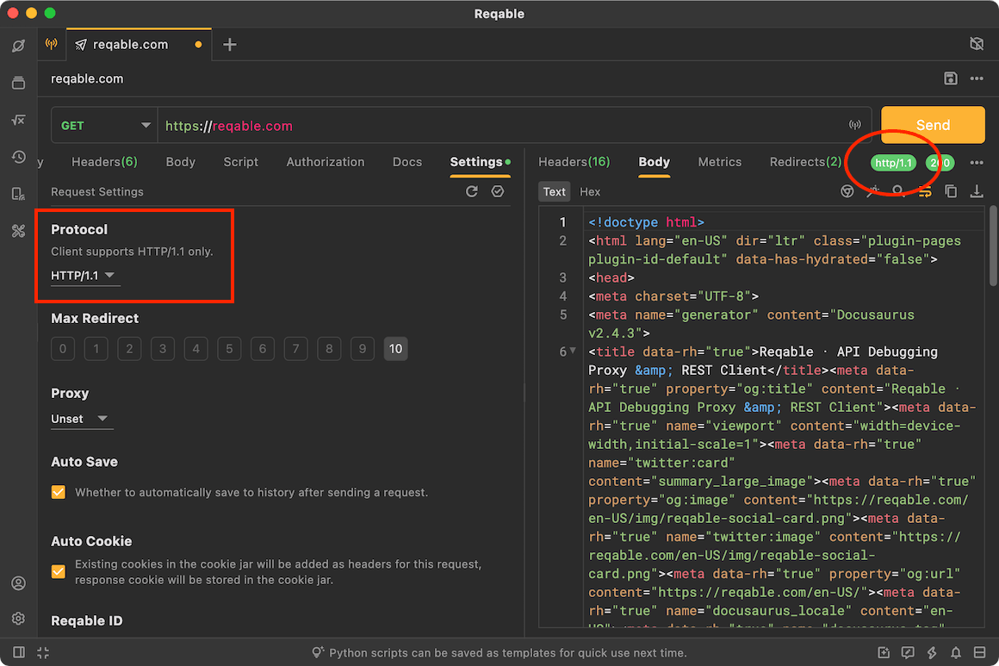
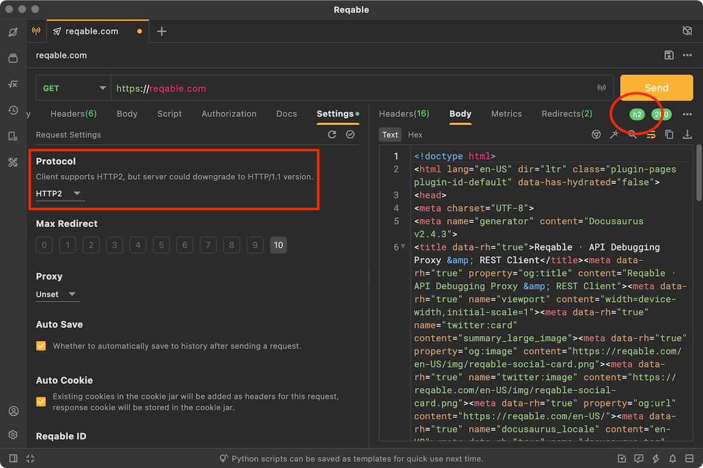
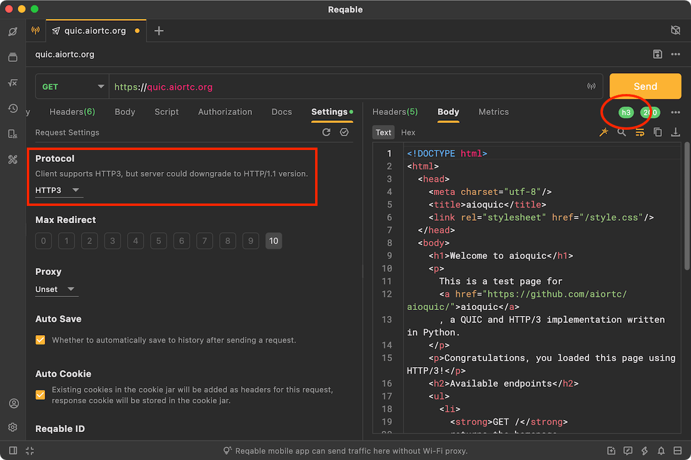

# Protocol

Reqable supports three HTTP protocols: [HTTP1.1](https://www.ietf.org/rfc/rfc2616.txt), [HTTP2](https://www.ietf.org/rfc/rfc7540.txt), and [HTTP3](https://www.ietf.org/rfc/rfc9114.txt). We can specify the protocol version in the request settings.

:::info Server Support

All protocol versions need to be supported by the server. If the server does not support a higher version, it will be downgraded to HTTP1.1 version.

:::

### HTTP/1.1

HTTP1.1 is currently the most popular version of the HTTP protocol, with well-known features such as persistent connections and chunked transfer. Currently, almost all HTTP frameworks support this version. We can check the protocol version used on the response label.

### HTTP/2

HTTP2 is currently a very commonly used HTTP protocol version. Compared with HTTP/1.1, features such as multiplexing and header compression offer significant performance advantages, but not all HTTP frameworks support this version. If the server does not support the HTTP2 protocol version, it will be downgraded to the HTTP1.1 protocol version, and we can check the specific protocol version used on the response label.

### HTTP/3

HTTP3 is developed from [QUIC](https://www.ietf.org/rfc/rfc9000.txt). Compared with HTTP2, its performance and security have been further improved, but unfortunately, most HTTP frameworks do not yet support this version. Reqable supports HTTP/3 even though server adoption is still limited. If the server does not support the HTTP3 protocol version, it will be downgraded to the HTTP/1.1 protocol version, and we can check the specific protocol version used on the response label.

