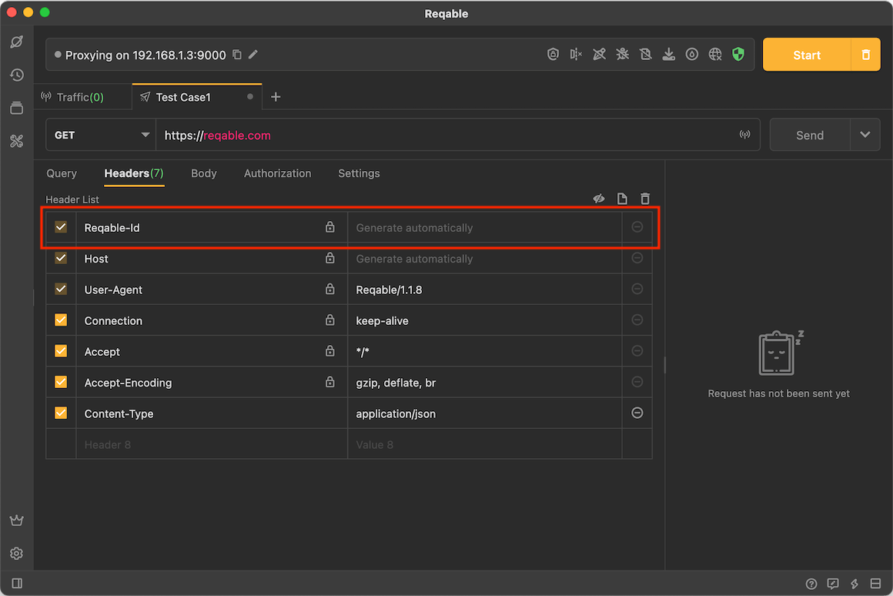
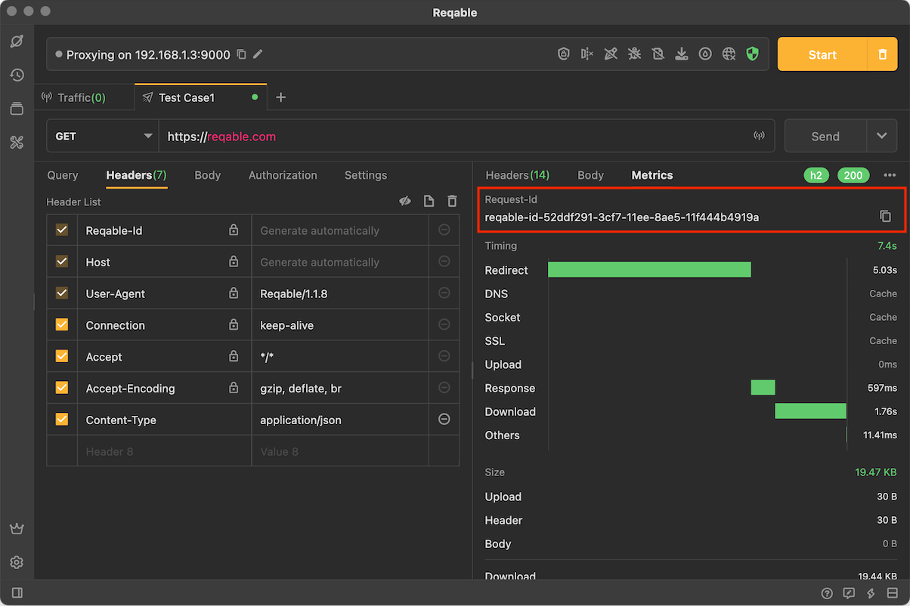
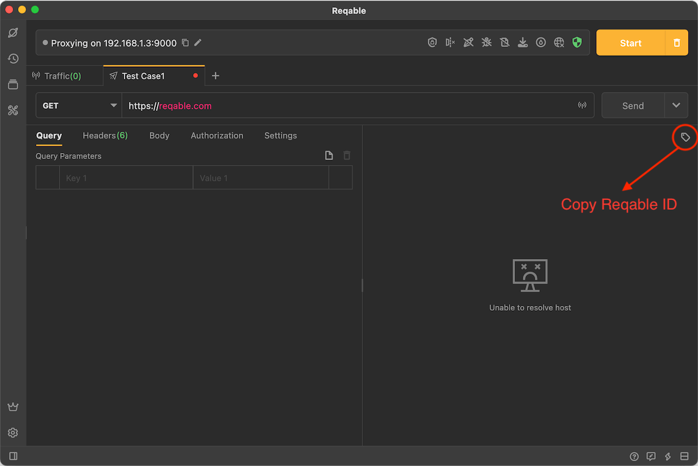
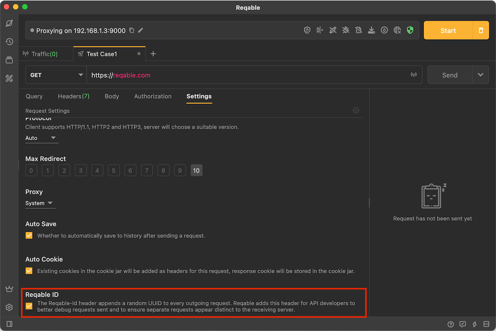

# Request ID

Reqable supports automatically generating a unique ID identifier each time before a request is sent. Through `Reqable-Id`, it is convenient for developers to cooperate with the server to trace the request. The automatically generated ID format is as follows:

```
reqable-id-{UUID}
``` 

For example:

```
reqable-id-aee9bdc1-ad01-11ed-ace8-ade55d424a3d
```



Developers can also fill in a fixed ID value by themselves.

### Check ID

When the request is successful, you can get or copy the ID value of this request in the **Performance** tab:



When the request fails, you can copy the ID value of this request with this icon:



### Disable Request ID

Request ID is enabled by default, but can be disabled by unchecking it in **Settings**:


