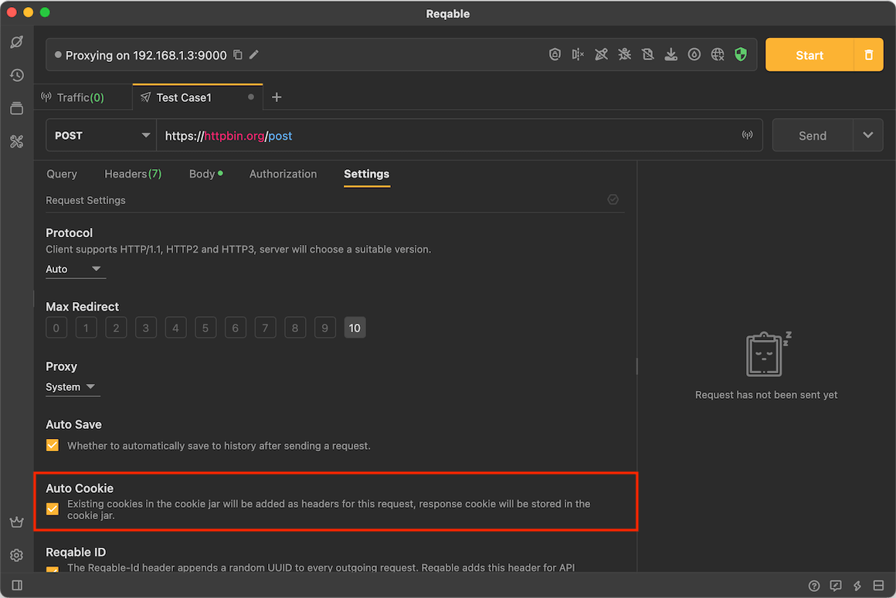
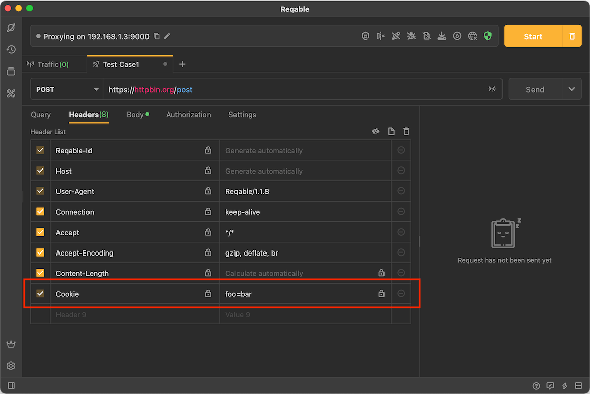
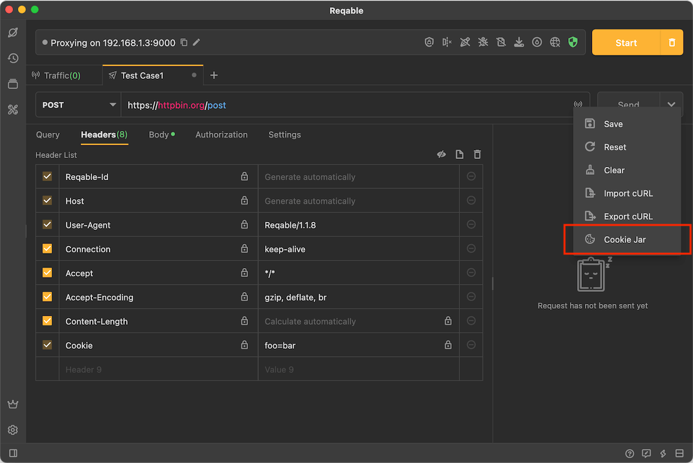
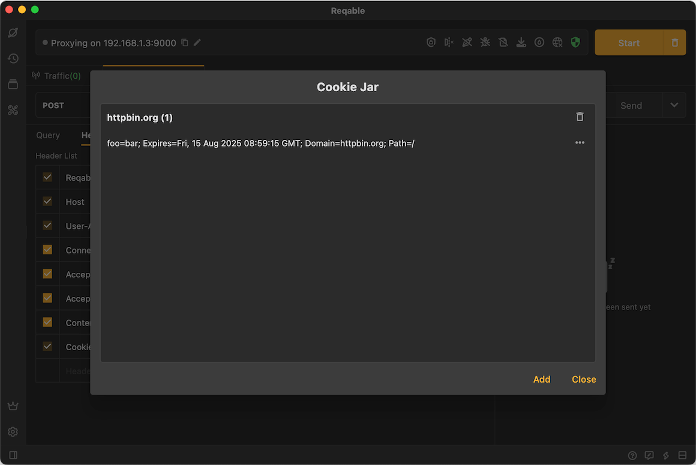
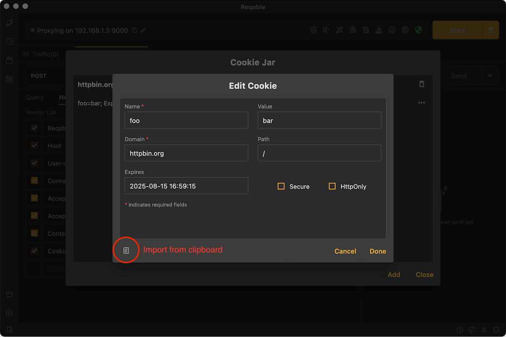

# Cookie

Reqable supports automatically importing and saving cookies. This feature is enabled by default and can be disabled in the settings.

The cookie returned by the server will be automatically saved in `Cookie Jar` and updated to the request header. The newly created API will also automatically get cookies from the `Cookie Jar` and fill it in the request header.

### Manage Cookie

Expand the drop-down menu, select **Manage Cookie** to open `Cookie Jar`:

### Edit Cookie

In the cookie manager, we can create, delete and edit cookies at any time. In addition to manually fill the content, you can also import it from the clipboard.

