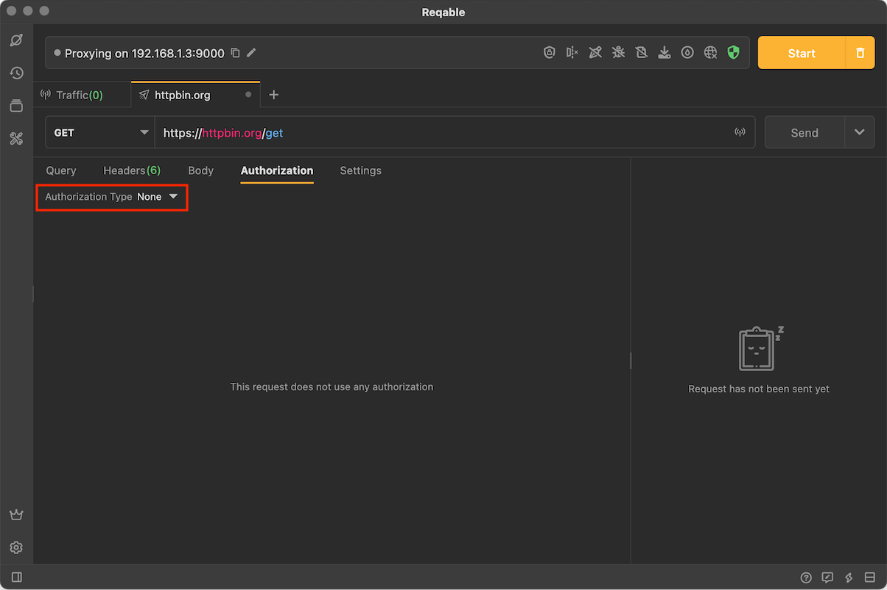
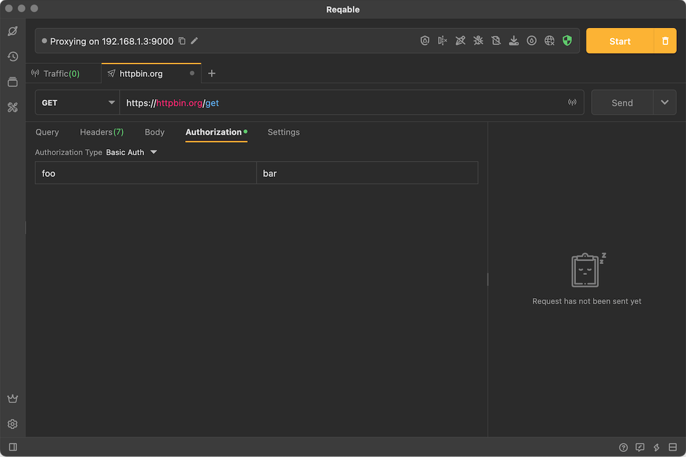
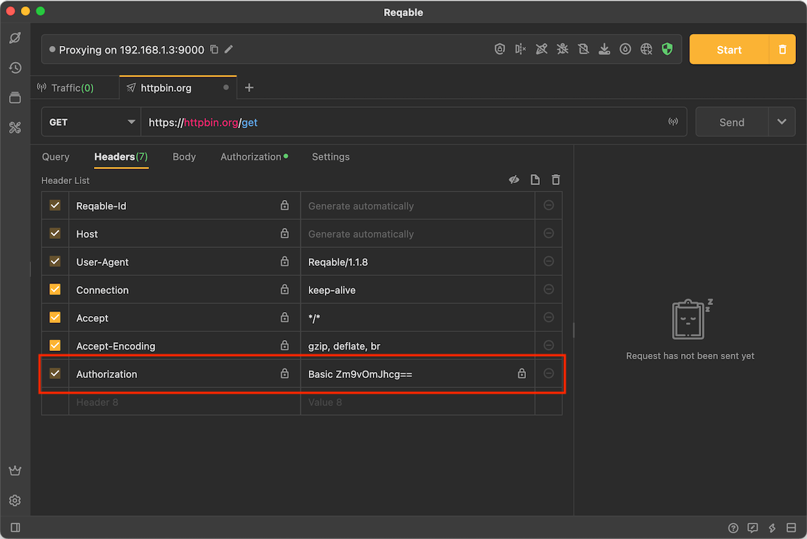
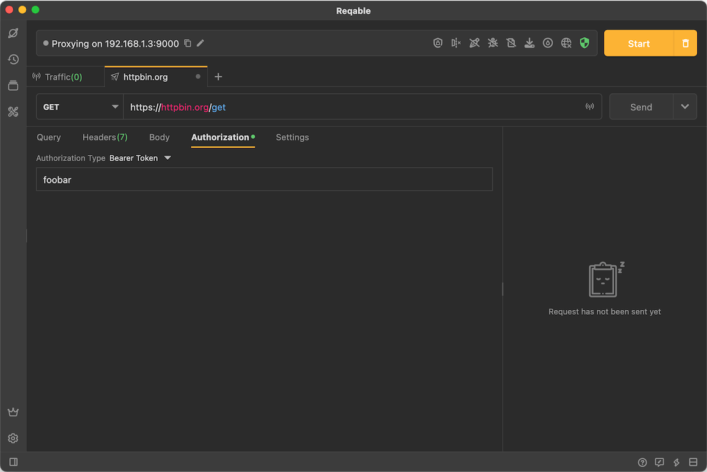
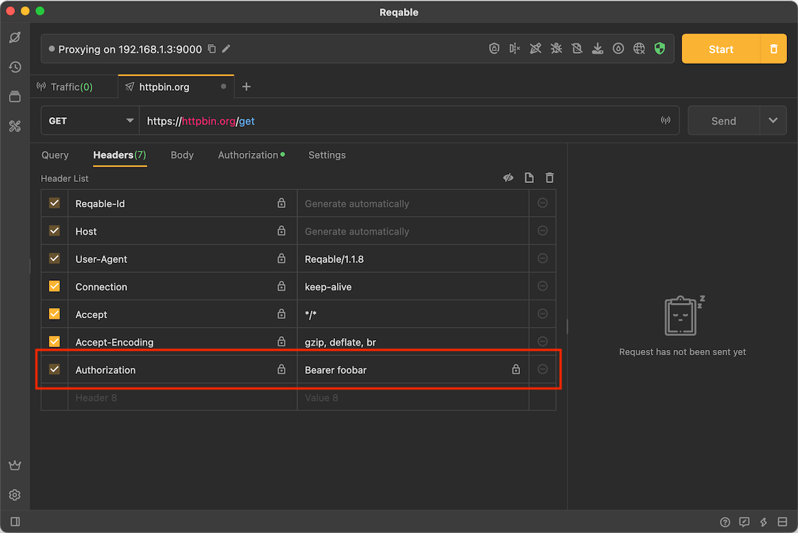
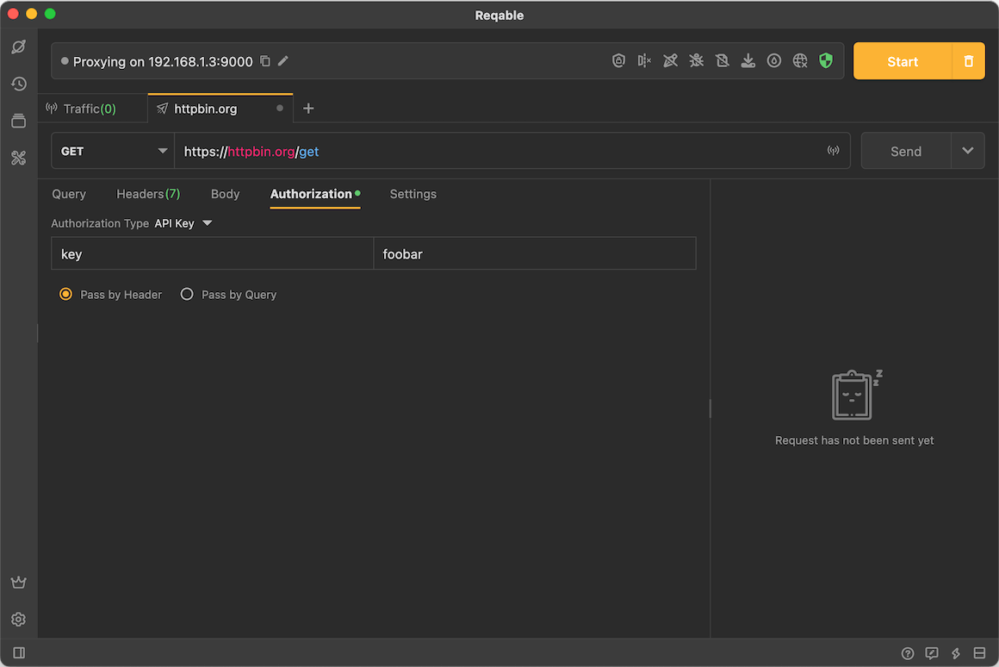
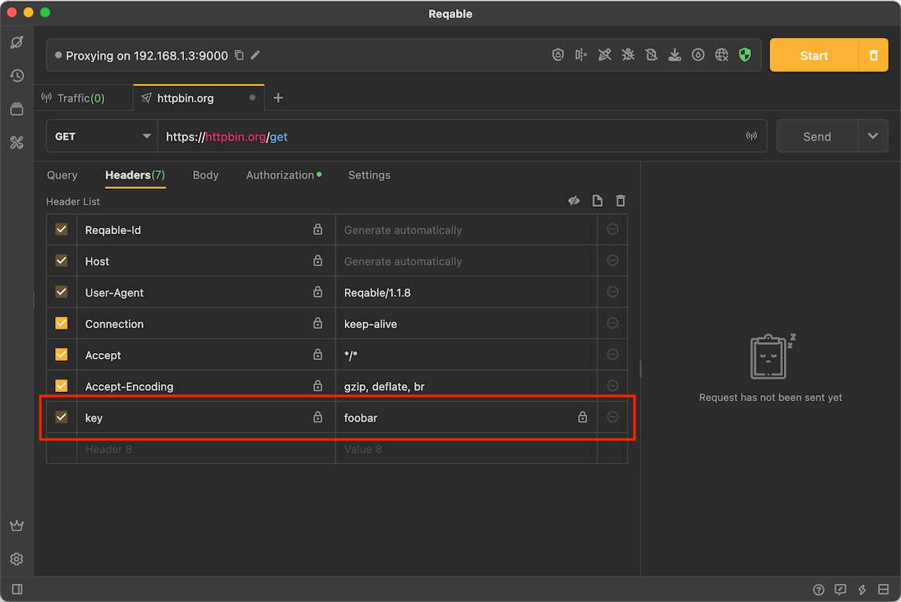
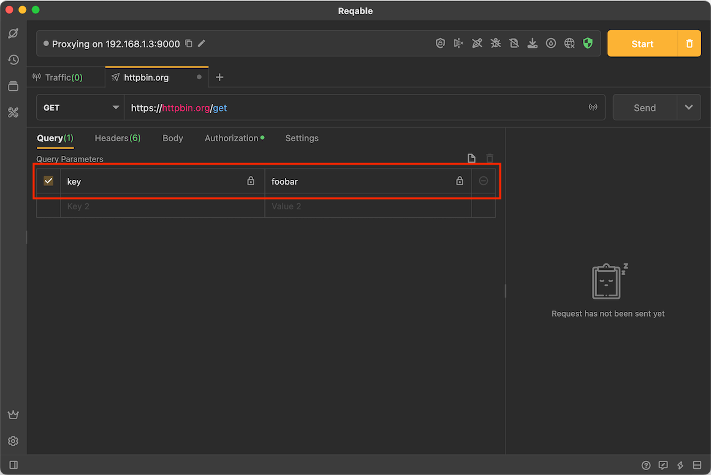

# Authorization

Reqable provides a simple authorization and supports 3 modes: [Basic Auth](#basic-auth), [Bearer Token](#bearer-token) and [Api Key](#api-key).

### Basic Auth {#basic-auth}

For details and specifications of Basic Auth, please refer to the [RFC document](https://datatracker.ietf.org/doc/html/rfc7617), without much explanation. The usage is very simple, just select **Basic Auth** in the authorization and fill in the username and password.

Reqable will automatically generate Authorization in the built-in request header.

### Bearer Token {#bearer-token}

For details and specifications of Bearer Token, please refer to the [RFC document](https://datatracker.ietf.org/doc/html/rfc6750), without much explanation. The usage is very simple, just select **Bearer Token** in the authorization and fill in the token.

Reqable will automatically generate Authorization in the built-in request header.

### Api Key {#api-key}

Api Key supports passing in request headers and query parameters.

Passed in request headers:

passed in rquery parameters:

