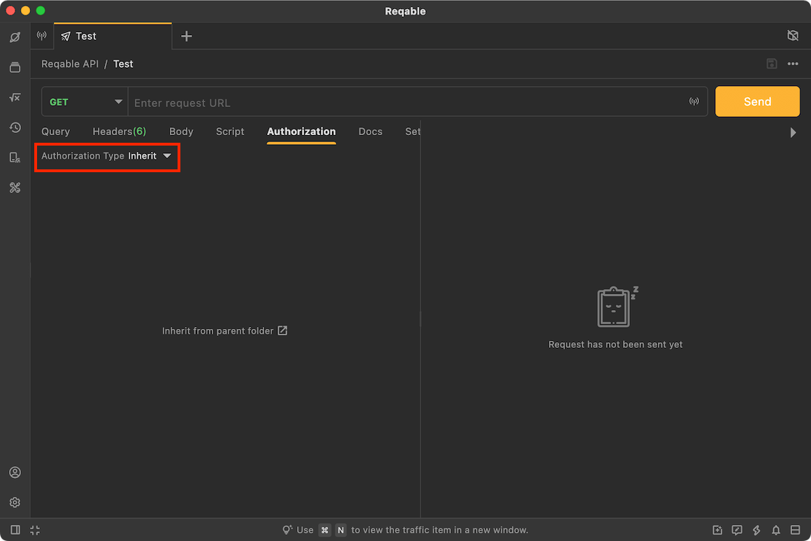
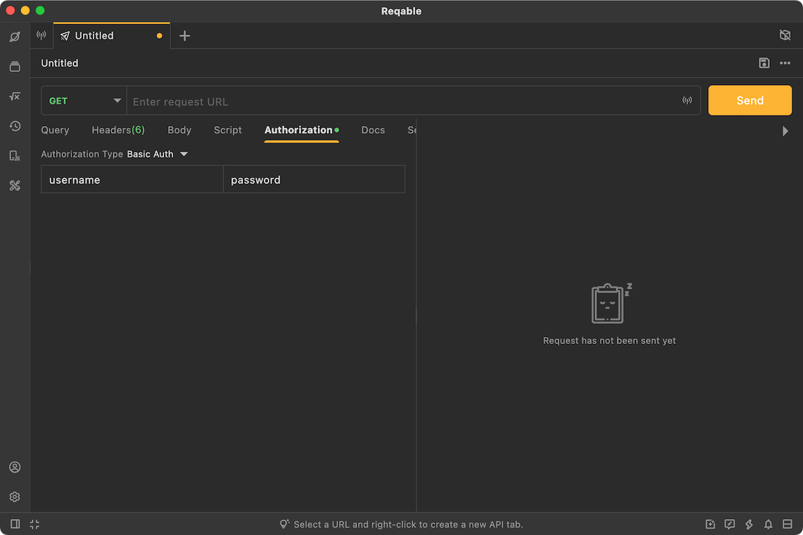
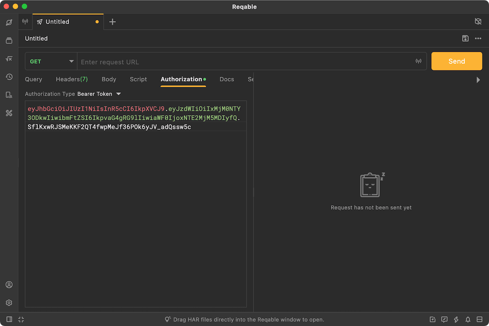
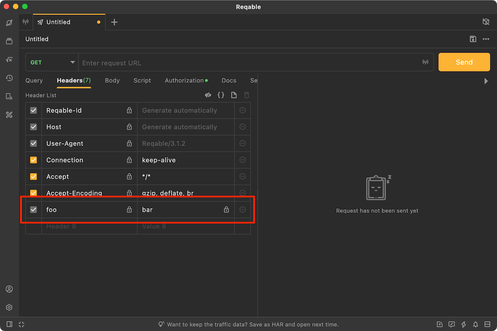
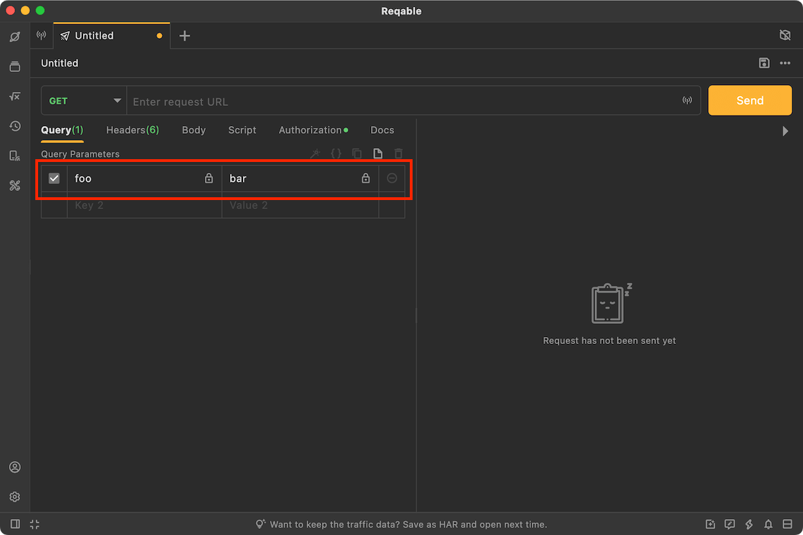
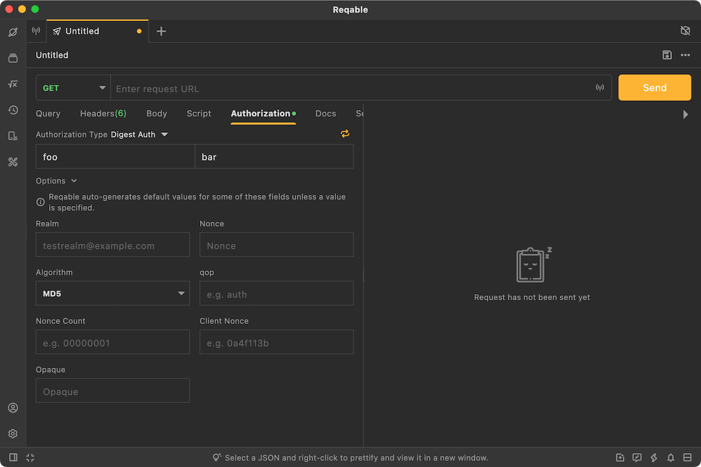

# Authorization

Reqable provides multiple authorizations:

- [Inherit](#inherit)
- [Basic Auth](#basic-auth)
- [Bearer Token](#bearer-token)
- [Api Key](#api-key)
- [Digest Auth](#digest-auth)

:::info
Authorization supports the use of [Environment Variables](../environment).
:::

### Inherit {#inherit}

If the API has already been saved to a collection, it automatically inherits the authorization defined for the collection. If it has not been saved to a collection, no authorization is applied.

### Basic Auth {#basic-auth}

For details and specifications of Basic Auth, see the [RFC 7617](https://datatracker.ietf.org/doc/html/rfc7617). Select **Basic Auth** in the authorization layout and fill in the username and password.

### Bearer Token {#bearer-token}

For details and specifications of Bearer Token, see the [RFC 6750](https://datatracker.ietf.org/doc/html/rfc6750). Select **Bearer Token** in the authorization layout and fill in the token.

### Api Key {#api-key}

Api key supports being passed either in request headers or request parameters.

Choose to pass it in the request header:

Choose to pass it in request parameters:

### Digest Auth {#digest-auth}

For details and specifications of Digest Auth, see the [RFC 7616](https://datatracker.ietf.org/doc/html/rfc7616). Digest Auth has many parameters, but for basic usage you only need to fill in the username and password.

Reqable automatically generates the other parameters according to the authentication requirements in the response. Of course, you can also expand the options and customize these parameters manually.

