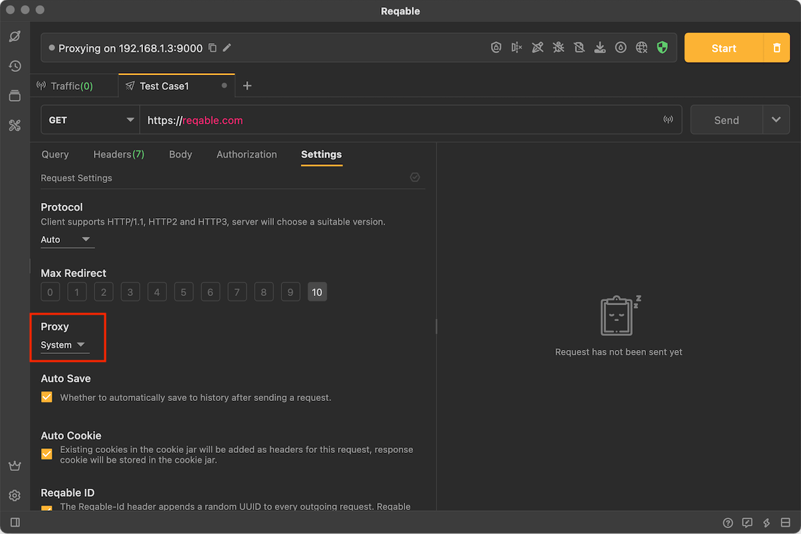
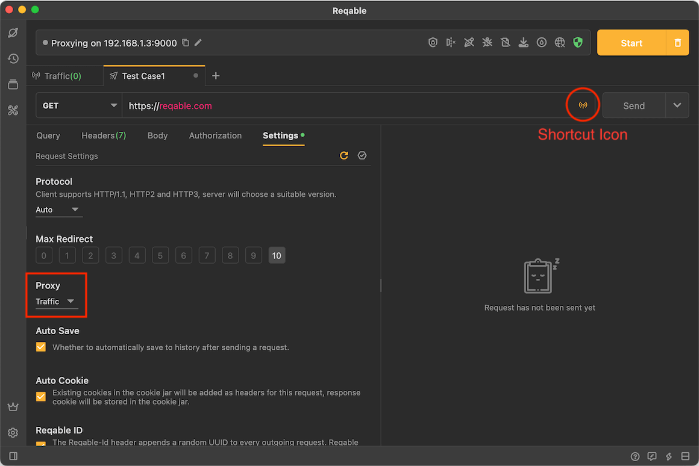
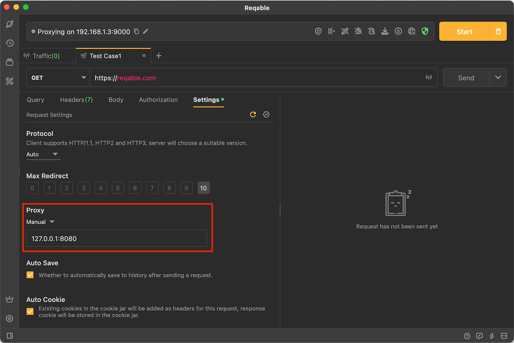

# Proxy

Proxy is one of the essential settings when testing APIs. We can configure proxy in the request settings.

Reqable supports 4 proxy settings:
- **Follow System** Use the proxy configured by the system.
- **Follow Traffic** Use the MITM proxy.
- **Manual** To use a custom web proxy, just specify the proxy IP and port number.
- **Unset** Disable any proxy.

### Follow Traffic

**Follow Traffic** is an important feature of Reqable, you can use [Script](../capture/script) to intercept the request. The requests will also be displayed in the traffic list without enabling the debugging.

### Manual Proxy

Reqable currently only supports setting a custom web proxy. You need to specify the proxy IP and port number. The configuration method is as follows:

:::info Proxy Protocol

If there is a need for proxy protocols such as Socks, you can configure it in the system and select **System** in settings.

:::