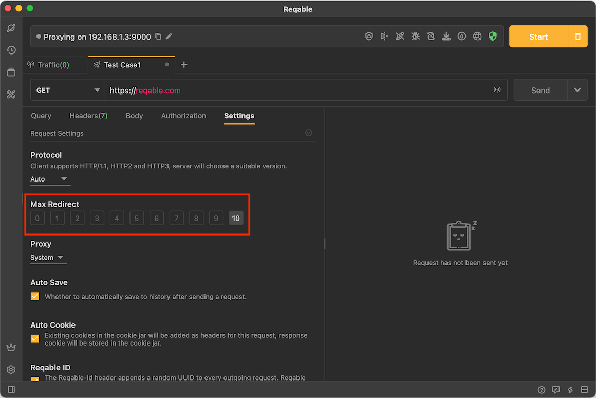

# Redirection

Reqable supports automatic redirection of requests, and we can configure the maximum number of redirections in the request settings.

:::caution

If the request is redirected, it will affect the measurement of [Metrics](metrics). Therefore, please turn off the redirection when measuring [Metrics](metrics).

:::