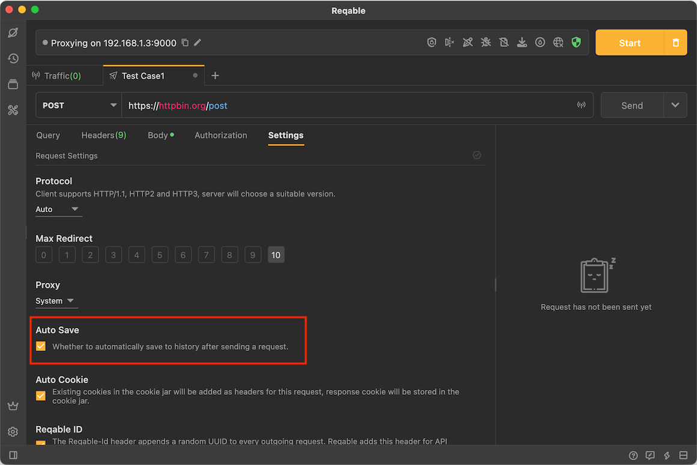
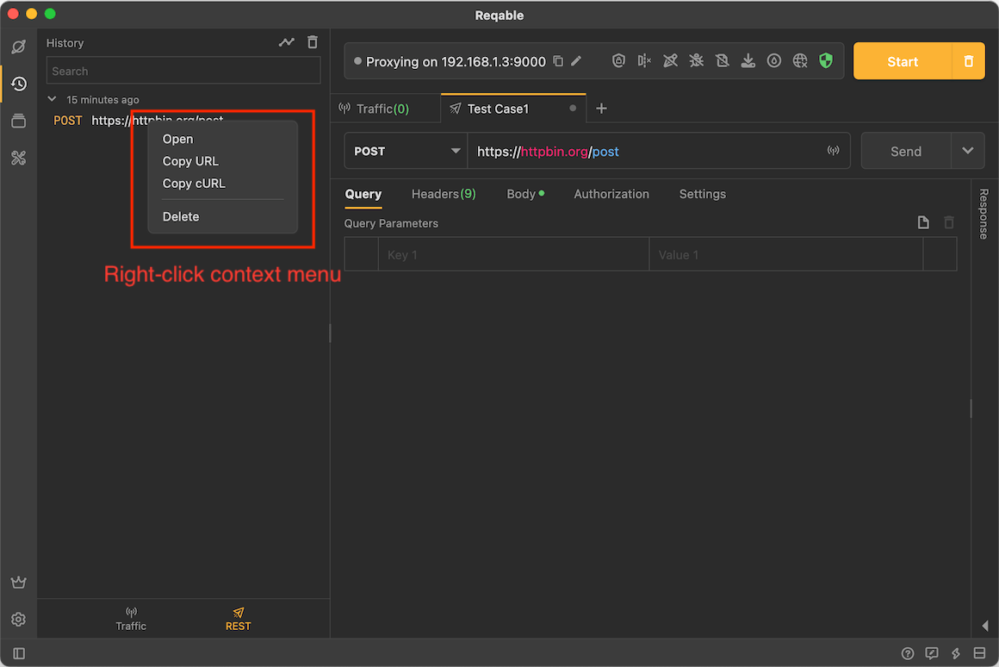
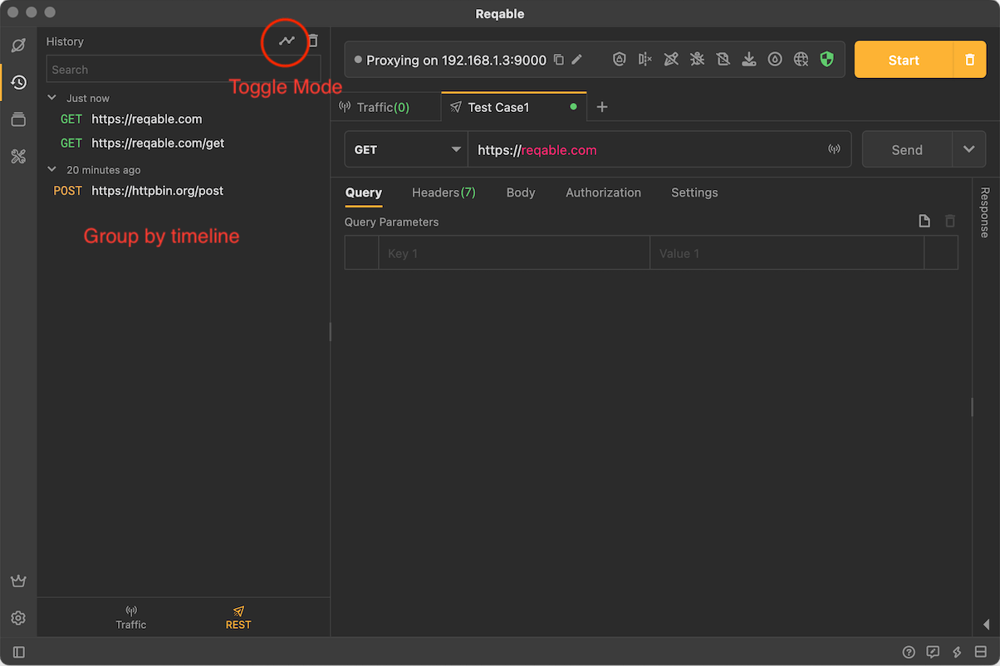
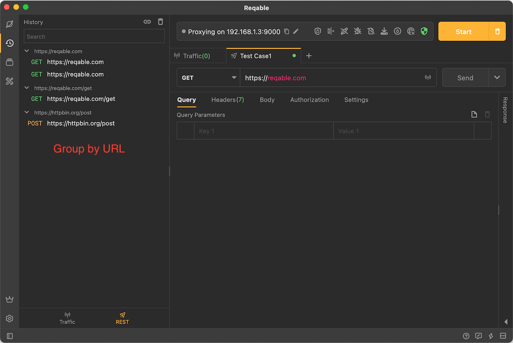

# History

Reqable supports saving the results of each request and response into history, which is enabled by default and can be disabled in the settings.

When you need to review, tap one in history, or right-click to select Open, Copy URL, Copy cURL or Delete.

The history list supports two display modes, one is sorting by timeline, the other is sorting by URL, and the display mode can be switched.

