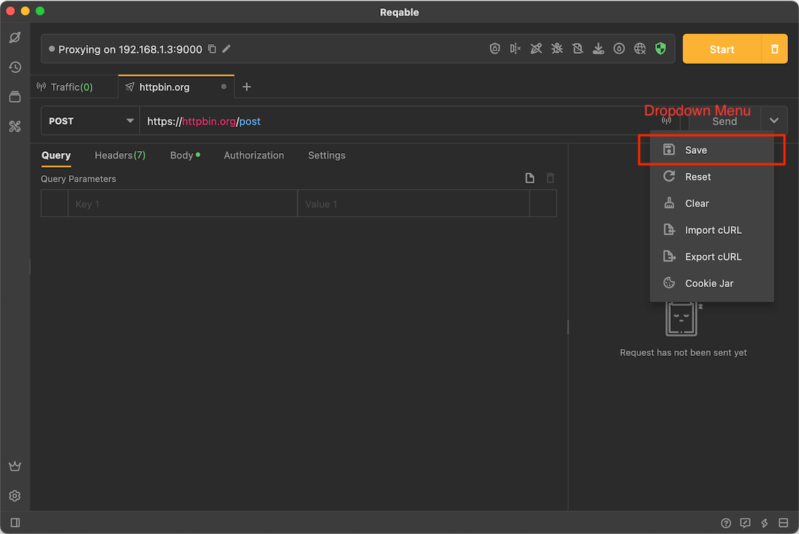
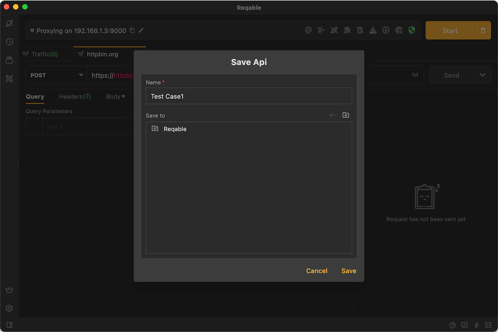
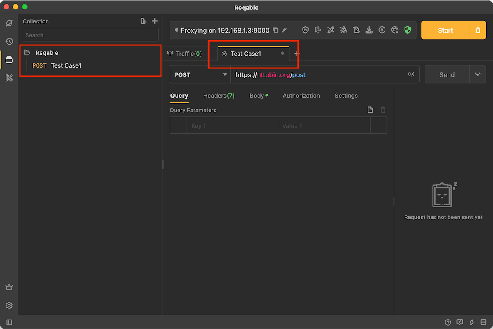
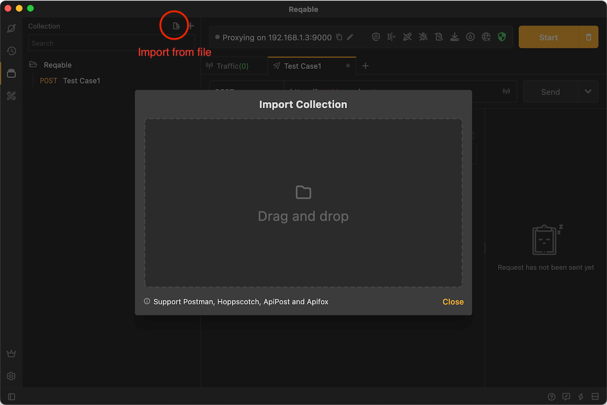
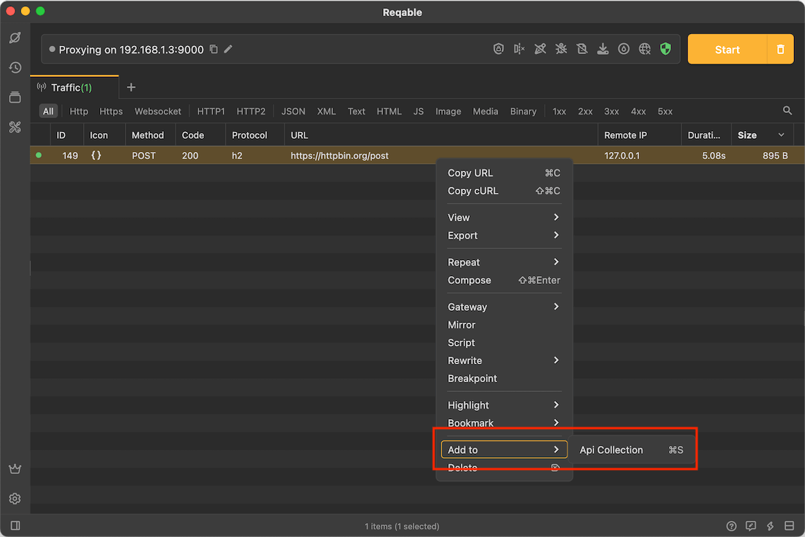
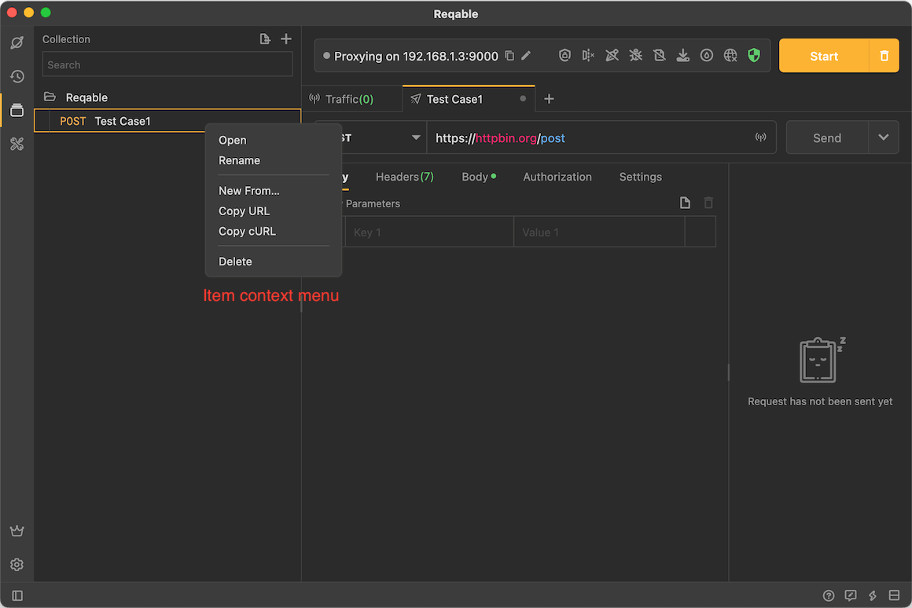
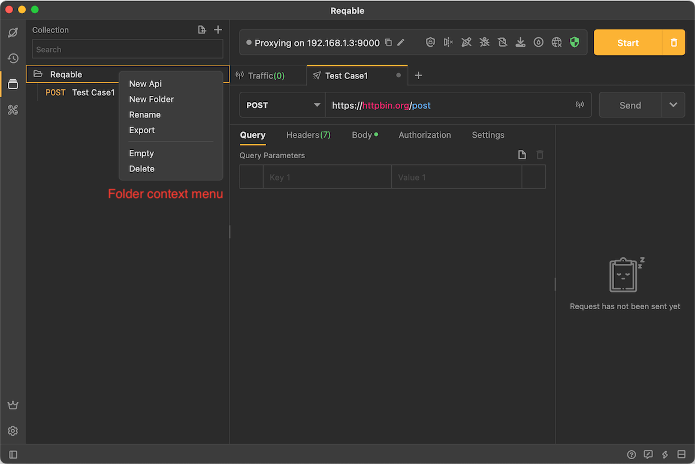

# Collection

import Shortcut from '@site/src/components/Shortcut';

Reqable supports saving API requests into collections and opening them for editing at any time. At the same time, Reqable also supports importing API collections in formats such as Postman, and can save the APIs in the traffic list to the collection.

### Save API

Expand drop-down menu, and tap `Save` (shortcut key <Shortcut>Control + S</Shortcut> ).

Enter a name in the pop-up dialog and select the stored folder.

After save, you can see the saved API in the collection panel, and you can also see that the title of the tab has also changed to the name of the API:

### Import Collections

Reqable currently supports the import of API collection files in 4 formats: Postman, Hoppscotch, ApiPost, and Apifox. Of course, the format exported by Reqable itself must also be supported.

### Save traffic API

Reqable can save the API in the traffic list to a collection, and select **Add to** -> **API Collection** in the right-click menu.

### Collection Management

When you need to review, right-click to Open, Copy, New, Rename or Delete.

You can also create subfolders in the collection, or perform operations such as exporting, renaming, and deleting the collection:

:::caution

For a more intuitive display, Reqable limits the level of subfolders in the collection to no more than 4.

:::