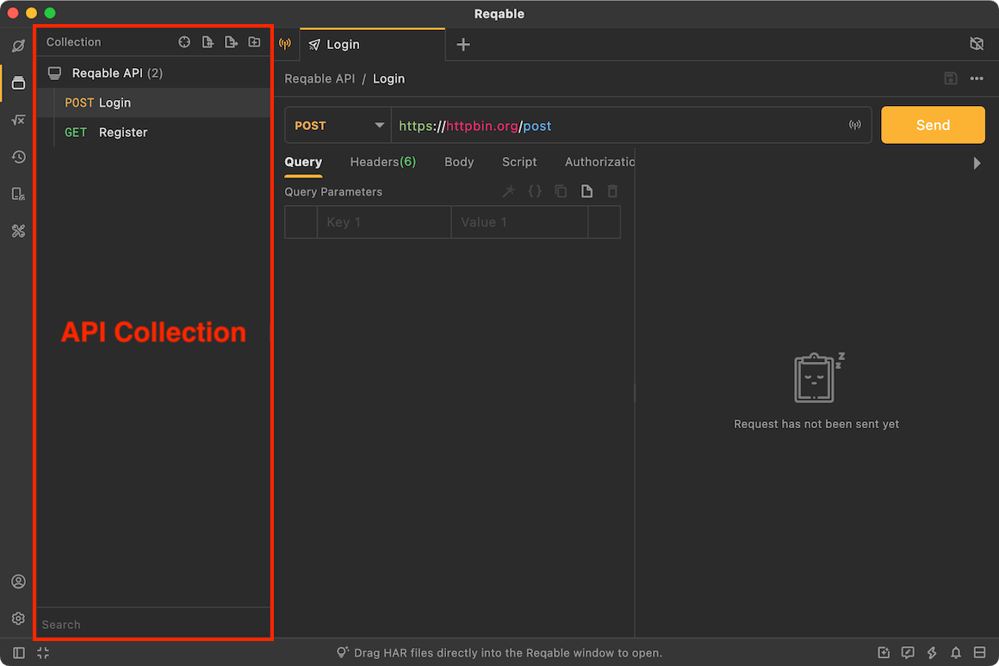
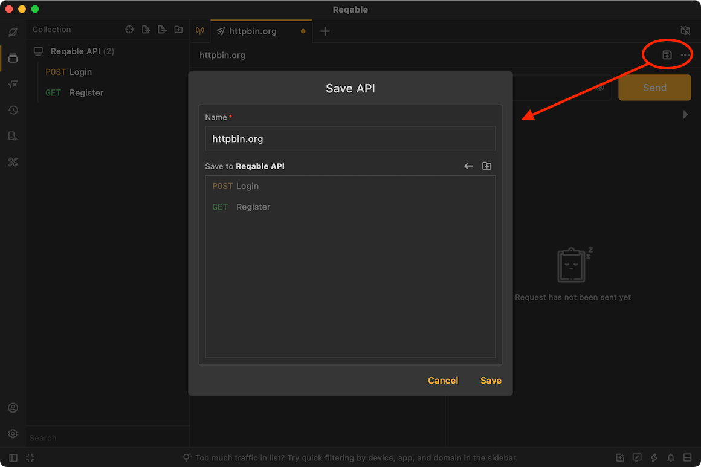
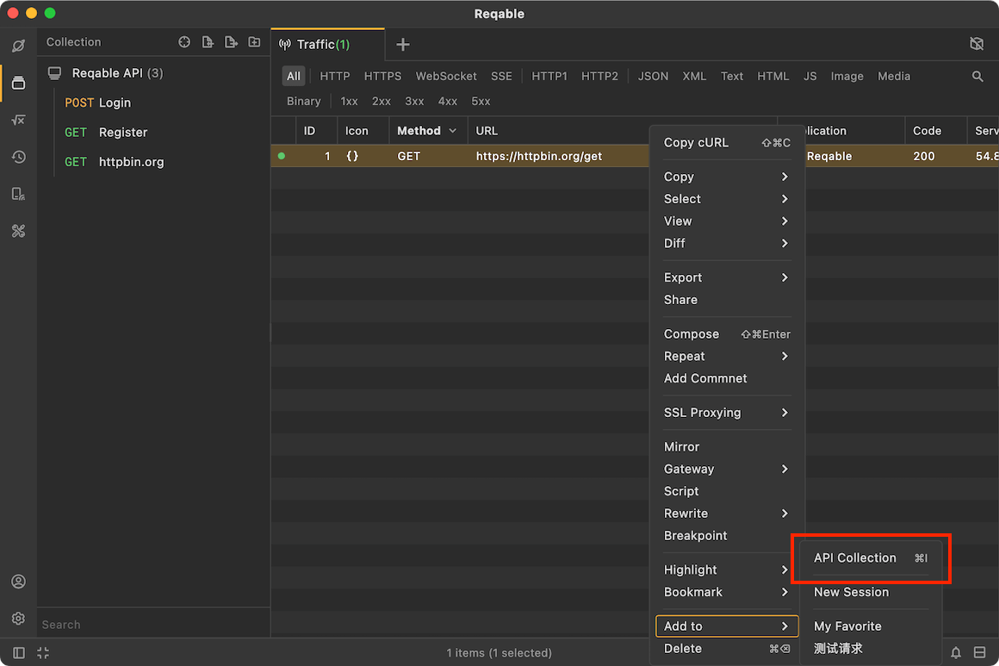
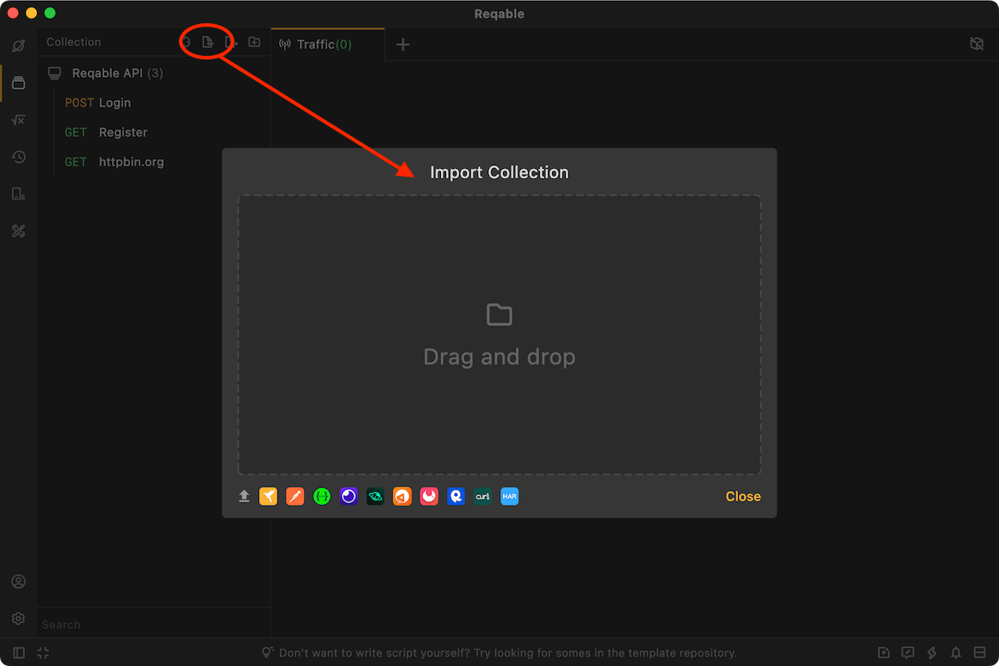
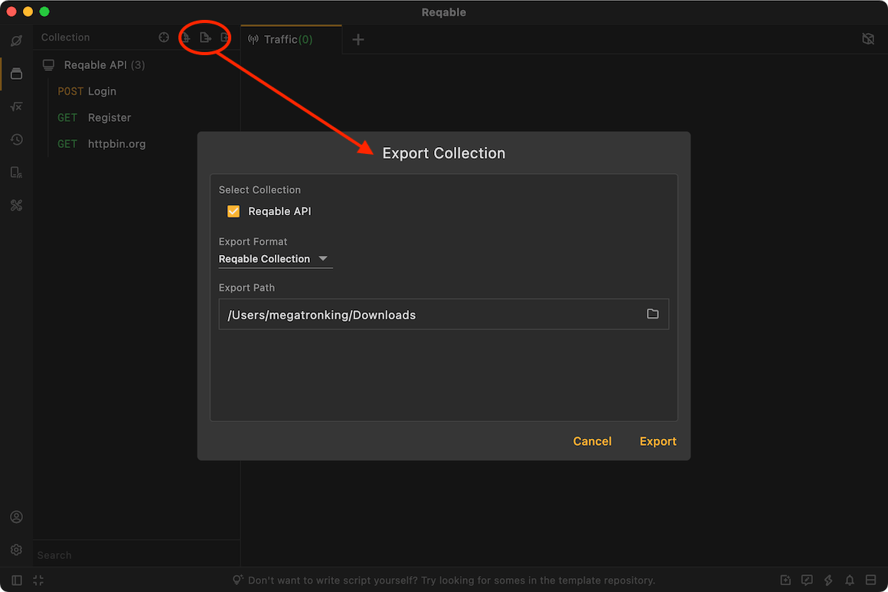
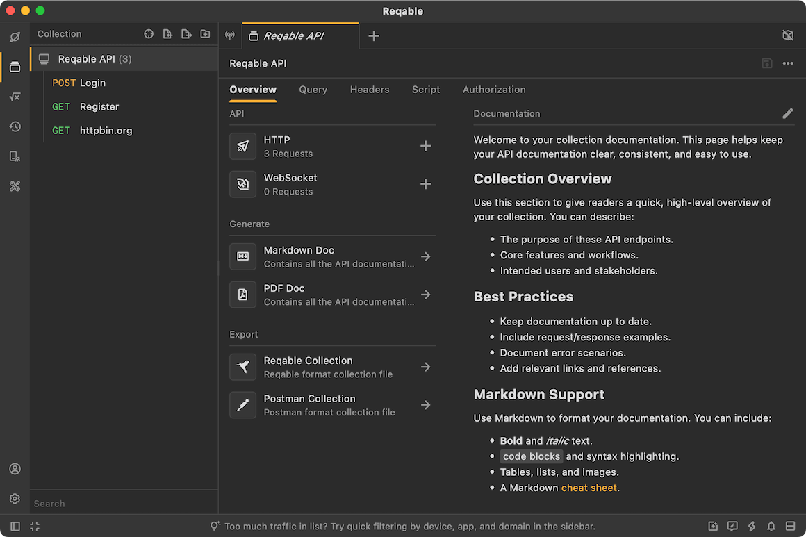

# Collection

import Shortcut from '@site/src/components/Shortcut';

Reqable supports saving API requests into collections for centralized management. Open `Collection` in the sidebar (shortcut key `F2`) to manage collection data.

Collections can contain HTTP APIs, WebSocket APIs, and folders, organized in a tree structure with a maximum depth of 4.

:::info Data Storage and Sync
- When you are not signed in, collection data is stored offline on the local device.
- After signing in, you can choose cloud storage, and collection data supports real-time sync across multiple devices.
:::

### Save API to Collection

Click the `Save` icon button to save the current API (shortcut key <Shortcut>Control + S</Shortcut>):

Enter the API name in the popup dialog and choose the target collection. After saving successfully, you can see the saved API in the collection panel in the sidebar.

### Save traffic to Collection

Reqable can save APIs from the traffic list into a collection. In the context menu, select `Add to` -> `API Collection` (shortcut key <Shortcut>Control + I</Shortcut>).

### Import Collection Files

Reqable supports importing collection files from other tools. Click the import icon to open the collection import page.

Reqable supports the following collection file types:

- Postman (JSON)
- Swagger (JSON and YAML)
- Insomnia (JSON)
- Hoppscotch (JSON)
- ApiPost (JSON)
- ApiFox (JSON)
- RapidAPI (JSON)
- cURL
- HAR

:::info Environment Variables
If the collection file contains environment variables, they are imported together as well. For more details, see [Environment Variables](../environment).
:::

### Export Collection Files

Reqable supports exporting collection files in two formats:

- Reqable file (JSON)
- Postman file (JSON)

Click the export icon to open the collection export page.

### Collection Management

Double-click a collection to open the collection management page.

On the collection management page, you can perform the following operations:

- Define common parameters, headers, scripts and authorization, which can be inherited automatically by APIs in the collection.
- Write collection documentation.
- Export documentation for all APIs in the collection.
- Export the collection file.

:::info PDF Documents
Due to technical limitations, exporting PDF documents is only available on macOS.
:::