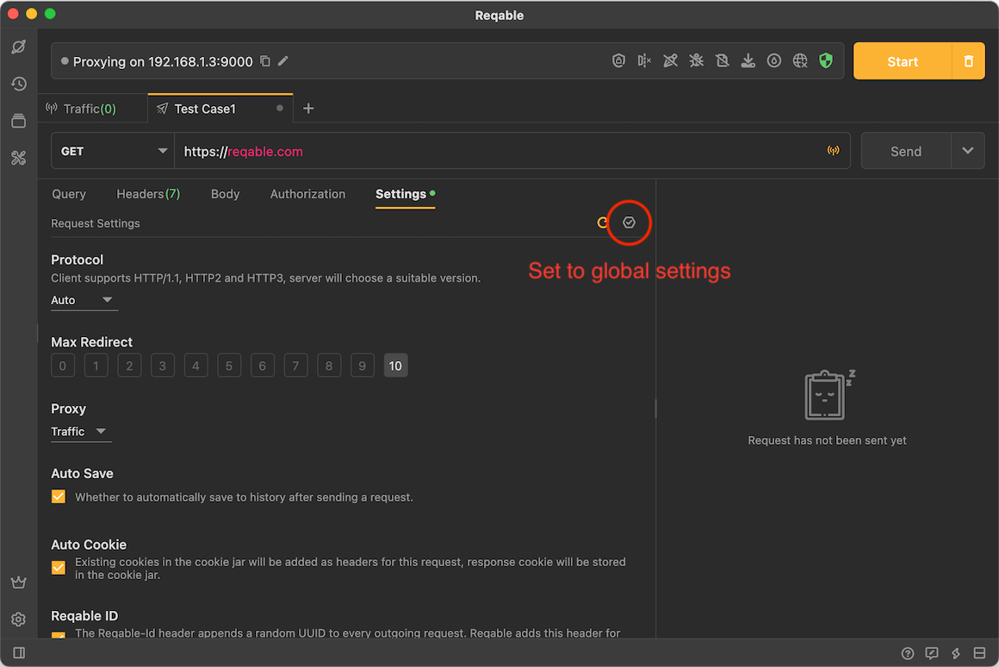

# Settings

Each API session can independently set protocol, redirection, proxy, cookie and other settings. The following are the default API settings of Reqable:

- Protocol: Auto
- Max Redirect: 10
- Proxy: Follow System
- Auto Save: Enabled
- Cookie: Enabled
- Reqable ID: Enabled

Of course, Reqable also supports configuring global API settings. Open an API setting and modify it and tap the **Apply to global** icon.

