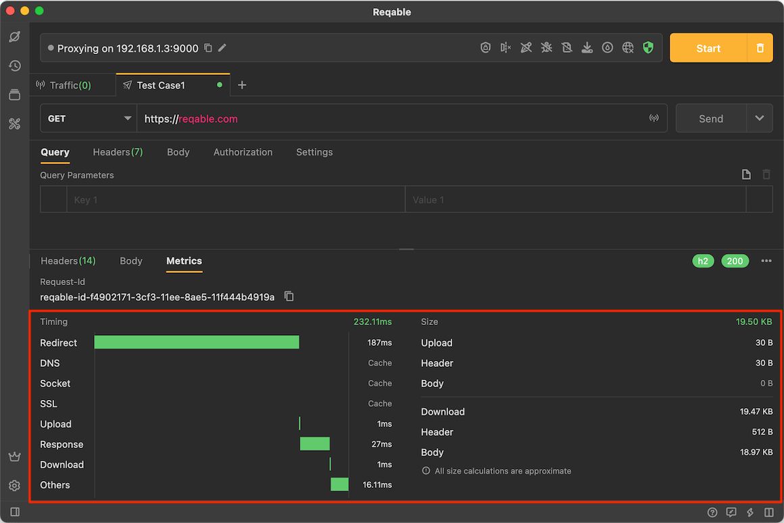

# Metrics

Reqable conducts simple statistics on requests and responses, and the dimensions include two aspects: time and size.

:::caution

If the request is redirected, it will affect the measurement. Therefore, please turn off the [Redirection](redirect) in the settings.

:::