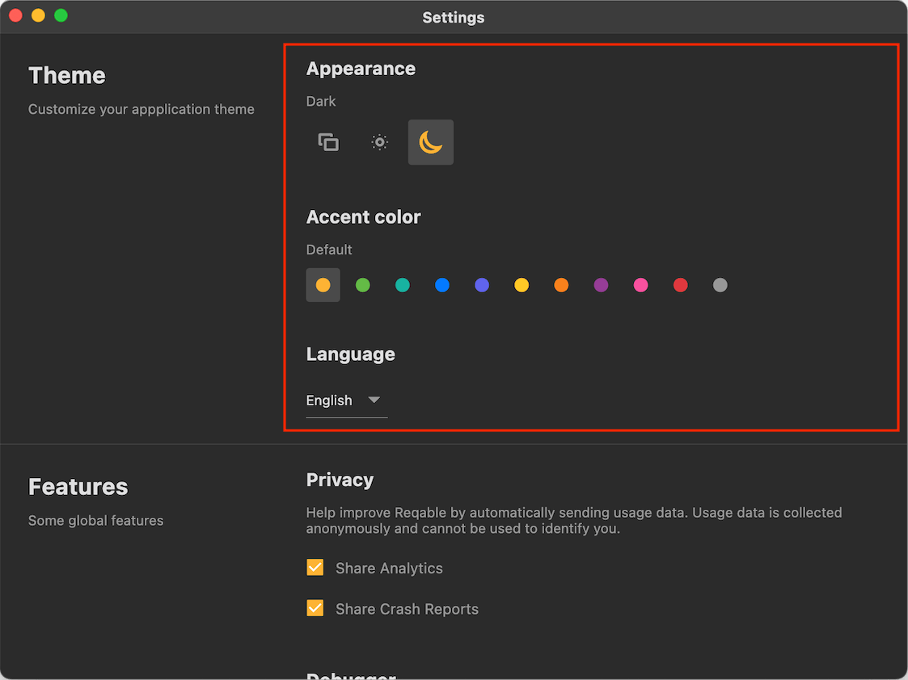
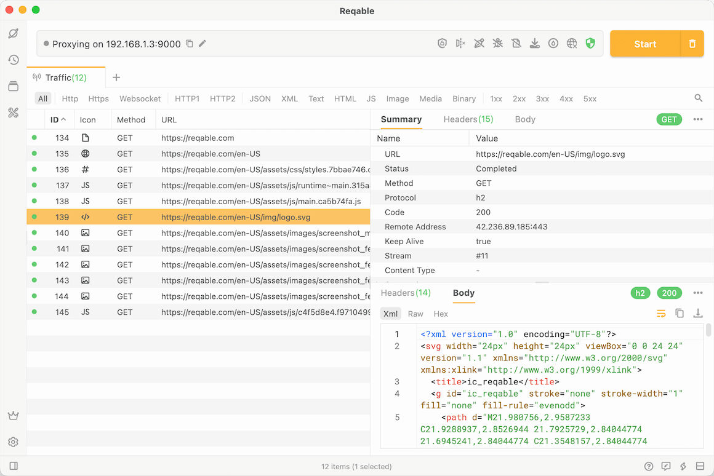
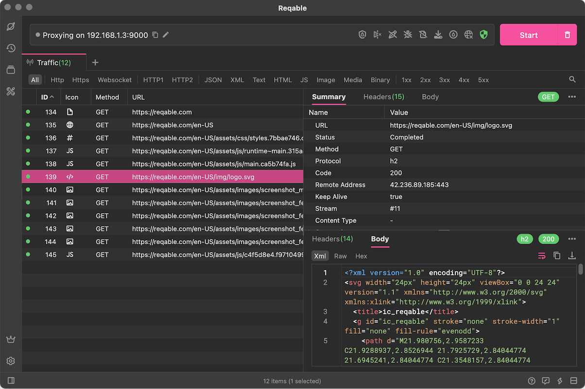

# Theme

Reqable supports colorful theme settings, you can configure theme in Settings -> Theme:

### Appearance

Reqable supports three modes: light color, dark color and follow the system (that is, use the current mode of the system).

### Accent Color

Reqable supports 11 accent colors:
- Classic (#FCB334)
- Green (#63BA46)
- Cyan (#16B2A0)
- Blue (#057AFF)
- Indigo (#6064EB)
- Yellow (#FFC726)
- Orange (#F7811C)
- Purple (#963D96)
- Pink (#F7509E)
- Red (#E0383E)
- Graphite Gray (#989898)

Here's the UI in pink:

### Code Highlight

Reqable is currently using the `Atom One` color scheme. If you have other color requirements, please leave a message under this [issue](https://github.com/reqable/reqable-app/issues/17).

### Language

Reqable currently only supports the following two languages:
- English
- Simplified Chinese