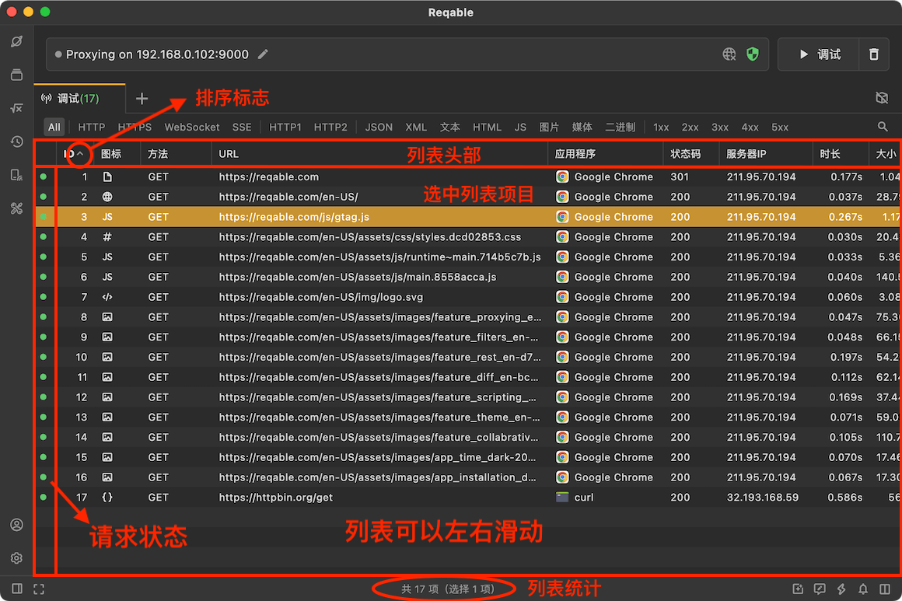
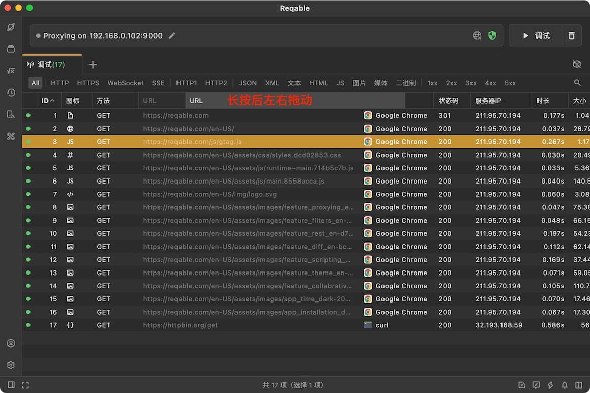
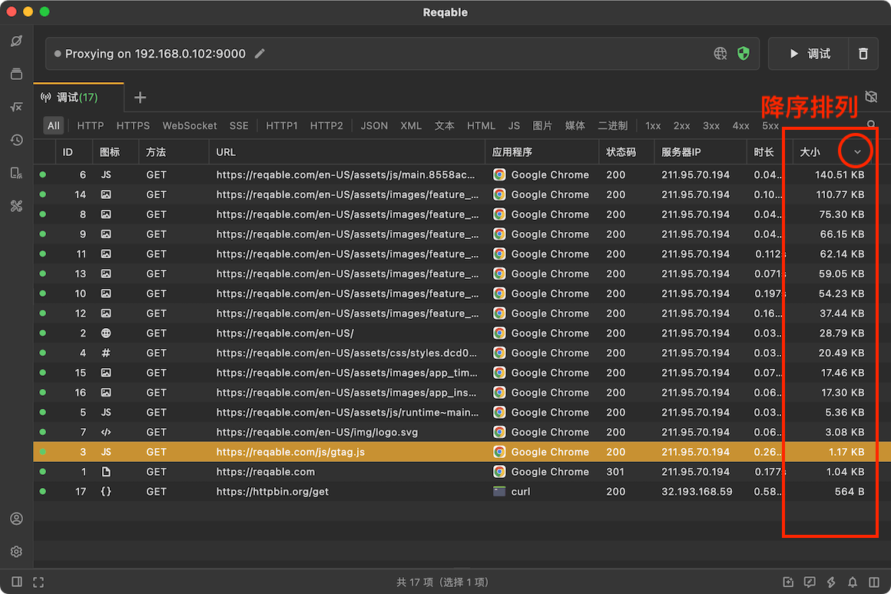
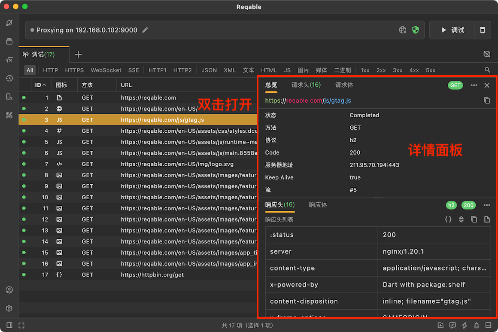
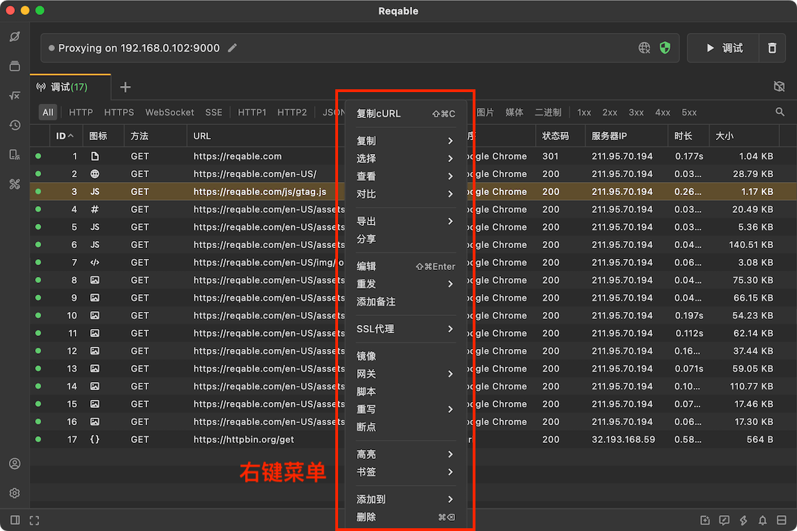

# 列表

import Shortcut from '@site/src/components/Shortcut';

无论是实时流量、历史流量查看或者HAR文件查看，Reqable都是以列表形式展示的。熟悉列表的布局和功能是进行API调试的基本要求之一，下面这张图标出了列表的重要元素和组成部分。

### 列表头部

列表头部用来控制流量信息的展示，因为在默认情况下Reqable不会展示全部的数据信息，可能需要用户根据自己的需求自主配置。我们可以通过**右键点击**列表头部打开配置菜单，点击菜单项可以勾选或者取消展示项，Reqable会记住此配置结果，即使重启应用也会生效。关于各个列表展示项的含义，可以阅读这篇文档[列选项](column)。

列表支持上下和左右滚动。如果列表横向内容过多，还可以长按左右拖动可以改变列顺序，将重要的信息前置显示。还可以左右拖动边界线来控制展示项的宽度，例如当URL内容过长时，调节URL展示项的宽度来显示更多内容。

Reqable可以基于某一个展示项进行列表排序，点击展示项可以切换行列表排序方式。例如下图，我们按照**数据大小**进行了降序排列。

### 列表操作

默认情况下，数据详情是关闭的，我们可以通过双击列表项打开详情面板，再次双击此列表项则可以关闭详情面板。当详情面板已经打开时，点击另一个列表项可以切换详情。

:::info 小技巧
关闭详情面板，有下面这四种方式：
- 双击原列表项。
- 拖动分界线。
- 快捷键 `ESC`。
- 更多图标 -> 关闭。
:::

右键点击列表项，可以打开操作菜单，可以针对选中的列表项进行操作。注意，列表项是支持多选的。

:::info 小技巧
清空列表，有下面这三种方式：
- 点击软件 **最右上角** 的垃圾篓图标。
- 右键点击标签Tab -> 清除。
- 快捷键 <Shortcut>Shift + Control + R</Shortcut>。
:::

列表操作的部分快捷键如下：

- <Shortcut>Enter</Shortcut> 查看详情。
- <Shortcut>Control + A</Shortcut> 选择列表全部项。
- <Shortcut>↑/↓</Shortcut> 上下切换选中项。
- <Shortcut>Alt + ↑/↓</Shortcut> 选择首/尾项。
- <Shortcut>Shift + ↑/↓</Shortcut> 上下连续选择。
- <Shortcut>Control + 左键点击</Shortcut> 选择多项。
- <Shortcut>Shift + 左键点击</Shortcut> 选择连续多项。

### 状态指示

状态指示总是位于列表的最前面，分为三个颜色：绿色、黄色和灰色。三种颜色分别代表三种状态：请求完成、请求失败和请求中。