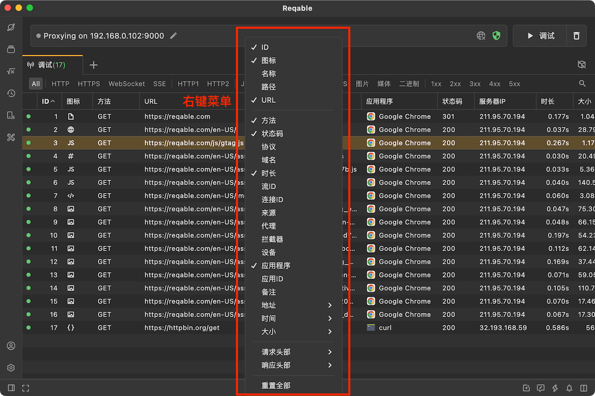
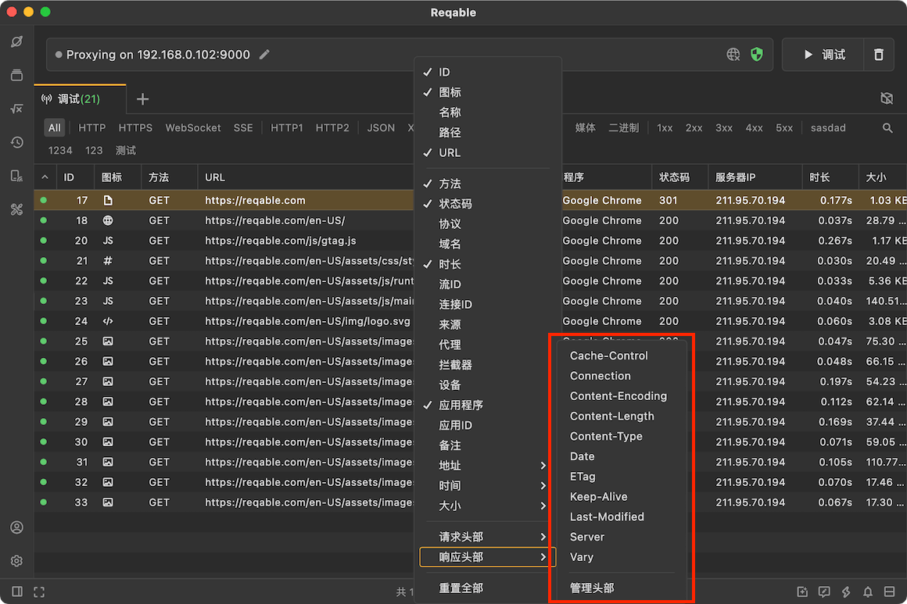

# 列选项

Reqable支持丰富的列选项，用以更好地展示流量数据信息。通过**右键点击**列表头部可以打开列选项配置菜单。

本篇文档主要是介绍各个列选项的含义。

### ID

唯一的整型ID号，按照流量进入列表的顺序自动生成，第一个请求的ID号为1，随后不断自增，即越往后的请求ID值越大。换句话说，我们可以通过ID的值判断请求的先后顺序。

### 图标

|   图标  |  含义 |
|  ----  | ----  |
||表示SSL代理请求未进行解密。当未安装CA根证书或者配置了SSL Bypass的时候代理请求会显示这种图标。|
||表示正在进行中的代理请求。当Reqable代理服务器接收到客户端流量，但尚未能与服务器建立通信链接的情况下会显示此图标。|
||表示响应体是JSON类型。|
||表示响应体是XML类型。|
||表示响应体是HTML网站类型。|
||表示响应体是Javascript类型。|
||表示响应体是CSS类型。|
||表示响应体是文本类型。|
||表示响应体是图片类型。|
||表示响应体是音频或流媒体类型。|
||表示响应体是视频类型。|
||表示响应体是压缩文件类型。|
||表示响应体是ProtoBuf类型。|
||表示响应体是OctetStream类型。|
||表示这是一个证书相关的请求。|
||表示这是一个Websocket请求。|
||表示这是一个未识别出类型的空响应请求。|
||表示这是一个未识别出类型的非空响应请求。|

### 名称

请求URL路径的最后一项，对应到常规的`GET`请求的话一般是文件名。例如下面这个请求的名称是`logo.svg`。
> https://reqable.com/zh-CN/img/logo.svg

### 路径

请求URL的完整路径PATH，例如下面这个请求的路径是`/zh-CN/img/logo.svg`。
> https://reqable.com/zh-CN/img/logo.svg

### URL

顾名思义，就是请求的完整URL，包括协议、地址、路径和参数等。注意，这里显示的是解码之后的URL。

### 方法

请求方法，`GET`、`POST`、`PUT`等。

### 状态

响应状态码，`200`、`404`、`500`等。

### 协议

HTTP协议版本名称，`HTTP/1.1`表示HTTP协议1.1版本，`h2`表示HTTP2协议版本。注意，这里显示的是ALPN中的协议版本名称。

### 域名

请求URL中的域名HOST，注意这里有可能会显示IP地址。

### 时长

从Reqable代理服务器接收到请求开始，到Reqable代理服务器发送响应数据结束，这两者之间的时间差值。

### 流ID

在TCP连接复用的情况下，一个连接中可能处理多个HTTP请求，Reqable将此连接中的每一个HTTP请求视为一个流。虽然在HTTP1的规范中，没有流（Stream）的概念，但为了更好地反应连接复用的情况，Reqable从1开始为每个HTTP请求赋予流ID的值，即第一个请求的流ID为1，第二个请求的流ID为2，依次类推。在HTTP2的规范中，本身存在流（Stream）的概念，所以Reqable在这里直接显示流的ID号。注意，按照HTTP2的规范，流ID是按照奇数赋值的，即第一个请求的流ID为1，第二个请求的流ID为3，这一点和HTTP1略有不同。

### 连接ID

TCP连接的ID号，从1开始。Reqable代理服务器每接收到一个客户端TCP连接请求，都会将ID加1。通过对比连接ID的值，我们可以判断哪些HTTP请求是复用了TCP连接。

### 来源

流量来源，由于Reqable底层是使用Netbare库作为MITM核心，所以捕获到的流量的来源都会显示成`Netbare`。注意，这里的来源并非是表示客户端信息。如果是查看一个HAR文件，这里的来源显示的是`Creator`的值。

### 代理

显示此请求所使用的代理协议名称，例如`http`、`https`、`socks4`和`socks5`等。关于代理协议，请阅读[代理协议](proxy)。

### 拦截器

显示此请求被哪些拦截器处理过，每一个拦截器都会显示相应的图标。如果一个请求被多个拦截器处理过，这里会显示多个图标。支持的拦截器见下表。

|   图标  |  含义 |
|  ----  | ----  |
||表示此请求被镜像处理过。|
||表示此请求被重写处理过。|
||表示此请求被断点处理过。|
||表示此请求被脚本处理过。|

:::info
此功能于`v1.1.4`版本开始支持。
:::

### 应用程序

显示此流量所属的应用程序（或可执行文件），正常情况下会显示出应用程序（或可执行文件）的名称和图标。注意，请由于部分应用程序（或可执行文件）可能没有图标，这里会使用一个默认图标代替。另外，由于某些不确定性情况，一些应用程序（或可执行文件）可能无法被定位到。

:::info
此功能于`v1.3.0`版本开始支持。
:::

### 地址 - 服务器IP

表示服务器IP地址，可能是IPv4也可能是IPv6。

### 地址 - 服务器端口

表示服务器端口号，HTTP请求默认端口号是80，HTTPS请求默认端口号是443。

### 地址 - 本机IP

表示客户端IP地址。通过此IP可以区分流量来源，例如`127.0.0.1`表示当前设备。

### 地址 - 本机端口

表示客户端的端口号。

### 时间 - 请求开始

Reqable代理服务器接收到请求开始的时间点。表示一个请求会话开始的时间。

### 时间 - 请求结束

Reqable代理服务器接收请求完成的时间点。

### 时间 - 响应开始

Reqable代理服务器接收到远程服务器响应开始的时间点。

### 时间 - 响应结束

Reqable代理服务器完成向客户端发送响应的时间点。表示一个请求会话结束的时间。

### 头部信息

Reqable除了支持上面这些列选项，还支持显示请求头和响应头的值，例如`Content-Type`等。Reqable内置了一些常用的请求头名称，如果使用的时候不够还可以通过`管理头部`自行添加。

