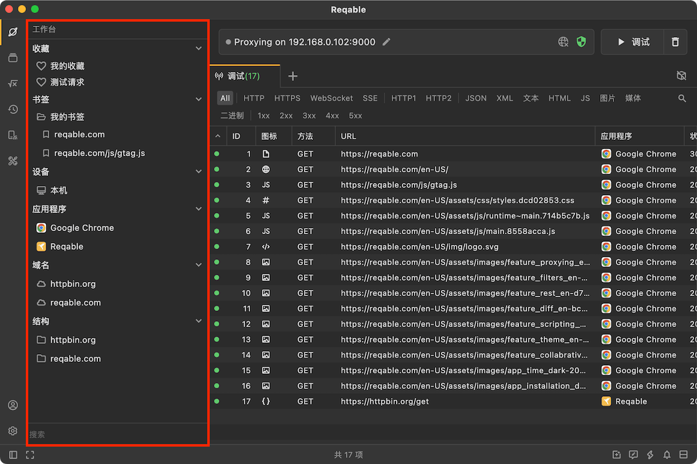
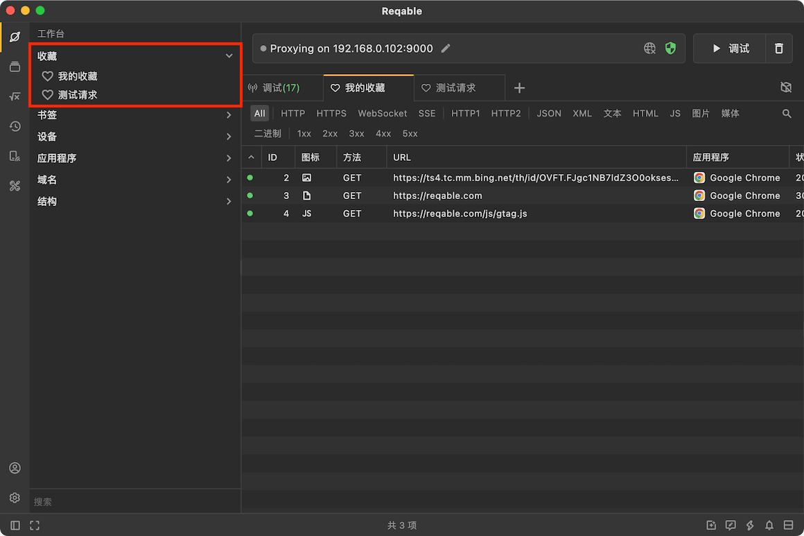
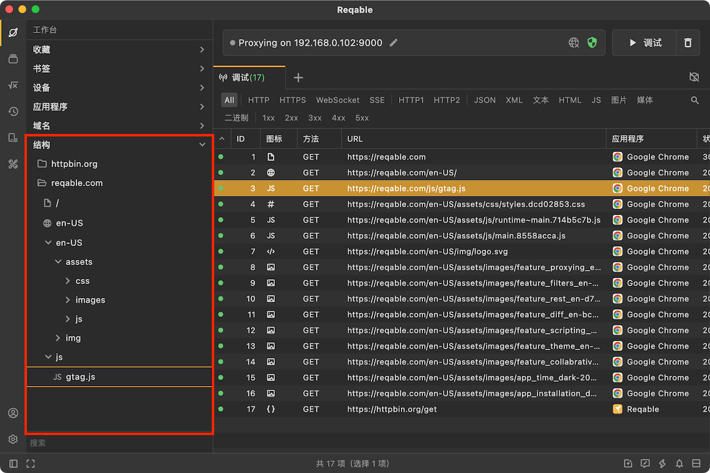
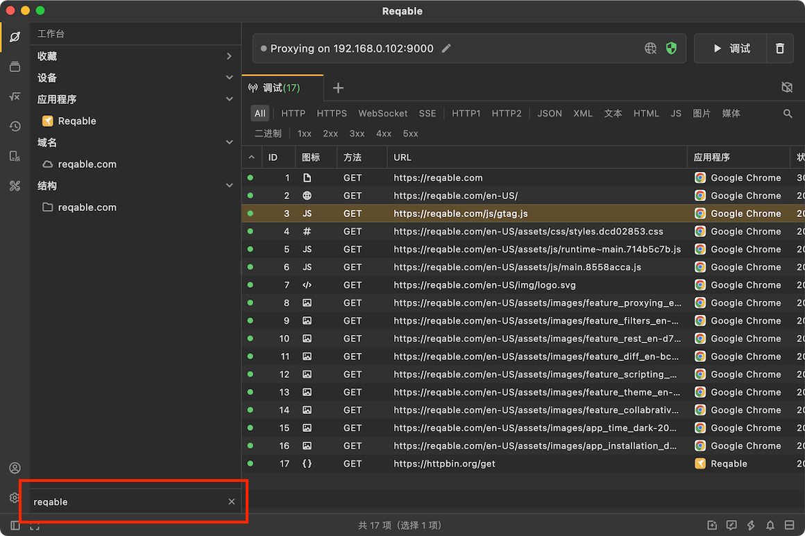

# 工作台

除了主内容区域操作外，Reqable还提供了**工作台**侧边栏用于辅助操作。点击侧边栏的第一个图标，可以打开工作台面板。工作台中包含五个部分：[收藏](#favorite)、[书签](./search#bookmark)、[设备](./search#device)、[应用程序](./search#application)、[域名](./search#domain)和[结构树](#structure)。

其中，`书签`、`设备`、`应用程序`和`域名`作为列表筛选器，具体作用可以在[筛选和搜索](./search)中查看。

### 收藏 {#favorite}

用户可以在[调试列表](./list)中将请求记录添加到收藏文件夹（右键菜单 -> 添加到 -> 收藏文件夹），在工作台中可以打开收藏文件夹查看和管理已收藏的请求记录。Reqable默认内置了`我的收藏`文件夹，用户也可以自行创建自定义的收藏文件夹。

### 结构树 {#structure}

结构树是列表的另一种展现形式，以文件目录的形式展示流量内容，在某些时候比列表更加直观。在结构树中点击请求，同样可以展开详情面板。

另外，对于文件目录右键还可以此目录下的全部请求进行批量操作。

### 搜索

在底部搜索输入框可以对`设备`、`应用程序`和`域名`进行快速筛选。

