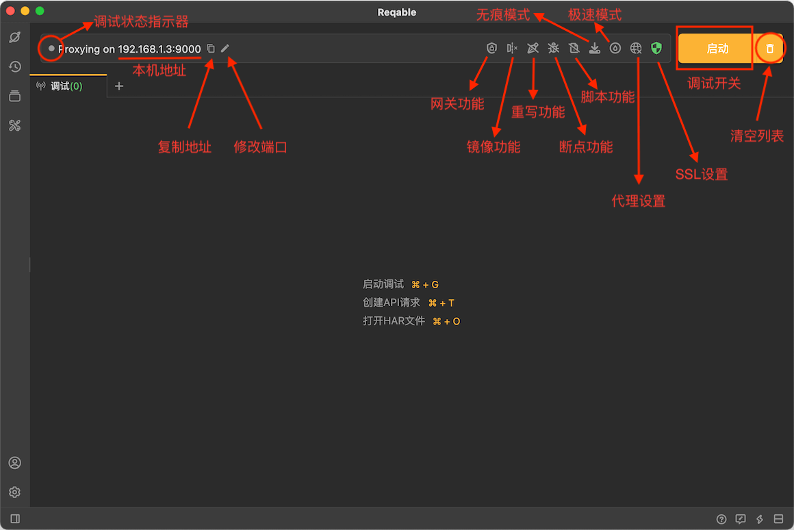

# 快捷操作栏

Reqable调试功能相关的操作入口几乎都放在了顶部的操作栏上，具体的功能说明如下图：

### 代理IP和端口

操作栏上会显示本机的IP和MITM代理服务器的端口号，便于远程设备局域网连接时快速设置。同时提供了两个快捷功能：
- 复制IP和端口号
- 修改端口号

### 网关功能

Reqable调试的核心功能之一：对指定请求或响应进行屏蔽，挂起，中断等操作，详细内容请阅读[网关](gateway)。

### 镜像功能

Reqable调试的核心功能之一：对指定域名配置镜像，详细内容请阅读[镜像](mirror)。

### 重写功能

Reqable调试的核心功能之一：预设规则对指定请求或响应进行替换或修改等，详细内容请阅读[重写](rewrite)。

### 断点功能

Reqable调试的核心功能之一：对请求或响应进行实时断点操作，详细内容请阅读[断点](breakpoint)。

### 脚本功能

Reqable调试的核心功能之一：编写和挂载Python脚本处理请求或响应，详细内容请阅读[脚本](script)。

### 系统代理状态指示器

系统代理状态指示器。详细内容请阅读[系统代理](proxy)。

### SSL证书状态指示器

SSL证书安装状态指示器。详细内容请阅读[SSL配置](ssl)。