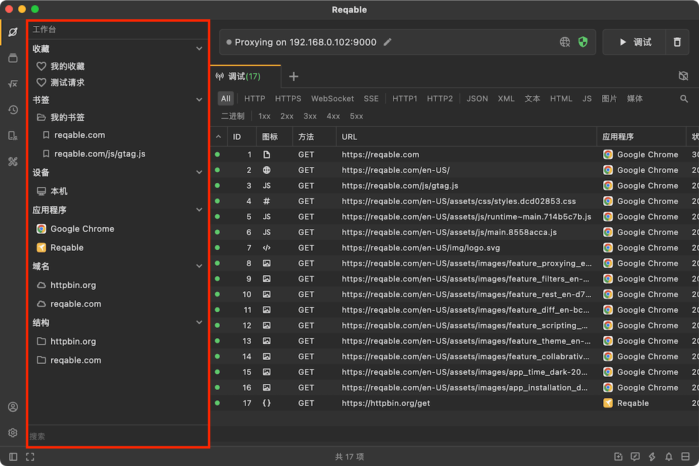
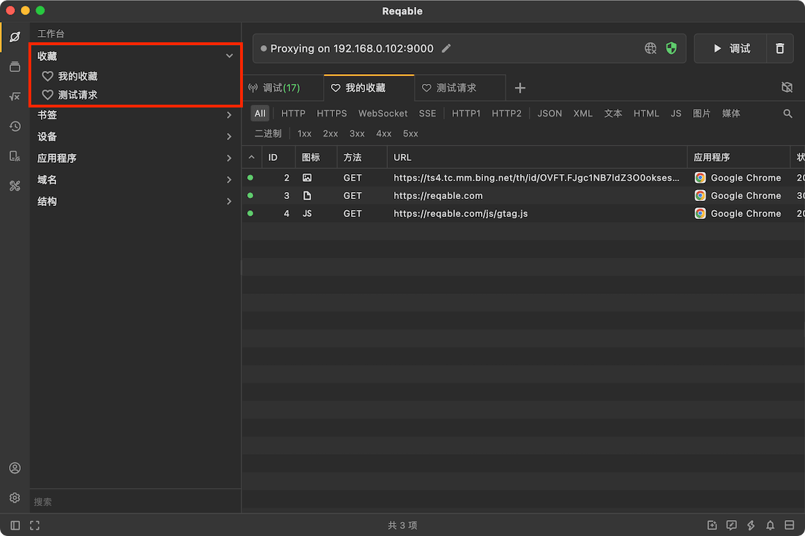
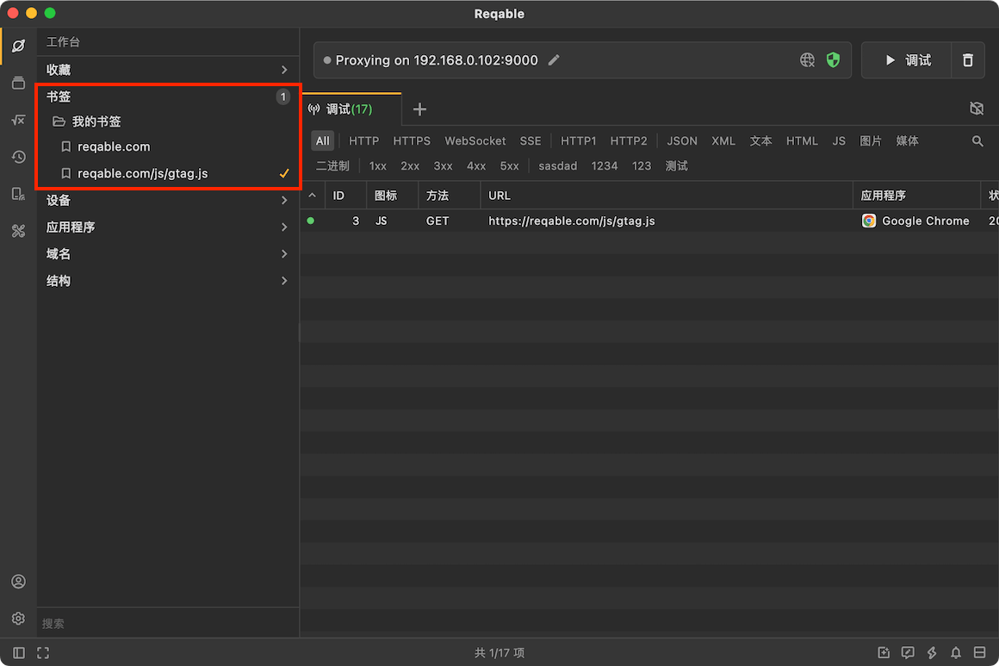
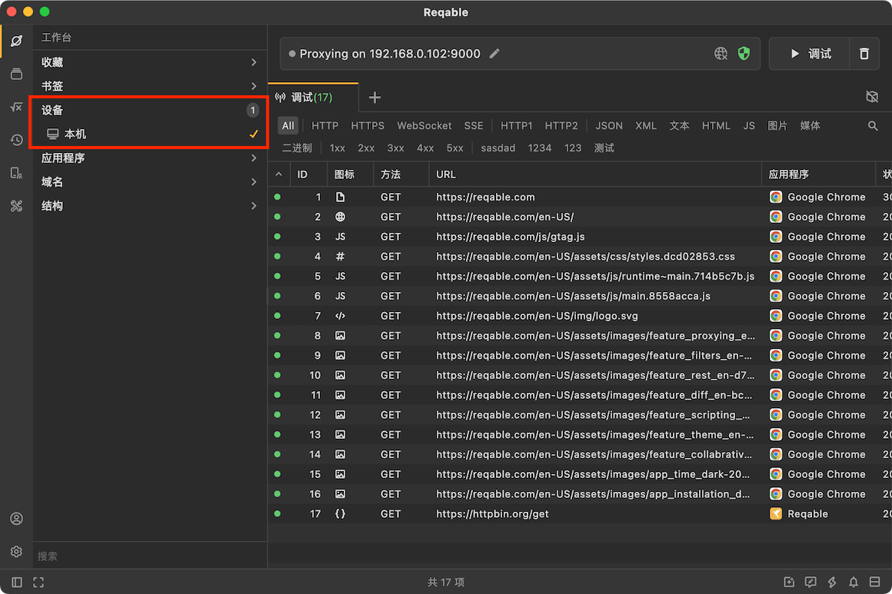
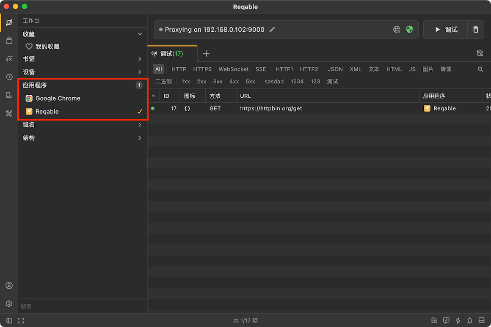

# 工作台

除了主内容区域操作外，Reqable还提供了**工作台**侧边栏用于辅助操作。点击侧边栏的第一个图标，可以打开工作台面板。工作台中包含三个部分：[书签](#bookmark)、[域名](#domain)和[结构树](#structure)。




### 书签 {#bookmark}

书签用于快速筛选请求，书签通过文件夹（目前只支持单级目录）的方式进行管理。右键点击 **书签** 可以创建文件夹，在文件夹上右键点击可以新建书签，当然，我们还可以从列表的请求中创建书签。



书签按照目录结构过滤请求，例如 `https://reqable.com/zh-CN/` 可以过滤出下面的所有请求：

```
https://reqable.com/zh-CN/img/logo.svg
https://reqable.com/zh-CN/assets/css/styles.7bbae746.css
```

即只要是域名 `reqable.com` 中 `zh-CN` 目录下的请求都会被过滤出来。如果书签是域名本身，那么此域名下面的所有请求都会被过滤出来。



### 域名 {#domain}

域名同样用于快速筛选请求，并且可以和书签同时使用（或的逻辑关闭）。工作台中会显示出列表中全部的域名数据，用户可以根据实际情况选择一个或者多个域名进行过滤，未选择的情况下列表将会显示全部。



:::info 小技巧
- 双击可以单选。
- 点击数字可以取消全部选择。
:::

### 结构树 {#structure}

结构树是列表的另一种展现形式，以文件目录的形式展示流量内容，在某些时候比列表更加直观。在结构树中点击请求，同样可以展开详情面板。另外，对于文件目录右键还可以此目录下的全部请求进行批量操作。

