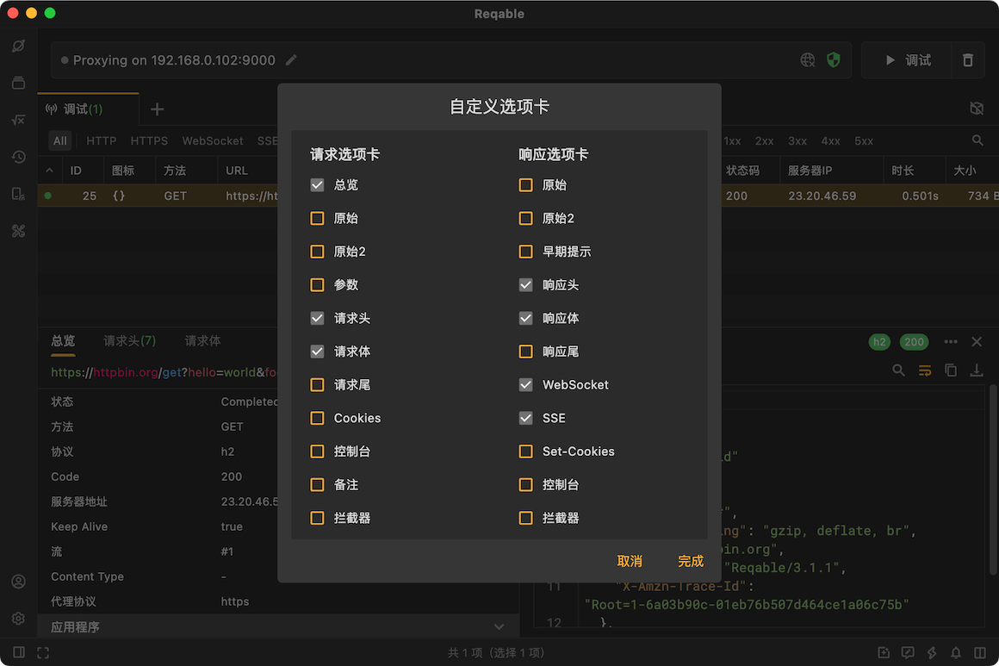
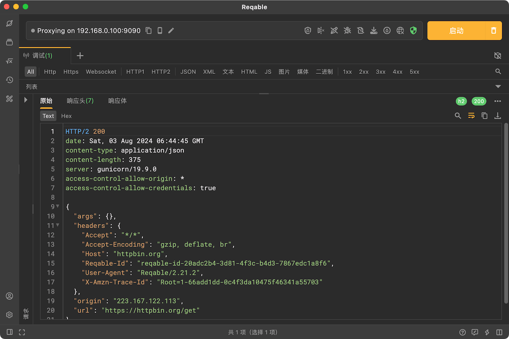
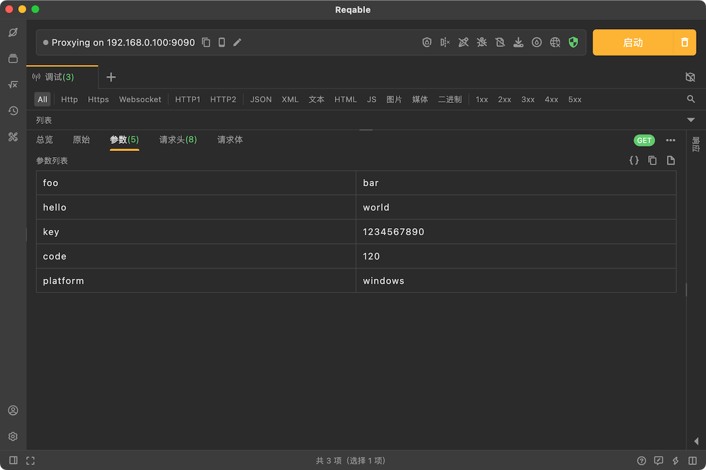
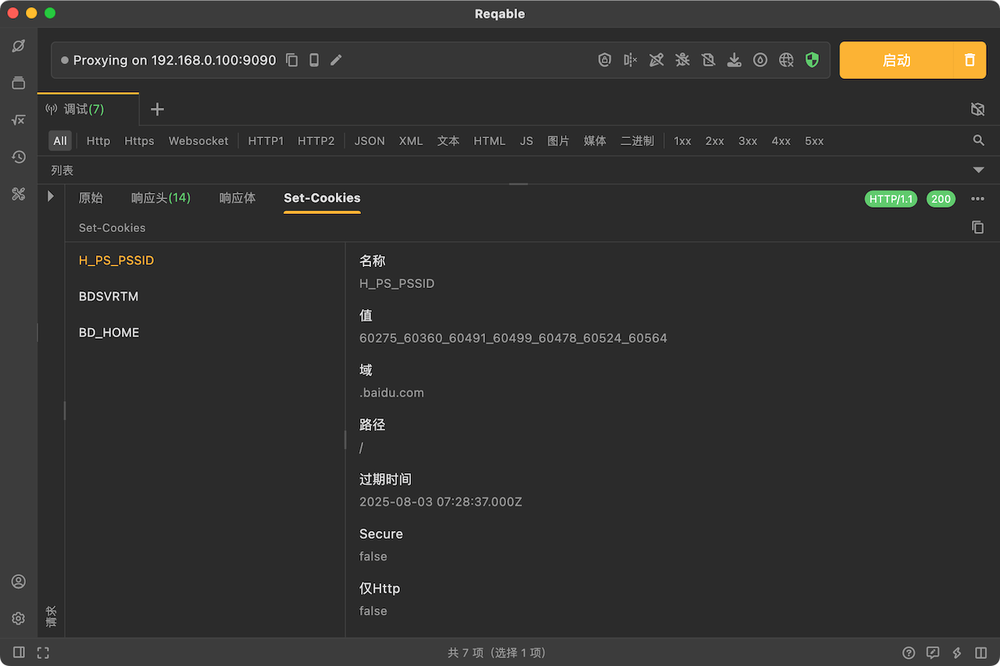

# 标签页

在HTTP流量的会话详情里面，我们会按照Tab的形式展示数据，点击Tab可以进行切换，查看不同部分的数据。

展开最右边更多菜单，选择`自定义选项卡`可以进入Tab管理页面，自定义控制哪些Tab内容显示或不显示。

:::caution
如果Tab在实际会话内容中没有相关数据，可能不会显示，即使已经勾选了。
:::

### 总览 {#summary}

在总览Tab中会显示一个HTTP请求的整体信息，比如请求URL、状态、请求方法、协议版本、响应状态码、服务器地址、连接信息、TLS信息、证书信息、时间和大小等等细节内容。

### 原始 {#raw}

在原始Tab中会按照HTTP/1.1的协议规范展示请求或响应的原始报文。请求原始报文包含请求行、请求头和请求体，响应原始报文包含状态行、响应头和响应体。

### 参数 {#query}

在参数Tab中会显示请求的查询参数。如果请求没有查询参数，此Tab将不会显示。

### 头部 {#header}

在头部Tab中会显示请求头或者响应头列表。作为HTTP协议的必要组成部分，此Tab将固定显示，无法取消。

### 数据 {#body}

在数据Tab中会显示请求体或者响应体数据。作为HTTP协议的必要组成部分，此Tab将固定显示，无法取消。

Reqable支持多样化的数据展示和预览，例如JSON、XML、二进制、图片、MultiParts等等。

### 尾部 {#trailer}

在部分HTTP/1.1和HTTP2协议规范中，支持在请求体或者响应体之后发送Trailers，这部分数据将会显示在尾部Tab中。如果一个请求或响应没有相关数据，此Tab将不会显示。

### Cookie {#cookie}

在Cookie Tab中会显示请求的Cookie数据。如果请求没有Cookie，此Tab将不会显示。

### Set-Cookie {#cookie}

在Set-Cookie Tab中会显示响应返回的Cookie数据。如果响应没有Set-Cookie，此Tab将不会显示。

### 控制台 {#console}

在控制台Tab中会显示脚本执行时输出的日志内容。如果没有日志，此Tab将不会显示。

### 备注 {#comment}

在备注Tab中会显示当前请求的备注内容，用户可以在此Tab中修改和提交备注内容。只要勾选显示此Tab，将会一直显示。

### Websocket {#websocket}

如果一个请求是Websocket，原来的数据Tab将会自动变为Websocket Tab，展示Websocket的帧数据。

### 早期提示 {#earlyHint}

在HTTP2协议规范中，服务器在发送数据之前可能会先响应`103 Early Hints`，在此Tab中将会显示早期提示（Early Hints）的数据。如果响应中没有早期提示，此Tab将不会显示。

### 堆栈跟踪 {#stackTrace}

这是一项实验性的功能，需要在具备lsposed的环境下，安装算法助手Pro（请关注公众号`算法助手Plus`下载安装包），并在其设置中启用`Reqable增强`开关。启用后，Reqable将会显示目标应用中网络请求调用的Java堆栈信息。

