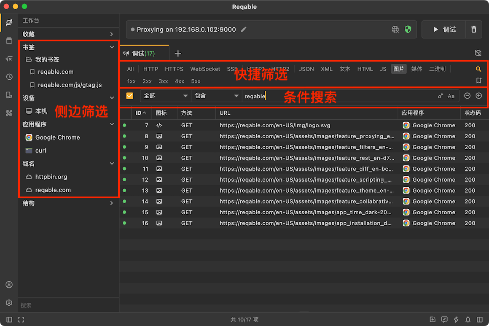
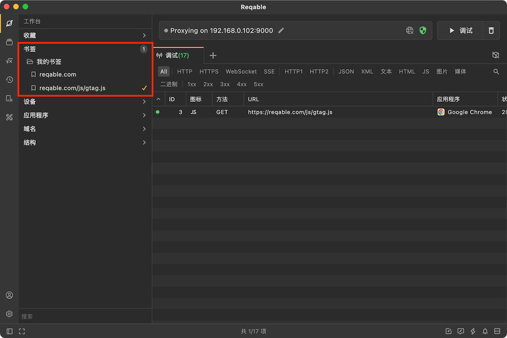
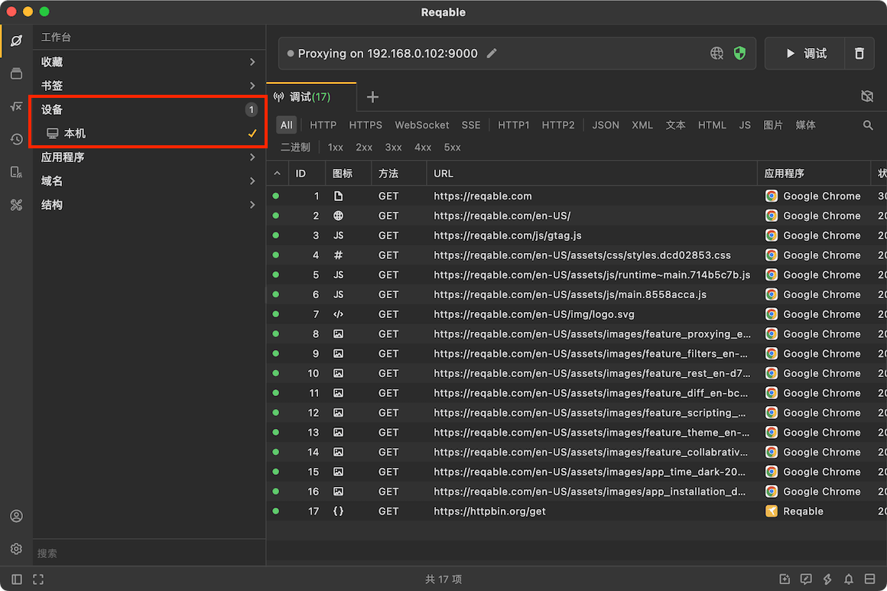

# 筛选和搜索

import Shortcut from '@site/src/components/Shortcut';

Reqable提供了4种数据筛选功能，分别是书签筛选、域名筛选、快捷筛选和搜索筛选。其中书签筛选和域名筛选位于侧边栏[工作台](explorer)，在前面的文档中已经介绍过了，本篇主要内容是介绍快捷筛选和搜索筛选。

### 快捷筛选

快捷筛选位于列表顶部，分为三个部分：协议、内容类型和状态码，不同部分的筛选项可以共存，逻辑关系为`与`。各筛选项点击即可进行快速筛选，再次点击可以取消筛选。

:::note
1xx、2xx、4xx等表示状态码范围，例如4xx表示，400-499这个范围。
:::

### 搜索筛选

Reqable提供了最多三组搜索条件，支持全局搜索和细分条件搜索。点击快速筛选栏最右侧的放大镜按钮打开，或者使用快捷键 <Shortcut>Control + F</Shortcut> 打开。

上图是Reqable支持的筛选条件，注意，每组筛选条件之间的逻辑关系为`与`。

筛选内容的输入分为两种类型，分别是文本输入和选择输入。文本输入支持匹配大小写和正则表达式，选择输入只需要点击输入框在弹出的菜单中选择即可。部分类型的文本输入会有内容提示，例如请求类型，服务器地址等。

:::info 小技巧
当有多台设备的流量显示在列表中的时候，可以使用`客户端地址`进行搜索筛选，例如`127.0.0.1`表示当前电脑本机。
:::