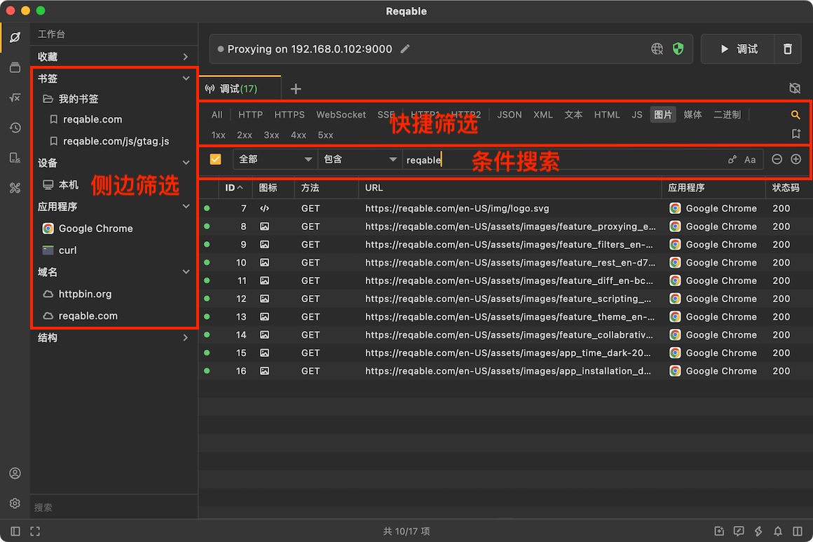
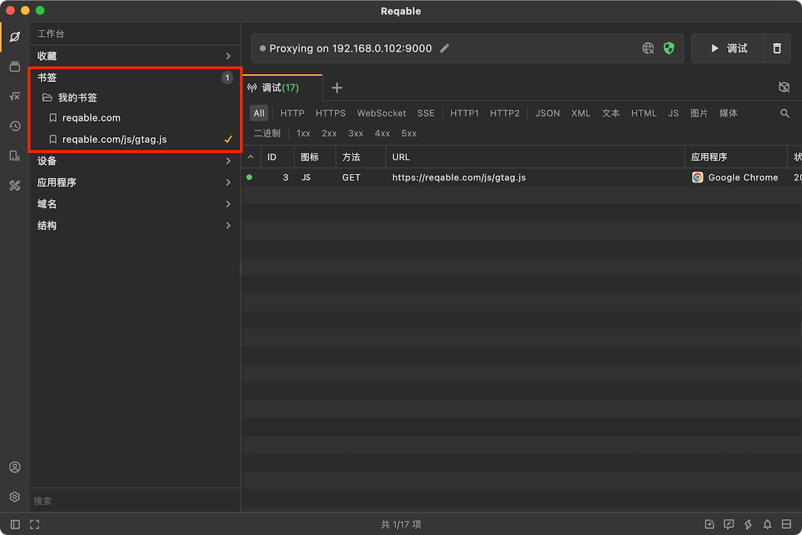
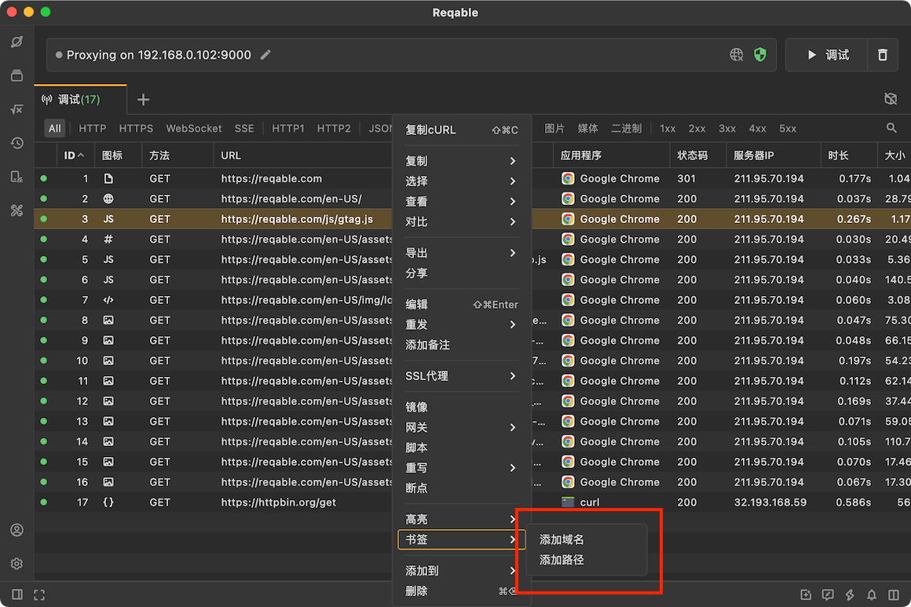
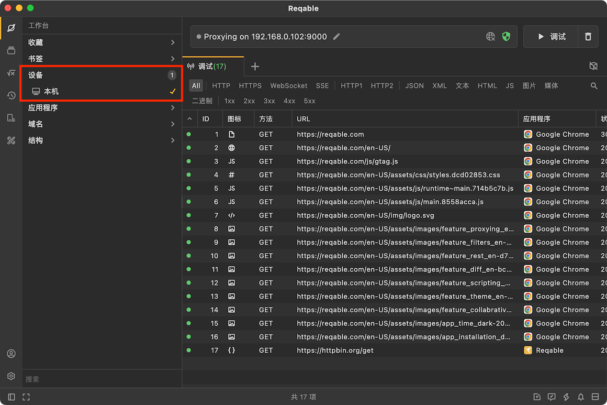
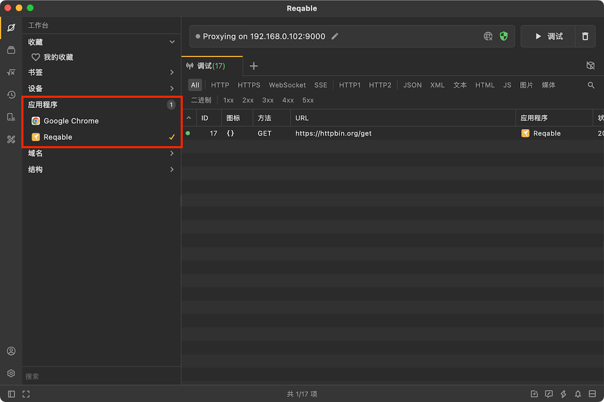
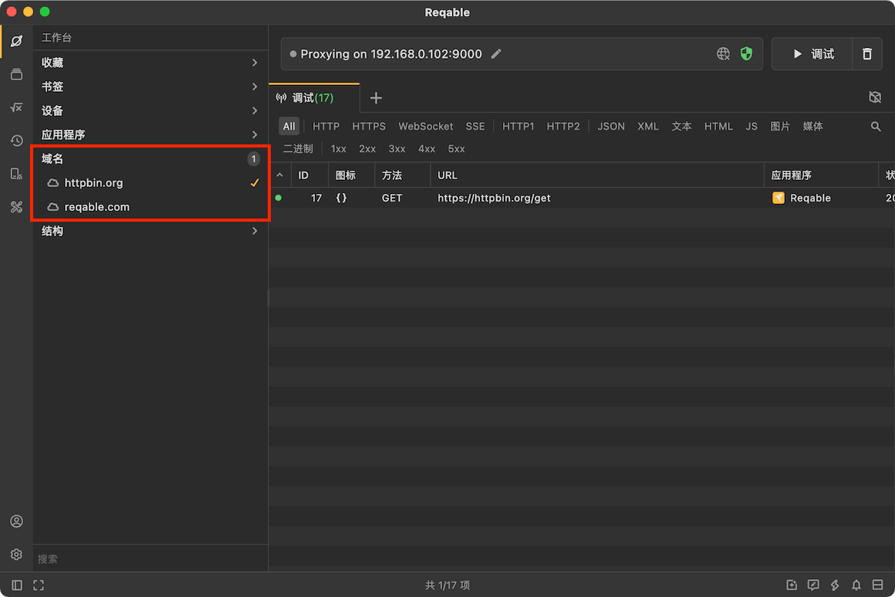
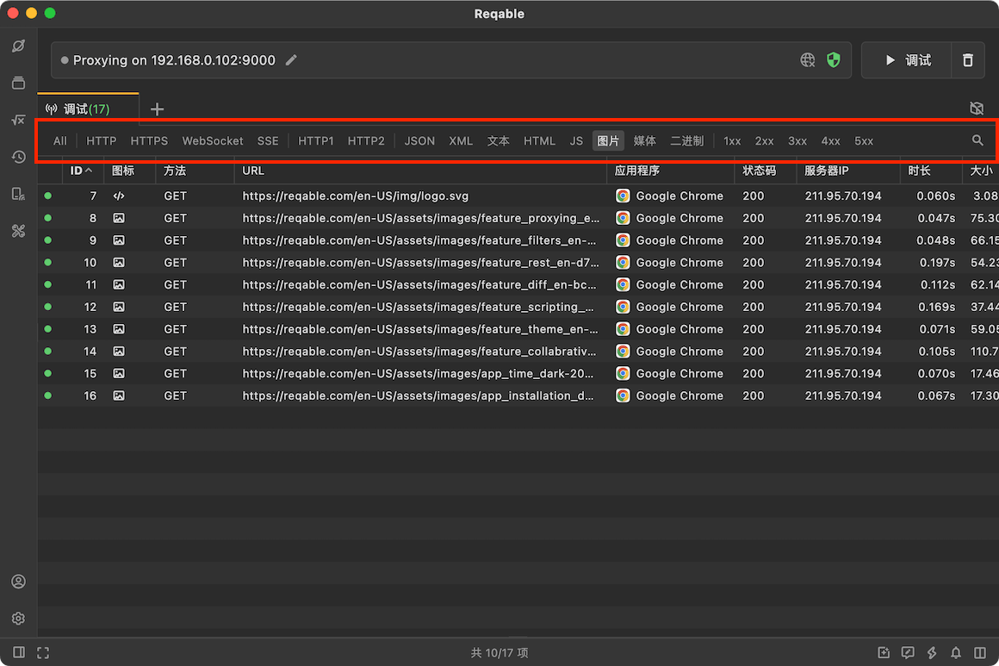
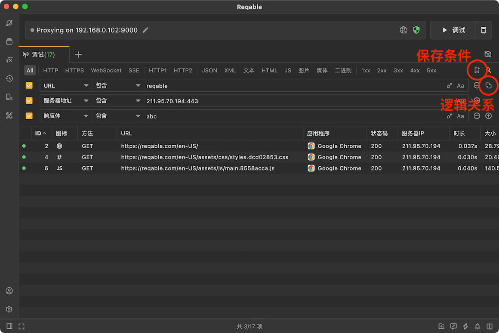
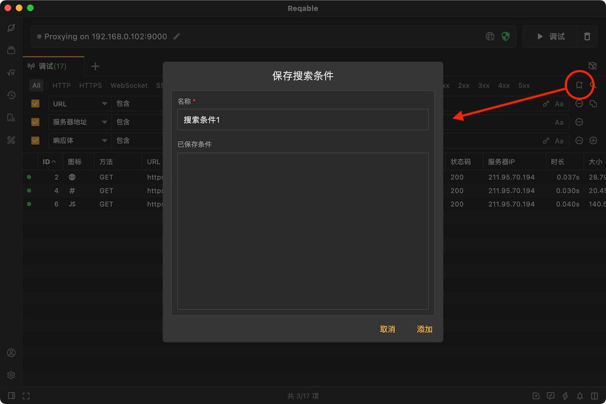

# 筛选和搜索

import Shortcut from '@site/src/components/Shortcut';

Reqable提供了多样化的数据筛选器，分别是[书签](#bookmark)、[设备](#device)、[应用程序](#application)、[域名](#domain)、[快捷筛选](#quick-filter)和[条件搜索](#search-filter)。其中`书签`、`设备`、`应用程序`和`域名`位于侧边栏[工作台](explorer)，`快捷栏`和`条件搜索`则位于列表顶部。

### 书签 {#bookmark}

书签用于快速筛选请求，点击书签后将在列表中过滤出匹配的请求。书签支持多选，多选时将按照`或`的逻辑关系过滤。

书签通过文件夹（只支持单级目录）的方式进行管理。文件夹右键可以新建书签，我们还可以从[调试列表](./list)中的请求直接创建书签。

Reqable默认内置了`我的书签`文件夹，用户也可以自行创建自定义的书签文件夹。

### 设备 {#device}

设备用于快速筛选请求，和[书签](#bookmark)是`或`的逻辑关系。工作台中会显示出列表中全部的设备名称（如果以非[协同模式](../getting-started/collaboration)连接到本机将显示IP源地址），用户可以根据实际情况选择一个或者多个设备进行过滤，未选择的情况下列表将会显示全部。

:::info 小技巧
- 双击可以单选。
- 点击数字可以取消全部选择。
- 右键可以`固定`应用程序到顶部并一直保留。
:::

### 应用程序 {#application}

应用程序用于快速筛选请求，和[书签](#bookmark)是`或`的逻辑关系。工作台中会显示出列表中全部的应用程序（未检测到应用程序来源的流量将显示`未知应用`），用户可以根据实际情况选择一个或者多个应用程序进行过滤，未选择的情况下列表将会显示全部。

### 域名 {#domain}

域名用于快速筛选请求，和[书签](#bookmark)是`或`的逻辑关系。工作台中会显示出列表中全部的域名数据，用户可以根据实际情况选择一个或者多个域名进行过滤，未选择的情况下列表将会显示全部。

### 快捷筛选 {#quick-filter}

快捷筛选位于列表顶部，分为三个部分：协议、内容类型和状态码，不同部分的筛选项可以共存，逻辑关系为`与`。各筛选项点击即可进行快速筛选，再次点击可以取消筛选。

:::note
1xx、2xx、4xx等表示状态码范围，例如4xx表示，400-499这个范围。
:::

### 条件搜索 {#search-filter}

Reqable提供了最多三组搜索条件，支持全局搜索和细分条件搜索。点击快速筛选栏最右侧的放大镜按钮打开，或者使用快捷键 <Shortcut>Control + F</Shortcut> 打开。

搜索支持的匹配项目，包含如下：

- 全部
- URL
- 方法
- 请求类型
- 请求头
- 请求体
- 响应类型
- 响应头
- 响应体
- 状态码
- 服务器地址
- 客户端地址
- 高亮
- 拦截器
- 备注
- 控制台

搜索支持的匹配类型，包含如下：

- 包含
- 不包含
- 等于
- 不等于
- 开始于
- 结束于
- 匹配通配符
- 不匹配通配符
- 匹配正则
- 不匹配正则

Reqable免费会员提供一组搜索条件，付费会员最多提供三组搜索条件。

每组筛选条件之间的逻辑关系默认为`与`，你可以在点击上图中的按钮切换逻辑关系为`或`。点击上图中的保存条件按钮，可以将保存当前设置的条件。保存的搜索条件位于快捷筛选栏，下次点击可以直接应用。

:::info 深度搜索
有些非ASCII字符会用Unicode编码，例如中文汉字。默认情况下，出于性能考虑，Reqable搜索不会还原成原文进行匹配。如有这种情况，请启用`深度搜索`（输入框尾部有个铲子图标）。
:::