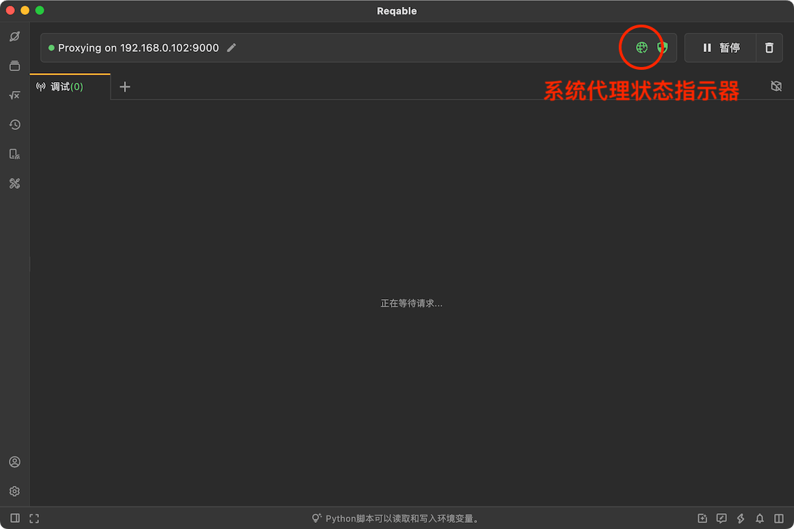
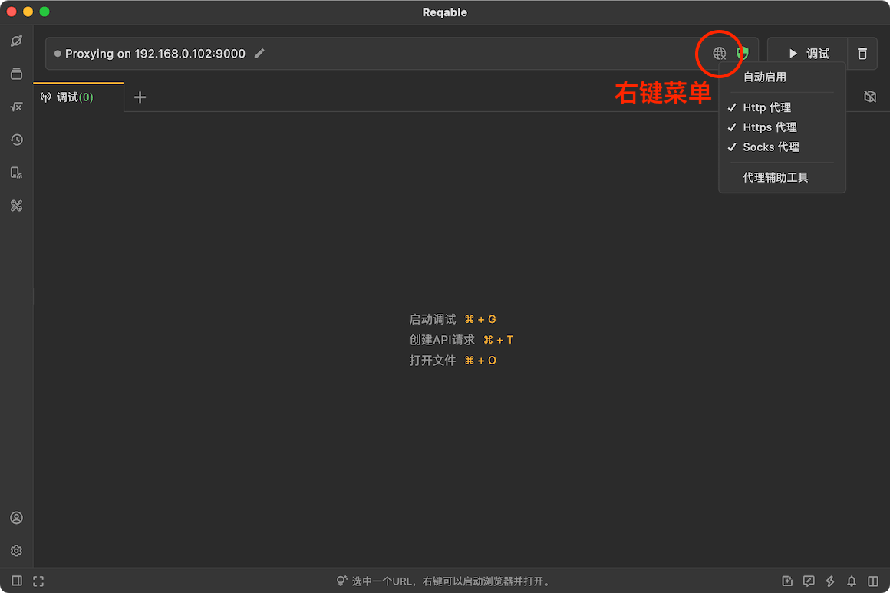
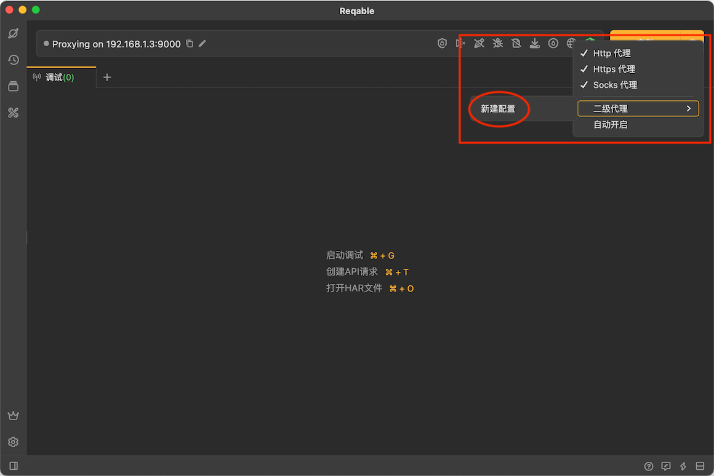
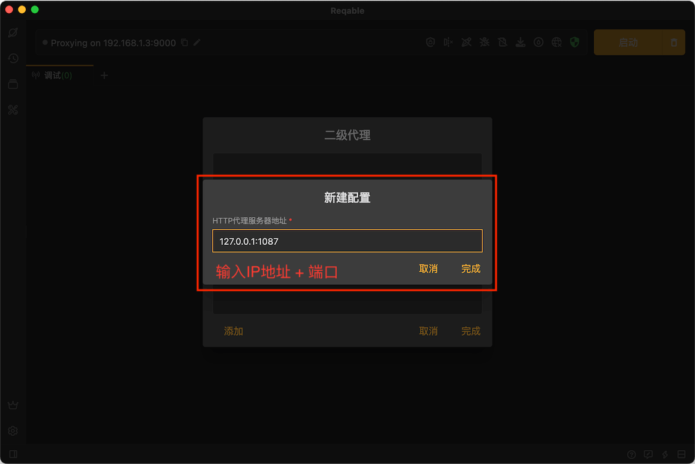
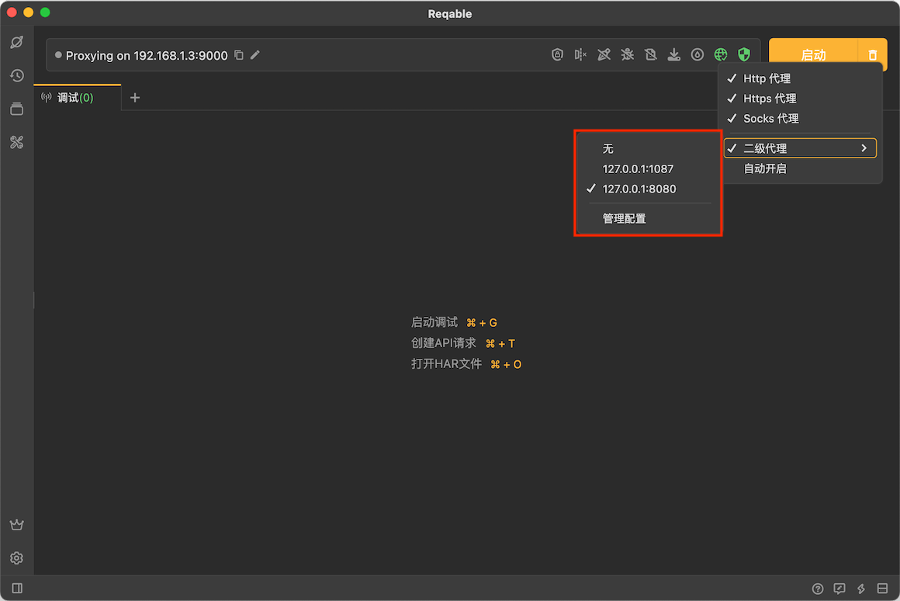

# 代理

Reqable获取流量使用的是MITM代理方式，如何正确地使用和配置代理非常重要。默认情况下，Reqable会自动配置系统代理，无需用户手动打开系统设置页面配置。

在应用顶部的[快捷操作栏](quickbar)上会显示系统代理的状态。如果系统代理已正确配置，图标将显示绿色激活状态；反之，将显示黄色警告状态。在绿色状态下点击图标，将会关闭系统代理；在黄色状态下点击图标，将会覆写系统代理设置。

:::caution

当需要对本机应用（例如浏览器等）进行流量分析时，请保持系统代理为绿色激活状态！部分代理类型的应用例如Clash等会造成冲突，建议在使用Reqable的时候关闭其他代理程序。

:::

正常情况下，一个客户端应用程序（例如浏览器）会根据系统的网络代理配置，主动连接到Reqable的代理服务器。但是，某些应用程序（例如微信）并不会使用系统的网络代理配置，这种情况需要用户在客户端应用程序的设置中手动配置。如果一个应用程序既不使用系统的网络代理配置，又未提供手动设置代理的途径，那么Reqable将无法分析其流量。当然，在获得此应用程序授权的前提下，您可以考虑使用`Proxifier`等工具强行转发其流量到Reqable的代理服务器。

对于localhost请求，可能不会主动访问Reqable的代理服务器，即使我们已经正确配置了网络代理。关于这个问题的处理，请阅读[本地流量](localhost)。

另外，在Windows系统上，部分客户端不支持通用的代理规则，解决方案具体请阅读下文[代理规则](#rule)。

### 代理协议

Reqable支持HTTP、HTTPS、Socks4、Socks4a和Socks5共五种代理协议，Reqable的代理服务器监听同一个端口（默认9000端口），会自动根据客户端的报文内容自动判断协议类型。Reqable无法指定目标应用程序采用哪种代理协议，只能配置到系统的代理设置中，由客户端程序自己决定。关于代理的设置，不同计算机系统提供的方式有所不同，下面请根据自己所使用的系统类型进行阅读。

#### Windows

Windows只能配置Web代理或者Socks代理，二者选其一。默认情况下，Reqable会自动配置Web代理，如果有使用Socks代理的需求可以在代理图标的右键菜单中进行切换。

#### MacOS

Mac OSX系统支持同时配置HTTP、HTTPS和SOCKS三种代理协议，用户可以在Reqable中配置三种全部，也可以只配置一种。一般情况下，建议三种协议全部勾选。

#### Linux

Linux系统同MacOS系统一样支持同时配置HTTP、HTTPS和SOCKS三种代理协议，用户可以在Reqable中配置三种全部，也可以只配置一种。一般情况下，建议三种协议全部勾选。

### 二级代理{#secondary}

:::warning 警告

Reqable本身不具备绕过流量受限的能力，也无法解决流量受限问题。在某些地区，法律可能禁止访问受限流量，如果您未获得法律或相关部门允许，应该跳过阅读此部分内容。

:::

对于访问一些受限的流量，例如在中国大陆访问Google，需要借助于某些代理软件。但系统设置只能配置一个代理，当使用Reqable作为系统代理的时候，这些网站将会无法访问，这种情况需要利用Reqable的二级代理功能。Reqable二级代理的原理：当Reqable接收到客户端的代理请求时，会转发给二级代理，由二级代理进行实际的通信。右键 **代理图标** -> **二级代理** -> **新建配置** 可以创建一个二级代理配置。

在配置编辑页面，输入二级代理服务器的IP地址和端口号，保存即可。

:::info

二级代理目前不支持SOCKS协议，也不支持认证，只支持填写HTTP代理服务器IP地址和端口号。

:::

如果您有多个代理服务器可以新建多个配置，在右键代理菜单选项中切换即可。如果需要关闭二级代理，在右键代理菜单选项中切换到`无`。

### 代理规则 {#rule}

在Windows系统上，HTTP协议的代理配置支持下面几种格式。

① `{ip}:{http_port}`

② `http=http://{ip}:{http_port};https=http://{ip}:{http_port}`

③ `http={ip}:{http_port};https={ip}:{http_port}`

其中第一种是通用格式，也是Reqable选用的默认格式。但是某些客户端无法识别这种格式（参阅此[问题](https://github.com/MatsuriDayo/nekoray/issues/104)），所以Reqable提供了切换格式的选项。当选用Web代理协议的时候，代理规则可以按照下图进行切换。