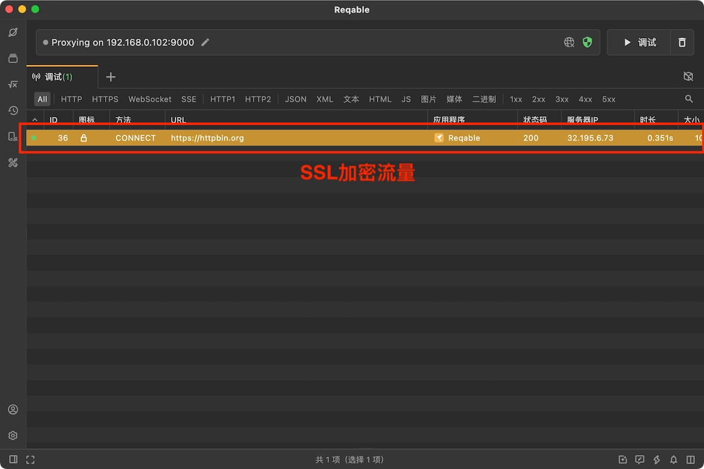
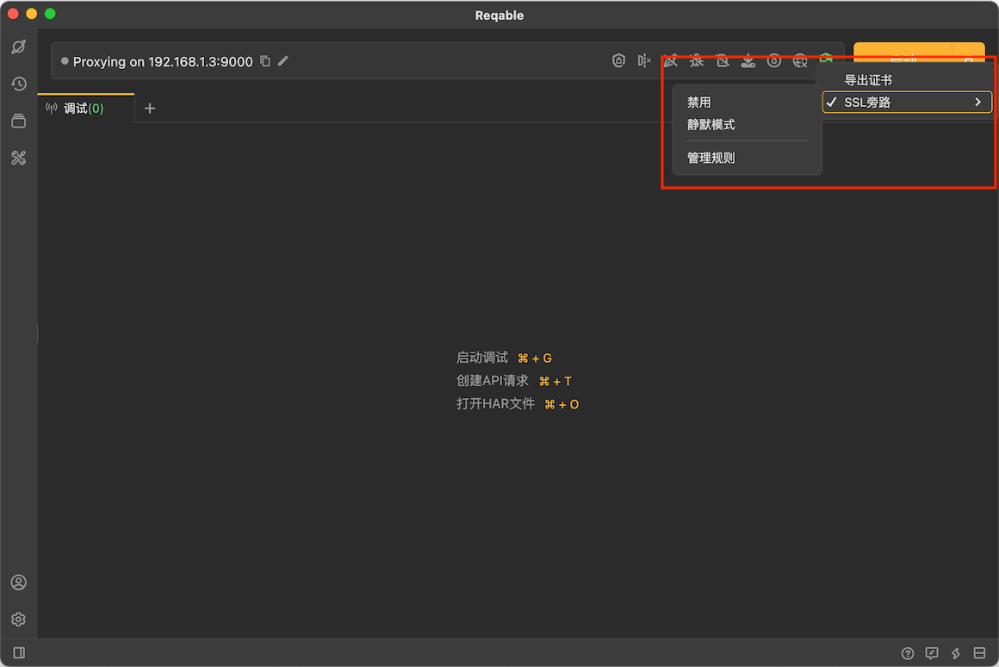
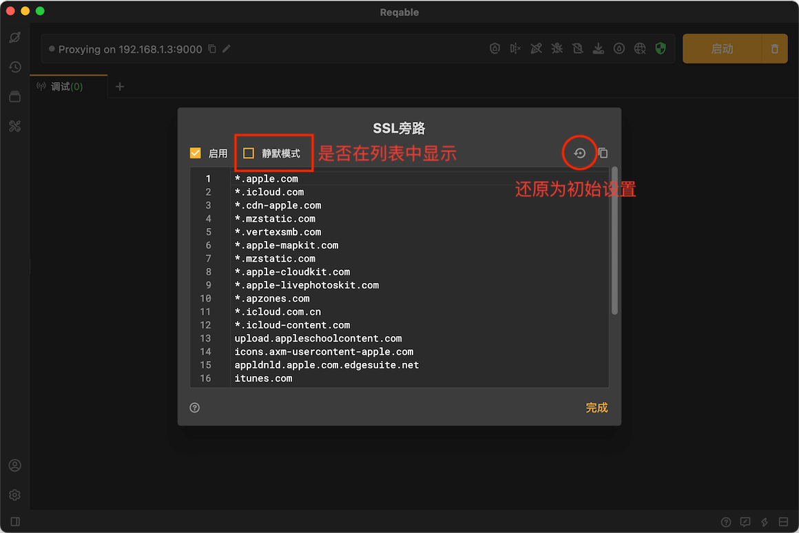
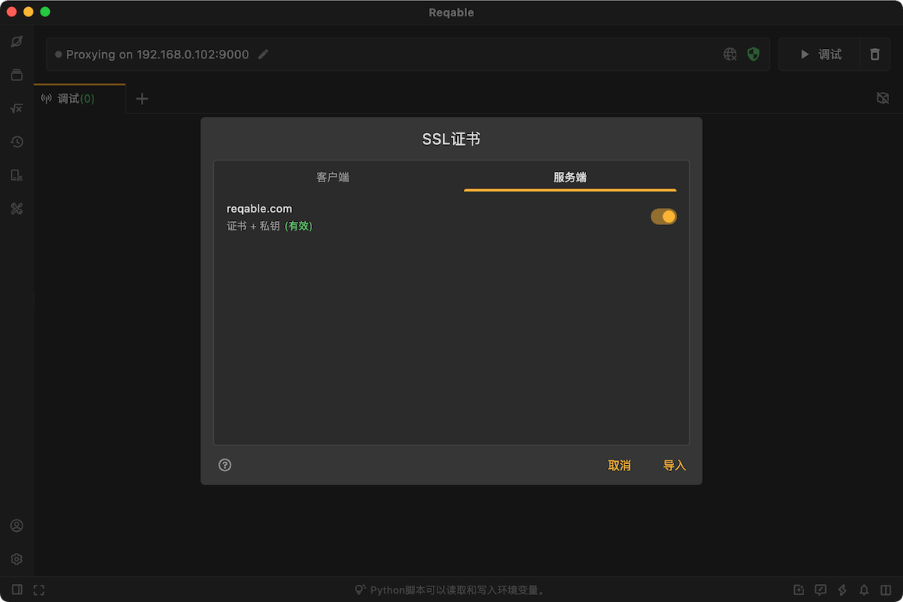

# SSL

Reqable支持分析SSL加密流量，如果已经成功安装了CA根证书，Reqable默认会自动分析所有SSL流量，反之Reqable则会绕过SSL解密逻辑。未解密的SSL流量图标会显示一个🔒的标记，如下：



## SSL代理 {#ssl-proxying}

在默认情况下，Reqable自动解析SSL加密流量，可能会带来一些问题。例如客户端固定证书、双向验证等，导致请求失败。这种情况下，我们需要配置一些规则来指定哪些域名的流量进行SSL解密，哪些域名的SSL流量绕过SSL解密。通过`工具` -> `SSL代理` 或者右键点击盾牌图标，可以打开SSL代理配置界面。



Reqable提供了两个内置规则集：全部拦截和全部绕行。全部拦截指的是拦截全部的SSL流量并进行解密，全部绕行指的是不对任何SSL流量进行解密。

当然，用户也可以编辑自定义的规则来设定不同的SSL行为模式。



域名支持Wildcard通配符 `*` 和 `?`。举个例子，假如配置了 `*.apple.com` 这个规则，那么下面域名的请求都将匹配成功。
```
https://www.apple.com/
https://api.apple.com/
```

匹配上SSL旁路规则的流量仍然会在列表中显示，可以通过🔒的图标分辨出来。如果希望不在列表中显示，可以勾选上`不显示绕行流量`。

:::info
- 配置绕行规则有利于过滤掉一些无关的流量，对于提高响应性能有很大帮助。
:::

## SSL证书 {#ssl-certificates}

有些网络请求可能会启用固定证书或者双向验证机制，在这些情况下Reqable默认无法进行SSL解密（表现为SSL握手失败或者请求失败）。针对这些场景，用户可以在Reqable中配置自定义SSL证书，既可以配置客户端证书，也可以配置服务端证书。



配置客户端证书，主要用于双向验证场景。Reqable代理客户端在与服务器进行SSL握手协商时，会将证书发给服务器进行验证。

配置服务端证书，主要用户固定证书场景。Reqable代理服务器在与客户端进行SSL握手协商时，会将证书发给客户端进行验证。

在配置证书的时候，要求指定域名，Reqable会自动根据域名来确定是否使用自定义SSL证书。

自定义SSL证书支持导入下面这些格式：
- crt
- pem
- der
- p12
- pfx
- zip
