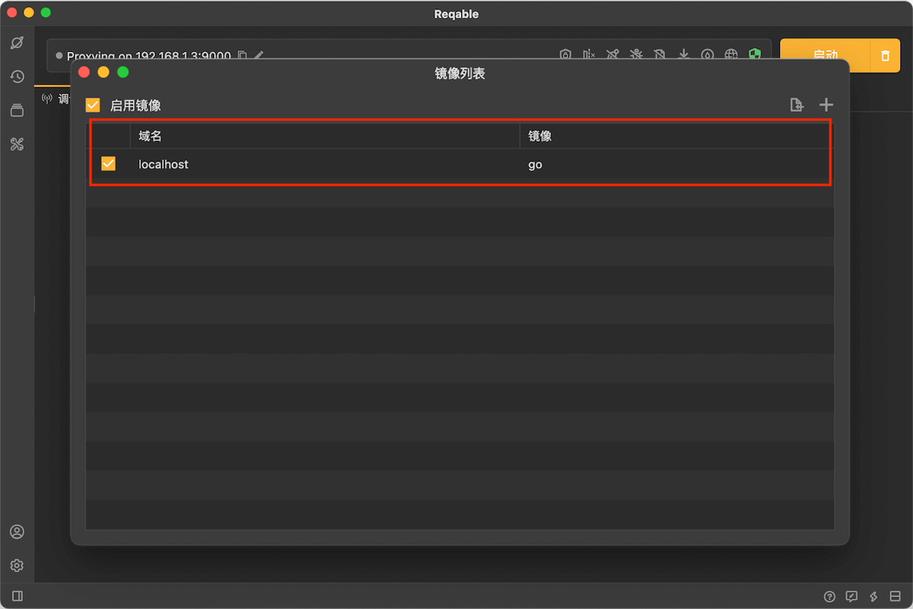

# 本地流量

在部分系统上，一些`localhost`请求，不会主动访问Reqable的代理服务器，即使我们已经正确配置了网络代理，这里需要进行一些额外的设置。注意，不同系统采取的方式有所不同，下面请选择自己的系统类型进行阅读。

### Windows

监听localhost的流量，需要在Reqable中开启回环代理选项。注意，此选项默认是开启的。

### Mac & Linux

我们需要借助 [镜像](mirror) 功能对`localhost`进行映射，例如可以按照下面的方式，将`localhost`映射成`go`。



配置完成并开启镜像开关后，`go`将作为`localhost`的别名，然后将请求地址中的`localhost`替换成`go`就可以了。
```
原始链接：http://localhost:3000/
新的链接：http://go:3000/
```
当然，你也可以选用其他的别名不一定是`go`，这里只是举一个示例。

:::info 小技巧
对于上面的示例链接，在配置镜像的时候可以带上端口号，即用`go:3000`作为镜像，可以省去输入端口号。`http://go`将等价于`http://localhost:3000`，是不是又方便了很多？
:::