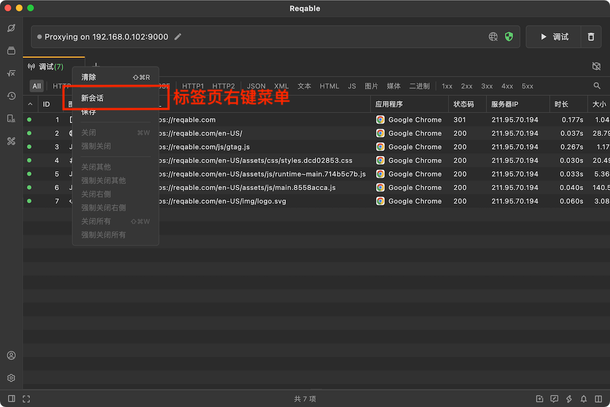
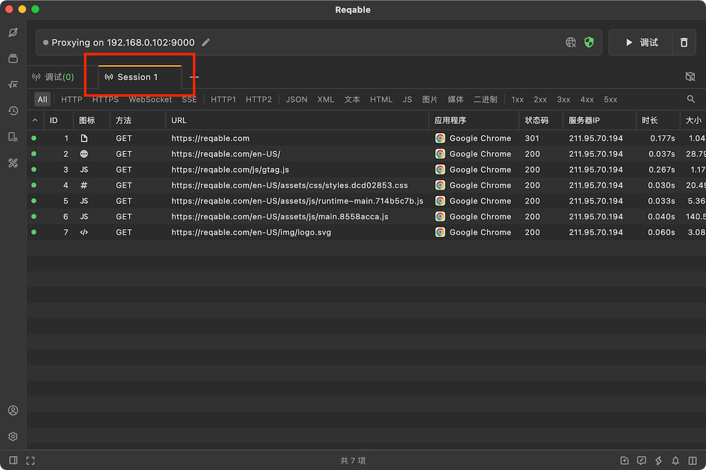
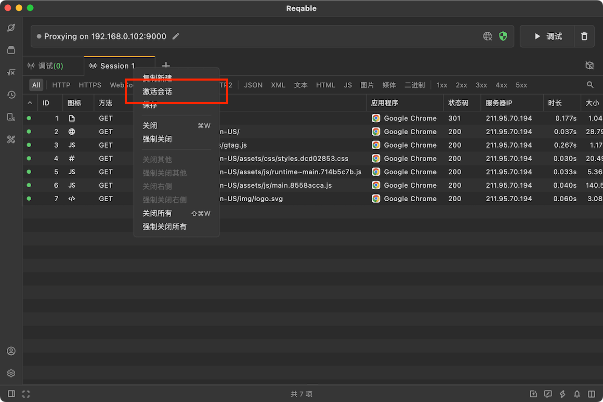

# 多会话

在设计上，Reqable将实时流量的会话标签固定在最左侧（无法删除或移动），如果希望将流量记录到多个会话上，可能会不知道如何操作。本篇文章主要讲解了如何使用多会话来记录流量。

我们可以在调试标签Tab右键打开菜单，点击**新会话**。

Reqable会将调试列表数据迁移到新一个新的Tab，这样新进来的流量就显示在一个新的会话列表里了。

如果希望切换到旧的会话，只需要在旧会话的标签Tab上右键打开菜单，点击**激活会话**即可。

理论上，用户可创建多个新会话，也可以基于一个已有会话复制出新会话。