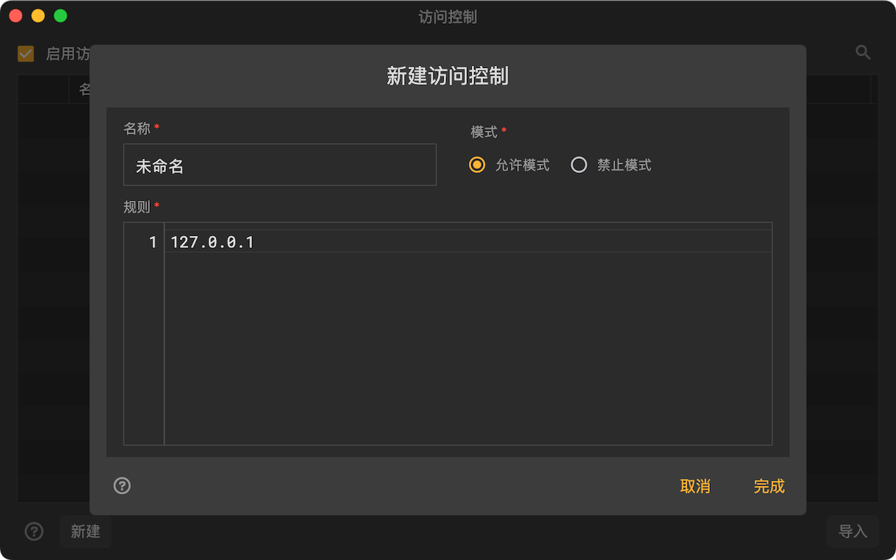

# 访问控制

Reqable的中间人代理服务器默认会接收全部的访问请求，这在某些情况下会收到外部的干扰，甚至可能出现访问回路，大量消耗Reqable运行设备的性能。现在，用户可以控制哪些IP设备可以访问代理服务器，未授权的IP设备的连接会被拒绝。

:::info
使用此功能需要更新Reqable到v2.21.0及以上版本。
:::

### 使用方式

从`代理`菜单中打开`访问控制`，然后添加一个配置。用户需要指定一个配置名称，选择`允许模式`或者`禁止模式`，并配置需要控制的IP地址。IP地址支持IPv4和IPv6，并且可以使用通配符`*`和`?`进行匹配，多个IP地址按行填写。

举个例子，如果只希望本机访问，可以选择`允许模式`并配置IP地址`127.0.0.1`。

:::info
手机版本可以从`⋮` -> `更多`中打开`访问控制`功能。
:::