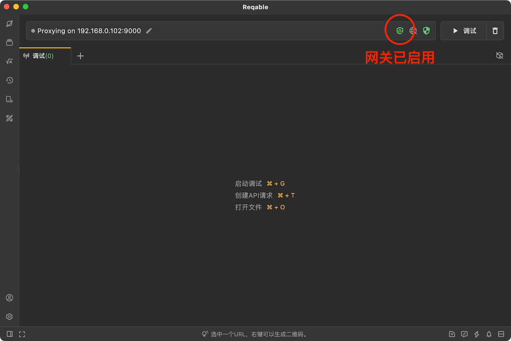
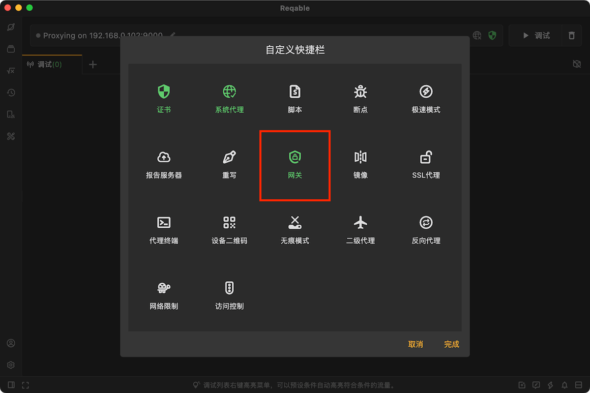
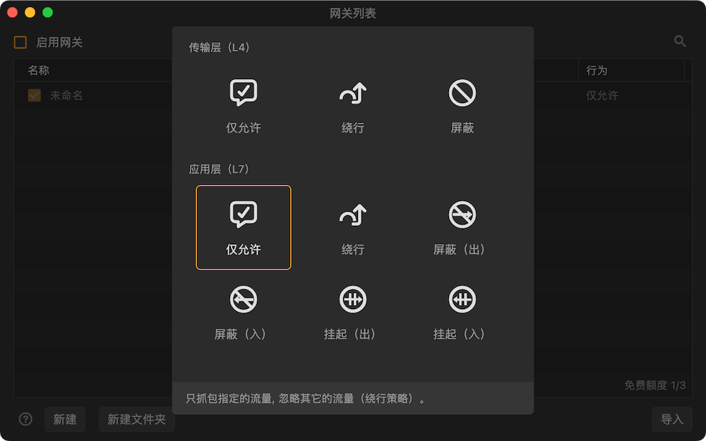

# 网关

import Shortcut from '@site/src/components/Shortcut';

网关是Reqable的核心调试功能之一，顾名思义，网关就是网络关卡的意思。注意，这里的网关不同于计算机术语中的网关（网间连接器或协议转换器），仅仅是表示Reqable中有关HTTP的网络链路控制特有的说法而已。

网关功能可以通过四种方式启用或关闭：
- 直接点击网关图标
- 右键网关图标 -> 启用/禁用
- 托盘 -> 网关 -> 启用/禁用
- 快捷键 <Shortcut>Shift + Control + G</Shortcut>

当网关功能开启后，快捷操作栏（Quickbar）上的网关图标将变为绿色激活状态。

### 创建规则

创建一个网关规则有下面六种方式：
- 右键网关图标 -> 新建规则
- 托盘 -> 网关 -> 新建规则
- 网关列表 -> 点击右上角 `+` 号图标
- 网关列表 -> 右键菜单 -> 新建
- 调试列表 -> 选中一个列表项 -> 右键菜单 -> 网关
- 快捷键 <Shortcut>Shift + Alt + G</Shortcut>

输入规则名称和匹配的URL，URL支持简单的Wildcard * 和 ? 匹配，最后需要选择一个行为。Reqable支持以下五种行为模式：

#### 仅允许

只对匹配的URL进行抓包，非匹配的URL请求将自动忽略（仅仅是忽略，并不会干扰）。这种模式适合只关注一个或者少数个域名请求的人员，排除设备上其他请求带来的烦扰。

#### 静默

忽略匹配的URL的请求，不会显示在操作列表中，可以看作是**仅允许**模式的取反。这种模式适合排除设备上某些无关请求带来的烦扰。

#### 屏蔽请求

一旦检测到URL匹配的请求，MITM代理服务器将会屏蔽该请求（请求数据不会发往服务器），并立即断开TCP连接。

#### 屏蔽响应

一旦检测到URL匹配的响应，MITM代理服务器将会屏蔽该响应（请求数据不会发往客户端），并立即断开TCP连接。

#### 挂起请求

一旦检测到URL匹配的请求，MITM代理服务器将会屏蔽该请求（请求数据不会发往服务器），TCP连接仍然保持。该模式适合测试HTTP请求超时。

#### 挂起响应

一旦检测到URL匹配的响应，MITM代理服务器将会屏蔽该响应（请求数据不会发往客户端），TCP连接仍然保持。该模式适合测试HTTP响应超时。

:::caution 优先级

规则匹配优先级：屏蔽 > 挂起 > 仅允许 > 静默

:::

### 管理规则

规则从上往下进行匹配，同一个请求可以匹配多个规则，越靠前越先执行。规则支持文件夹级别的管理，长按后拖动可以调整位置。同时支持导入和导出，方便与他人进行分享和协同。

