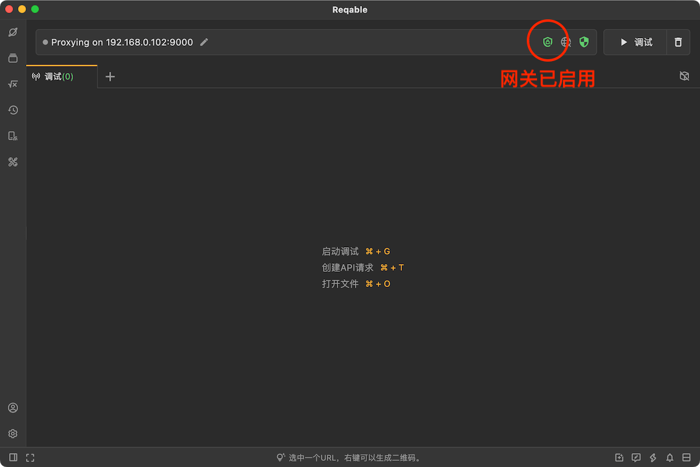
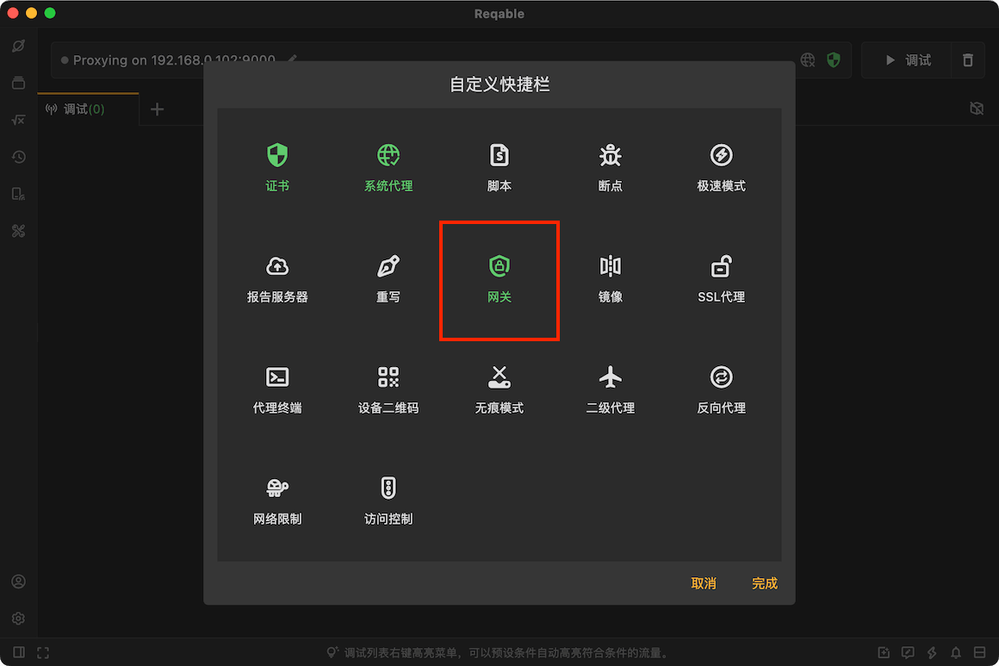
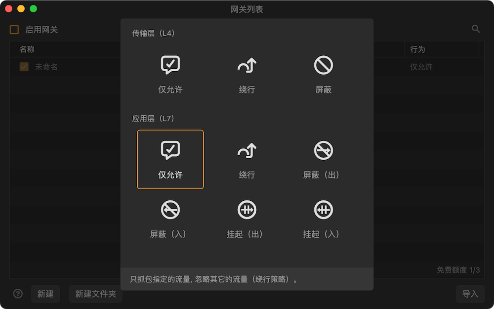
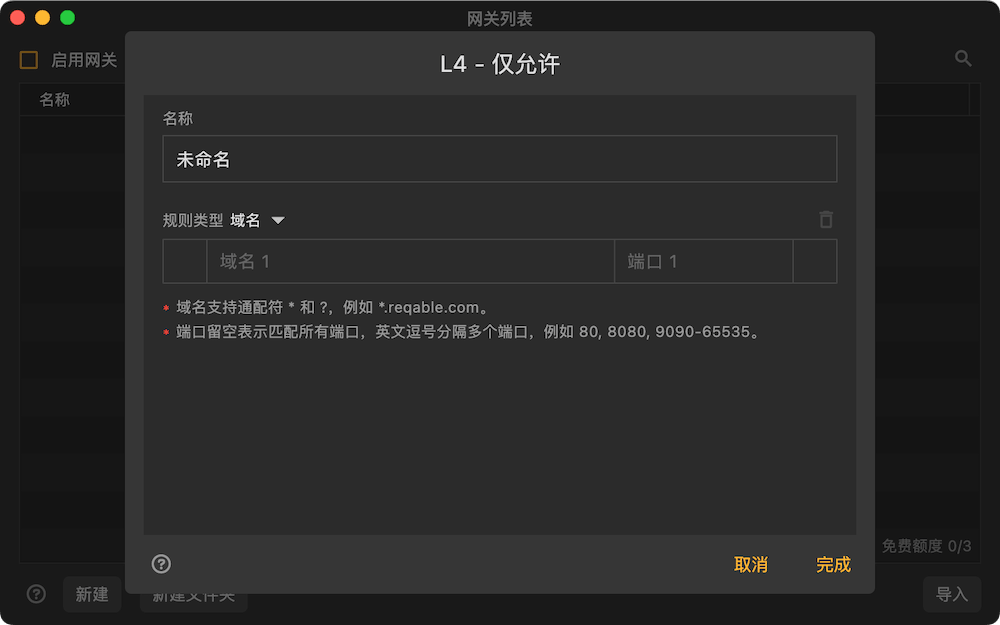
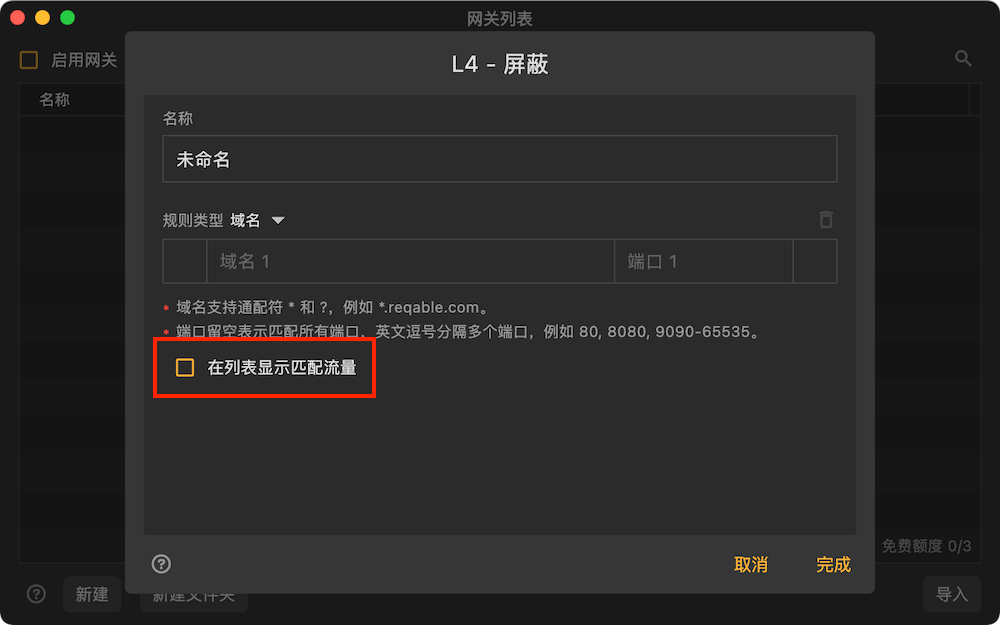
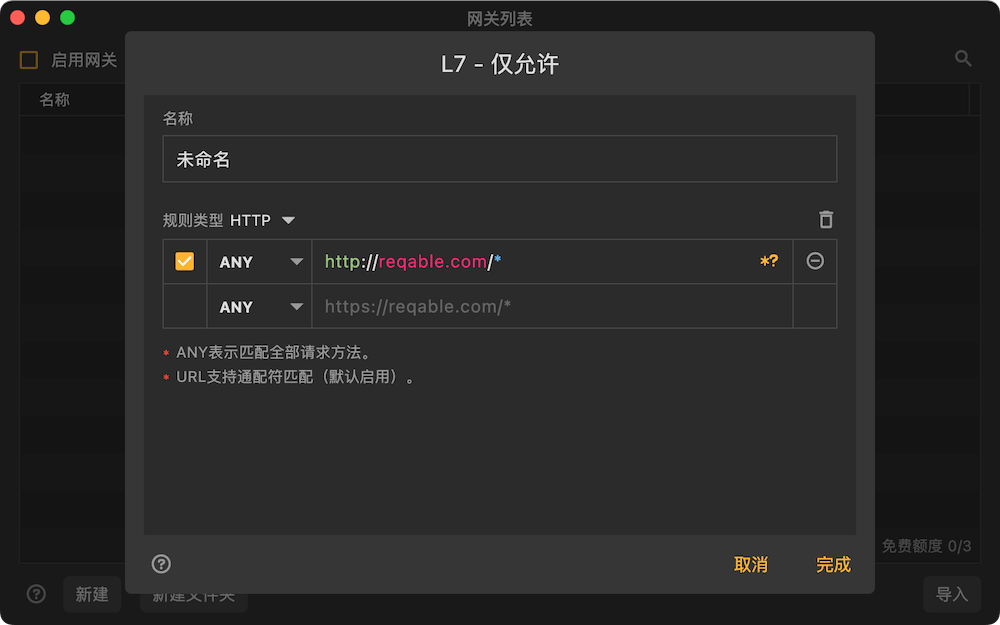
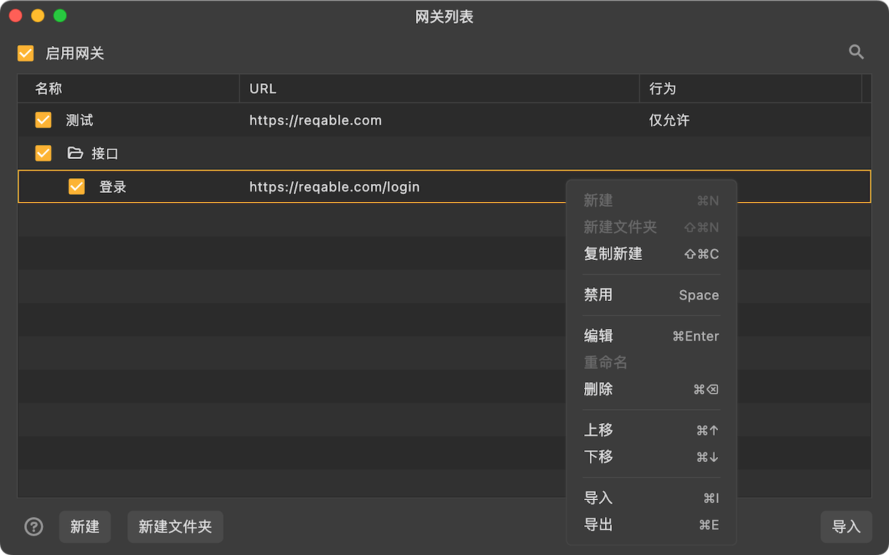

# 网关

import Shortcut from '@site/src/components/Shortcut';

网关是Reqable的核心调试功能之一，顾名思义，网关就是网络关卡的意思。注意，这里的网关不同于计算机术语中的网关（网间连接器或协议转换器），仅仅是表示Reqable中有关流量控制特有的说法而已。

网关可以通过菜单`调试` -> `网关` -> `启用`开启网关功能（快捷键<Shortcut>Shift + Control + G</Shortcut>），在网关开启后，快捷操作栏上的将会显示网关激活的图标。

点击以上图标，可以关闭网关功能，网关关闭后，图标将从快捷操作栏上消失。如果希望网关功能图标常驻在快捷操作栏，可以使用右键快捷操作栏自定义进行固定。

:::info

为防止功能滥用，Reqable在移动端不提供此功能。

:::

### 创建规则

创建一个网关规则有下面几种方式：
- 调试菜单 -> 网关 -> 添加规则
- 右键网关图标 -> 添加规则
- 托盘 -> 网关 -> 添加规则
- 网关列表 -> 新建按钮
- 网关列表 -> 右键菜单 -> 新建
- 调试列表 -> 选中一个列表项 -> 右键菜单 -> 网关
- 快捷键 <Shortcut>Shift + Alt + G</Shortcut>

网关分为`网络层（L4）`和`应用层（L7）`控制，和网络七层模型中的两层相对应。

网络层（L4）有三种模式：

- 仅允许
- 绕行
- 屏蔽

网络层（L4）支持两种规则类型：`域名`、`IP/CIRD`。每种规则都可以配置多个，命中任意一个即可触发。

应用层（L7）有六种模式：

- 仅允许
- 绕行
- 屏蔽（出）
- 屏蔽（入）
- 挂起（出）
- 挂起（入）

网络层（L7）支持两种规则类型：`域名`、`IP/CIRD`、`HTTP`和`WebSocket`。每种规则都可以配置多个，命中任意一个即可触发。

下面我们来看看每种模式的详细介绍。

### 仅允许（L4）

在网络层控制对哪些流量进行抓包，非匹配的流量将执行绕行策略（非屏蔽），只有允许的流量的请求才会出现在调试列表。

::: info

如果需要屏蔽而不是绕行非匹配流量，请再新建一个屏蔽策略。

:::

### 绕行（L4）

忽略匹配的流量，不会显示在操作列表中，但是流量仍然会发送给服务器。可以看作是`仅允许`模式的取反，这种模式适合排除设备上某些无关请求带来的烦扰。

### 屏蔽（L4）

屏蔽匹配的流量，流量不会发送给服务器。默认情况下也不会显示到列表，除非显式勾选`在列表显示匹配流量`。

### 仅允许（L7）

功能和`仅允许（L4）`相同，处理时机是在应用层，可以执行更加详细的匹配，因此多了`HTTP`和`WebSocket`两种匹配规则。

### 绕行（L7）

功能和`绕行（L4）`相同，同样多了`HTTP`和`WebSocket`两种匹配规则。

### 屏蔽出（L7）

功能和`屏蔽（L4）`相同，同样多了`HTTP`和`WebSocket`两种匹配规则。

### 屏蔽入（L7）

相对于`屏蔽出（L7）`，屏蔽的不是发送给服务器的流量，而是发送给客户端的流量。

### 挂起出（L7）

相对于`屏蔽出（L7）`，挂起不会中断连接，而是模拟超时效果。

### 挂起入（L7）

相对于`屏蔽入（L7）`，挂起不会中断连接，而是模拟超时效果。

::: caution 优先级

同一个请求命中多个模式的处理优先级：`仅允许` > `绕行` > `屏蔽` > `挂起`。

:::

### 管理规则

规则从上往下进行匹配，同一个请求可以匹配多个规则，相同模式越靠前越先匹配。规则支持文件夹级别的管理，长按后拖动可以调整位置。同时支持导入和导出，方便与他人进行分享和协同。

