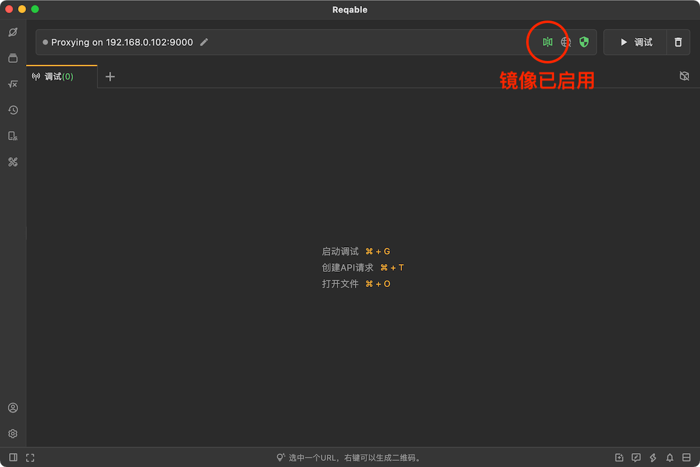
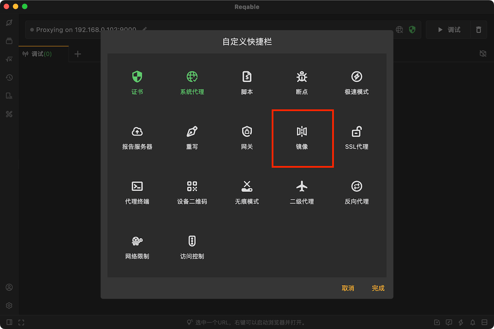
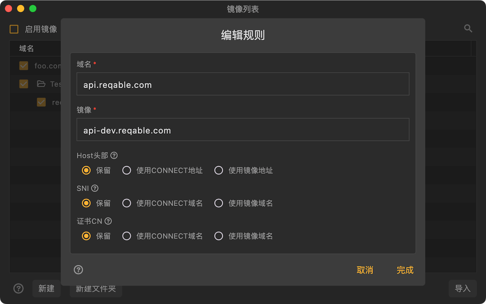

# 镜像

import Shortcut from '@site/src/components/Shortcut';

镜像是Reqable的核心调试功能之一，镜像是指域名映射。例如，访问域名A（`www.foo.com`），映射为访问域名B（`www.bar.com`）, 客户端所有发给域名A的请求都将发向域名B。此功能实现是在代理层处理，而不是应用层，属于整体重定向，如果有需要对指定路径请求进行重定向，请使用[重写——重定向](rewrite#redirect)功能。

:::info

镜像的功能类似修改系统的`hosts.txt`配置，类似于修改了DNS，所以无法将`https`请求映射到`http`请求（例如本地localhost服务），处理此问题请使用[重写——重定向](rewrite#redirect)功能。

:::

镜像功能可以通过四种方式启用或关闭：
- 直接点击镜像图标
- 右键镜像图标 -> 启用/禁用
- 托盘 -> 镜像 -> 启用/禁用
- 快捷键 <Shortcut>Shift + Control + M</Shortcut>

当镜像功能开启后，快捷操作栏（Quickbar）上的镜像图标将变为绿色激活状态。

### 创建规则

创建一个镜像规则有下面六种方式：
- 右键镜像图标 -> 新建规则
- 托盘 -> 镜像 -> 新建规则
- 镜像列表 -> 点击右上角 `+` 号图标
- 镜像列表 -> 右键菜单 -> 新建
- 调试列表 -> 选中一个列表项 -> 右键菜单 -> 镜像
- 快捷键 <Shortcut>Shift + Alt + M</Shortcut>

原始域名支持简单的Wildcard * 和 ? 匹配。如果配置`*.reqable.com`，可以匹配全部的子域名，包括`api.reqable.com`、`www.reqable.com`等。

如果不指定原始域名端口号，HTTP请求默认为**80**端口，HTTPS请求默认为**443**端口。当然，也可以显示地指定端口号，例如：`*.reqable.com:8080`。

如果不指定镜像域名端口号，将沿用原始域名的端口号。

#### Host头部

每个HTTP请求头中基本都会包含`Host`，例如`Host: reqable.com:80`，镜像功能可以指定此选项的设置策略，三个策略的含义如下：

- 保留。保持原始请求的`Host`数据不变。
- 使用CONNECT地址。CONNECT地址一般是指原始域名地址，例如`reqable.com:80`。这个值一般情况下和Host头部相同。
- 使用镜像地址。顾名思义，就是替换成新的域名地址。

#### SNI

SNI全称是Server Name Indication，一般包含在SSL/TLS的握手包里面，此值会影响SSL证书的验证。镜像功能可以指定此选项的设置策略，三个策略的含义如下：

- 保留。保持原始请求的SNI值不变。
- 使用CONNECT地址。CONNECT地址一般是指原始域名，例如`reqable.com`。这个值一般情况下和原始SNI相同。
- 使用镜像地址。顾名思义，就是替换成新的域名值。

#### 证书CN

证书Common Name，此值会影响SSL证书的验证。镜像功能可以指定此选项的设置策略，三个策略的含义如下：

- 保留。保持原始请求的证书的CN不变。
- 使用CONNECT地址。CONNECT地址一般是指原始域名，例如`reqable.com`。这个值一般情况下和原始证书的CN相同。
- 使用镜像地址。顾名思义，就是替换成新的域名值。

:::caution

由于浏览器或者应用程序的HTTP请求可能使用了`KeepAlive`，导致配置完镜像无法立即生效，所以建议配置镜像后立即重启浏览器或者目标应用程序。

:::

### 管理规则

规则从上往下进行匹配，同一个请求可以匹配多个规则，越靠前越先执行。规则支持文件夹级别的管理，长按后拖动可以调整位置。同时支持导入和导出，方便与他人进行分享和协同。

### 使用教程

[Reqable镜像功能实战案例](https://reqable.com/blog/2023/06/07/post)