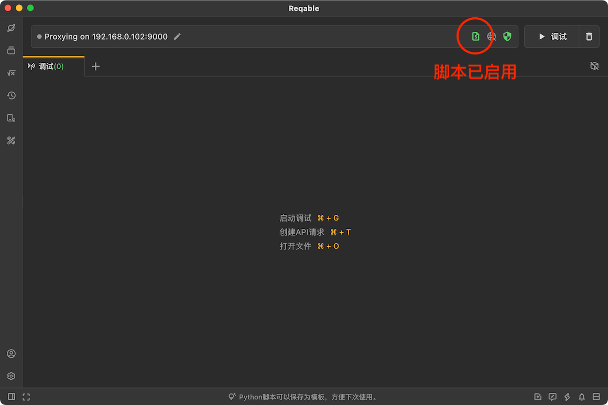
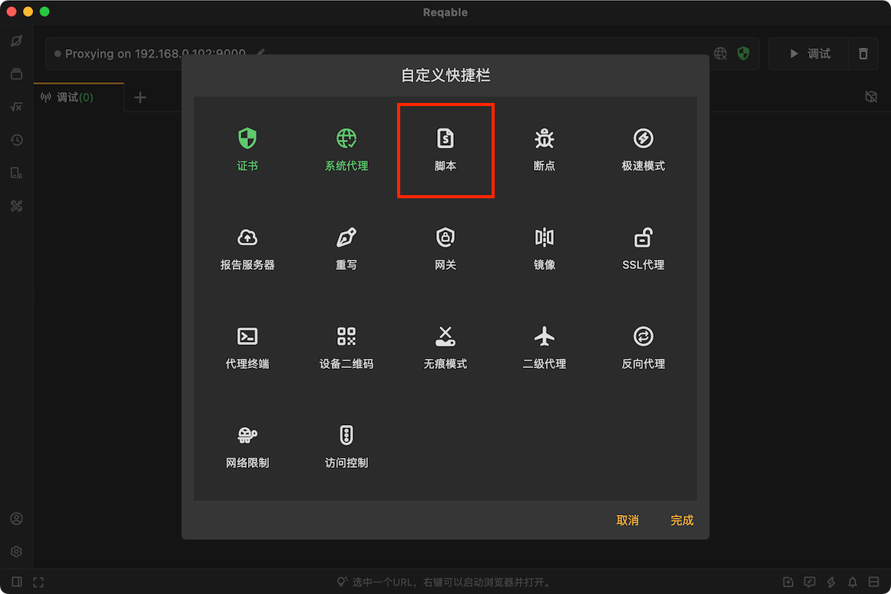
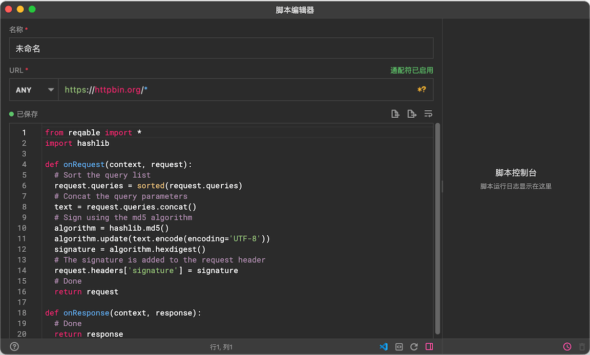
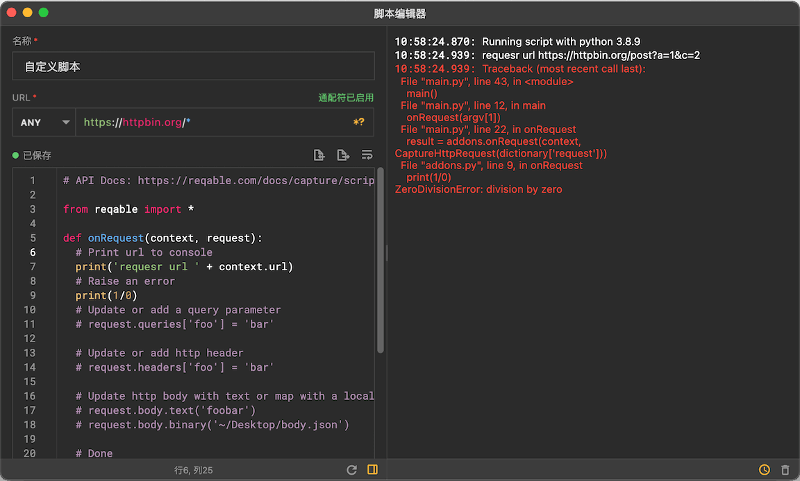
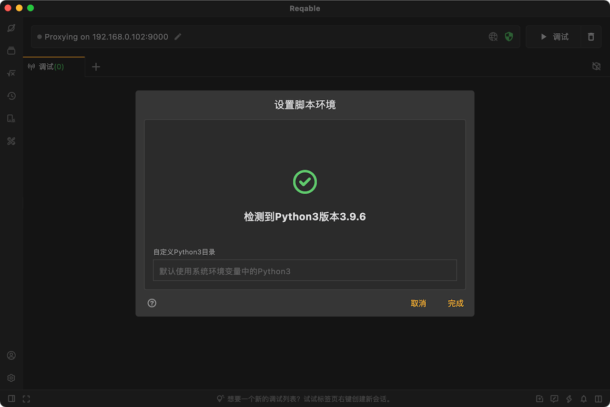

# 脚本

import Shortcut from '@site/src/components/Shortcut';

脚本是Reqable的核心调试功能之一，支持编写python脚本处理HTTP请求和响应。Reqable提供了一套基于Python的API，在脚本中，我们可以对请求和响应的数据进行修改、替换或者删除，甚至还可以中断请求和响应。除了使用Reqable内置的API，用户还可以使用自己安装的各种Python包，例如requests等。

脚本功能可以通过四种方式启用或关闭：
- 直接点击脚本图标
- 右键脚本图标 -> 启用/禁用
- 托盘 -> 脚本 -> 启用/禁用
- 快捷键 <Shortcut>Shift + Control + P</Shortcut>

当脚本功能开启后，快捷操作栏（Quickbar）上的脚本图标将变为绿色激活状态。



### 新建脚本

创建一个脚本规则有下面六种方式：
- 右键脚本图标 -> 新建规则
- 托盘 -> 脚本 -> 新建规则
- 脚本列表 -> 点击右上角 `+` 号图标
- 脚本列表 -> 右键菜单 -> 新建
- 调试列表 -> 选中一个列表项 -> 右键菜单 -> 脚本
- 快捷键 <Shortcut>Shift + Alt + P</Shortcut>

输入规则名称和匹配的URL，URL支持简单的Wildcard * 和 ? 匹配，然后编写Python脚本分别处理HTTP请求和响应。



### 编写脚本

脚本使用python3运行，必须使用python3的语法。脚本提供两个函数调用入口：`onRequest`和`onResponse`，顾名思义即请求和响应。

脚本修改后会自动保存，也可以手动使用快捷键 <Shortcut>Control + S</Shortcut> 立即保存。

#### onRequest

此函数在客户端请求发送给服务器前被调用，开发者可以在此函数作用域内对请求进行修改。
函数接收两个参数[CaptureContext](addons#api-context)和[CaptureHttpRequest](addons#api-request)并返回[CaptureHttpRequest](addons#api-request)。

:::info 请求中断

如果需要中断此请求，onRequest函数结果返回`None`即可！

:::

#### onResponse

此函数在服务端响应发送给客户端前被调用，开发者可以在此函数作用域内对响应进行修改。
函数接收两个参数[CaptureContext](addons#api-context)和[CaptureHttpResponse](addons#api-response)并返回[CaptureHttpResponse](addons#api-response)。

:::info 响应中断

如果需要中断此响应，onResponse函数结果返回`None`即可！

:::

#### 生命周期

需要注意的是，`onRequest` 和 `onResponse` 两个函数的分别运行在不同的进程中，所以两个函数无法直接共享外部变量。如果需要共享数据，请使用[CaptureContext](addons#api-context)的 `shared` 变量。

```python
def onRequest(context, request):
  context.shared = 'foobar'
  return request

def onResponse(context, response):
  print(context.shared) # print foobar
  return response
```

### API说明 {#api-addons}

已迁移至[脚本API](addons)！

### 调试控制台

Reqable提供了脚本控制台功能，方便开发人员查看脚本的日志输出，以及脚本报错的backtrace信息。在脚本执行的过程中保持脚本编辑器窗口打开，所有的信息都会实时输出到右侧的控制台中。



上图示例中，我们编写了一个除零错误，控制台中也产生了相应的报错信息。

### 运行环境 {#env}

脚本功能依赖于本机的python3环境，请务必保证本机设备上安装了python3。新手请参考[Python3下载和安装](https://www.runoob.com/python3/python3-install.html)。

:::caution

**要求Python3版本必须大于 3.6**

:::

如果本机上有多个python3环境，可以手动指定Python3 Home路径：**右击脚本图标 -> 设置环境**



### 执行顺序

一个请求或者响应可以挂载多个脚本（通过新建不同的规则来匹配同一个url），那必然会涉及到脚本执行先后顺序的问题。我们可以在脚本列表中调整先后顺序（快捷键 <Shortcut>Control + ↓/↑</Shortcut>）来设定优先级，列表靠前的先执行。

### 导入导出

Reqable支持脚本的批量导入和导出，方便与他人进行分享和协同。



### 实战教程

[Reqable镜像功能实战案例](https://reqable.com/blog/2023/06/12/post)