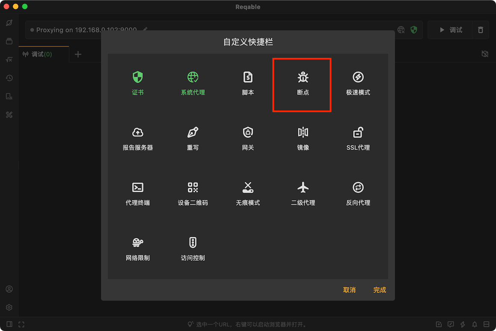
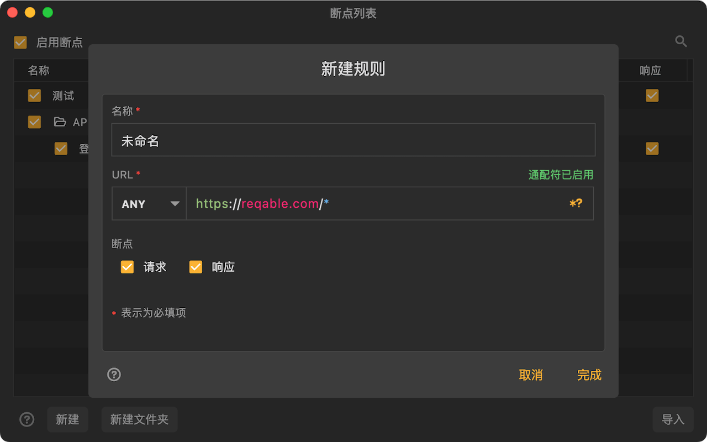
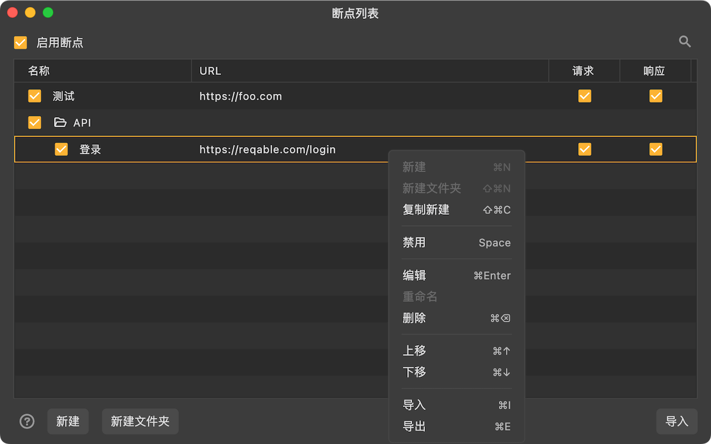

# 断点

import Shortcut from '@site/src/components/Shortcut';

断点是Reqable的核心调试功能之一，通过设定匹配规则，触发断点后实时控制和修改请求和响应。

断点功能可以通过四种方式启用或关闭：
- 直接点击断点图标
- 右键断点图标 -> 启用/禁用
- 托盘 -> 断点 -> 启用/禁用
- 快捷键 <Shortcut>Shift + Control + B</Shortcut>

当断点功能开启后，快捷操作栏（Quickbar）上的断点图标将变为绿色激活状态。

:::info

为防止功能滥用，Reqable在移动端不提供此功能。

:::

### 创建规则

创建一个断点规则有下面六种方式：
- 右键断点图标 -> 新建规则
- 托盘 -> 断点 -> 新建规则
- 断点列表 -> 点击右上角 `+` 号图标
- 断点列表 -> 右键菜单 -> 新建
- 调试列表 -> 选中一个列表项 -> 右键菜单 -> 断点
- 快捷键 <Shortcut>Shift + Alt + B</Shortcut>

输入规则名称和匹配的URL，URL支持简单的Wildcard * 和 ? 匹配。完成后，当请求或响应发生时，便可以进入断点操作界面。

### 断点执行器 {#executor}

断点生效后，会自动弹出下图的操作界面。我们可以在这个页面上，修改数据然后提交。

:::caution 注意事项

每个断点请求（响应）有**180s**的时间进行操作，超时后断点会自动失效，暂停住的请求和响应会继续。

:::

### 管理规则

规则从上往下进行匹配，同一个请求可以匹配多个规则，越靠前越先执行。规则支持文件夹级别的管理，长按后拖动可以调整位置。同时支持导入和导出，方便与他人进行分享和协同。

