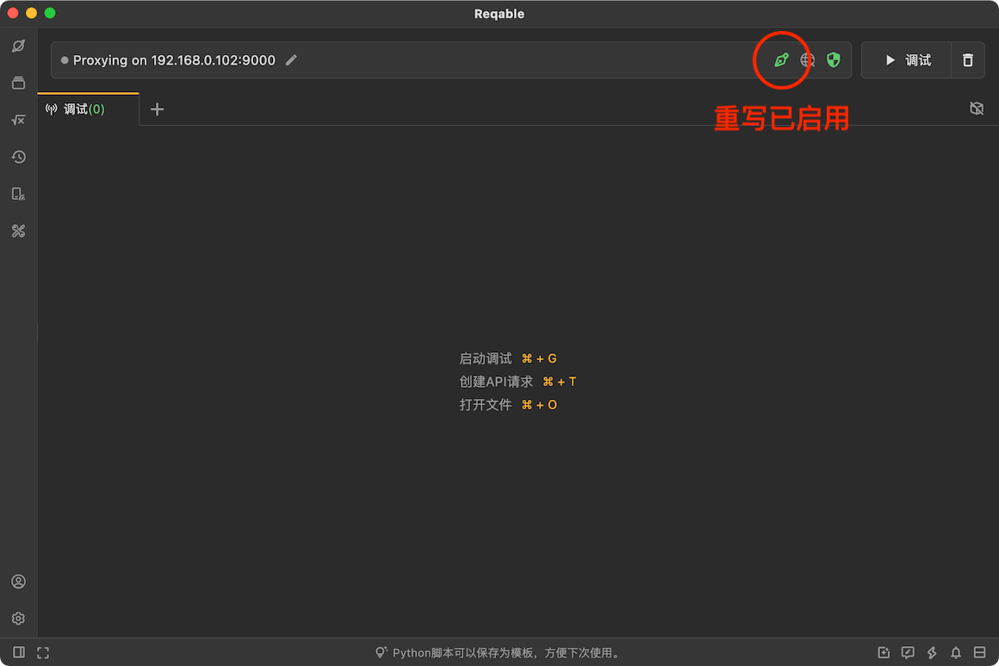
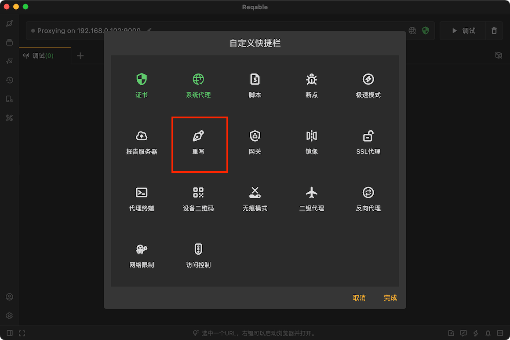
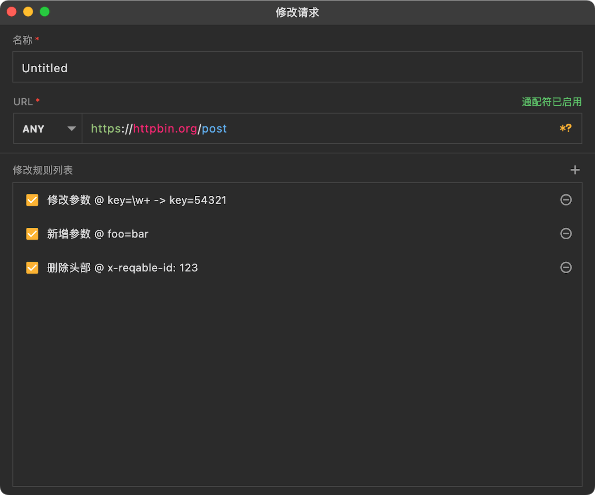
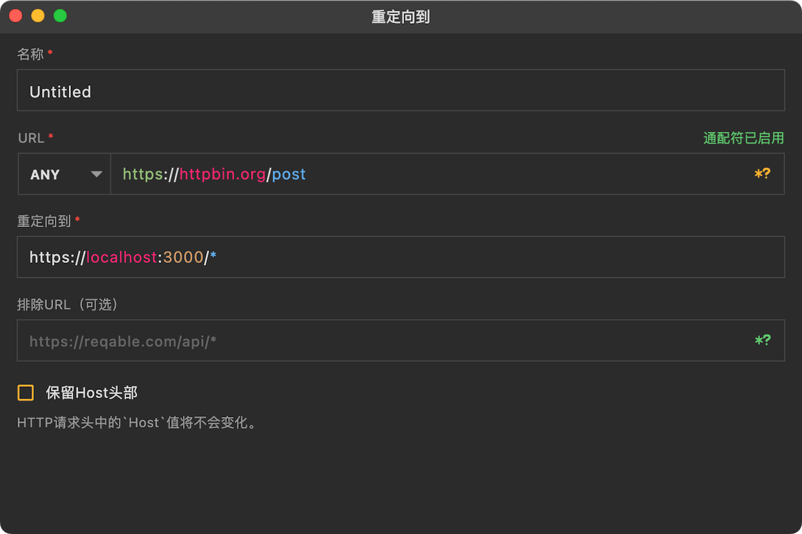
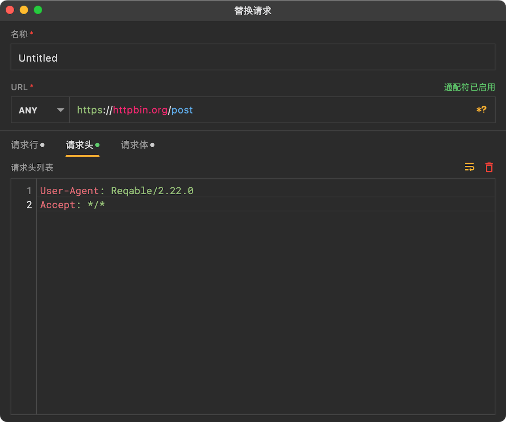
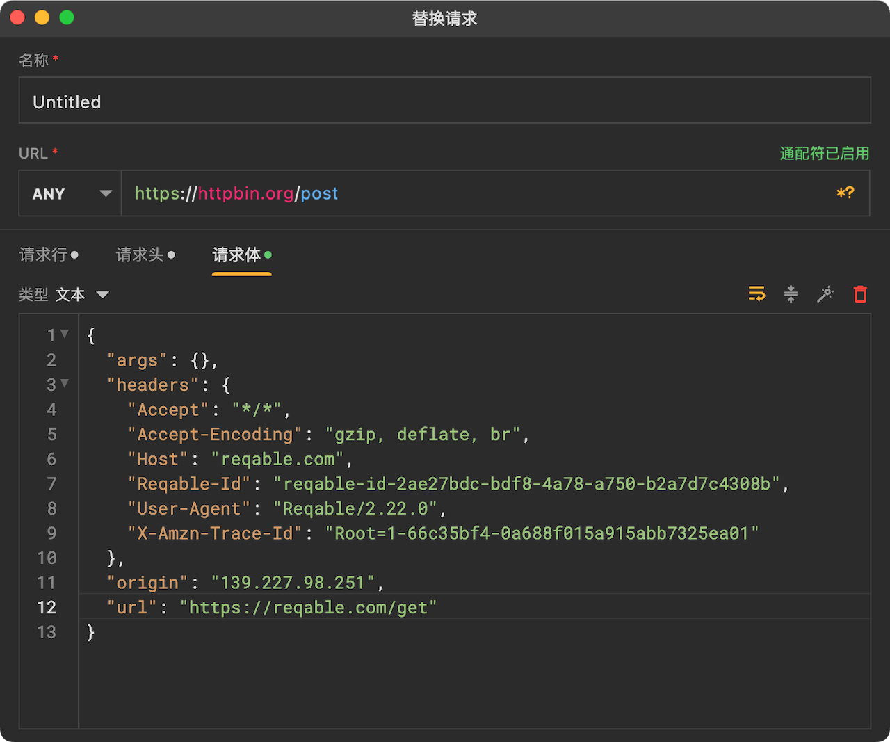
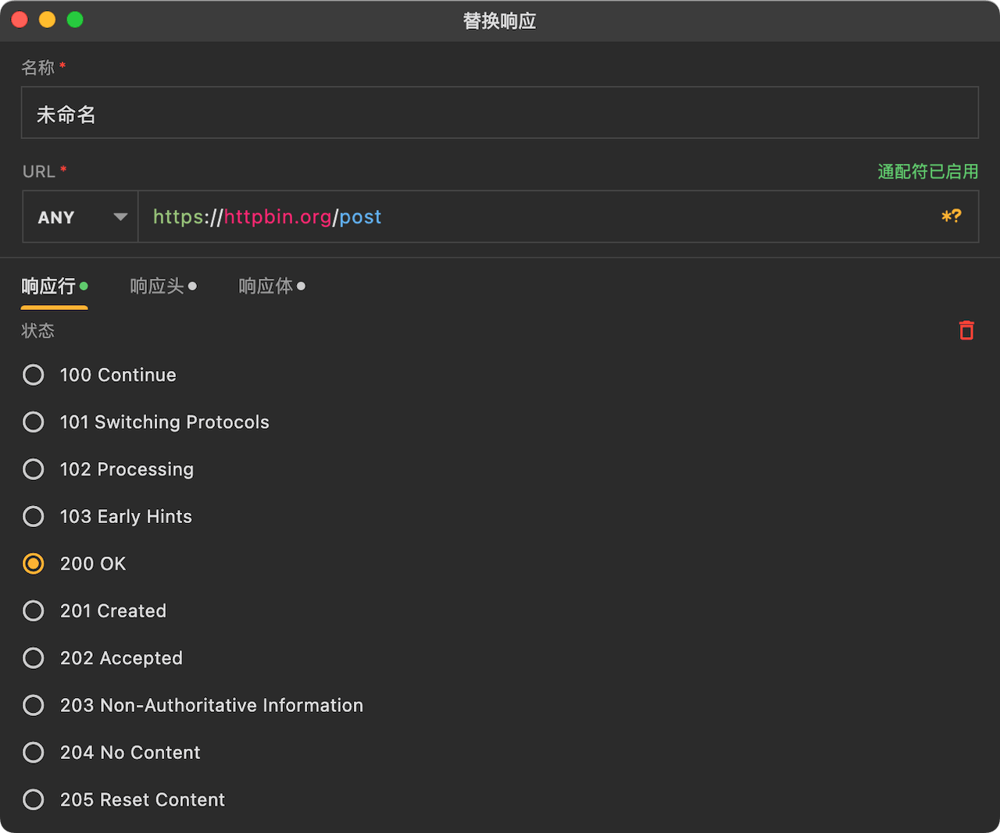
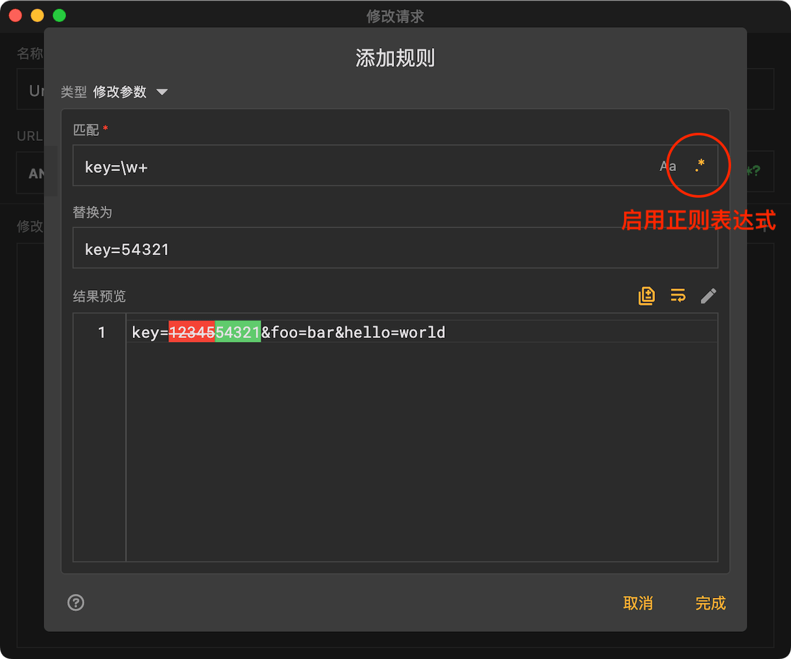
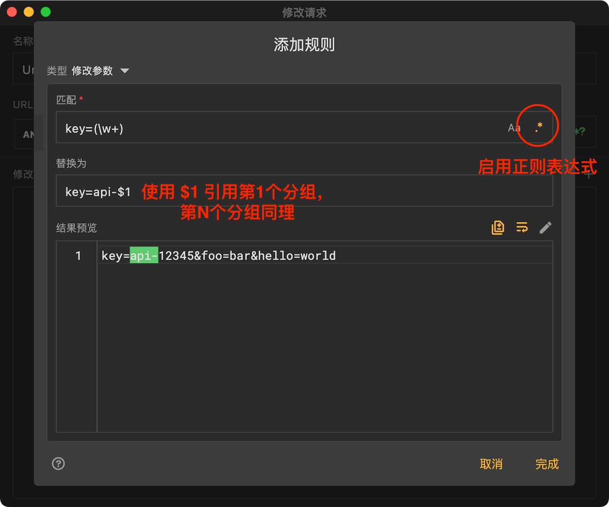

# 重写

import Shortcut from '@site/src/components/Shortcut';

重写是Reqable的核心调试功能之一，通过预设规则自动修改请求或者响应。Reqable的重写支持5种模式，分别是[重定向](#redirect)、[替换请求](#replace-req)、[替换响应](#replace-res)、[修改请求](#modify-req)和[修改响应](#modify-res)。

重写功能可以通过四种方式启用或关闭：
- 直接点击重写图标
- 右键重写图标 -> 启用/禁用
- 托盘 -> 重写 -> 启用/禁用
- 快捷键 <Shortcut>Shift + Control + K</Shortcut>



### 创建规则

创建一个重写规则有下面六种方式：
- 右键重写图标 -> 新建规则
- 托盘 -> 重写 -> 新建规则
- 重写列表 -> 点击右上角 `+` 号图标
- 重写列表 -> 右键菜单 -> 新建
- 调试列表 -> 选中一个列表项 -> 右键菜单 -> 重写
- 快捷键 <Shortcut>Shift + Alt + K</Shortcut>



输入规则名称和匹配的URL，URL支持简单的Wildcard * 和 ? 匹配，最后设置一个重写行为。Reqable支持以下五种重写行为。

### 重定向{#redirect}

相比于[镜像](mirror)功能，重写重定向提供了更加细粒度的重定向操作，例如一个客户端请求A：`https://hello.com/foo`，可以重定向为返回请求B：`https://world.com/bar` 的结果。



上图是重定向编辑页面，有几点需要注意：
- **保留头部Host** 请求新URL地址时，请求头部的Host值是否为原地址的Host。此选项一般不建议开启，不同服务端框架对Host的处理逻辑不同，可能导致请求失败。
- **目录匹配** 如果新URL地址以/*结尾，表示匹配原地址的子目录。
- **排除URL** 这是可选项，当被重定向的URL需要排除时（即不重定向）可以配置此项。

下面是一个重定向的示例，假如我们需要将下面的URL设置一个重定向：
```
https://hello.com/foo/bar/ok?abc=123
```
重定向为 
```
https://world.com/new/*
```
那么实际重定向的URL为 
```
https://world.com/new/foo/bar/ok?abc=123
```
:::warning 警告

当前版本的实现下，如果原请求的服务器地址无法响应，会直接导致请求失败（即不会发起重定向请求）。
另外，重定向未屏蔽发送给原地址服务器的请求，实际上只是替换了原地址服务器的响应数据。

:::

### 替换请求{#replace-req}

此重写行为表示整体替换请求数据，支持替换的部分包括：请求方法、请求路径、请求头和请求体。

:::info 小技巧

从调试列表右键菜单创建一个替换请求规则时，请求的数据会自动填充进来，我们只需要稍作修改即可。

:::

#### 替换请求方法和路径

无论原始请求方法和路径是什么，都会被替换成预设的请求方法和路径：


#### 替换请求头 {#repleace-req-headers}

无论原始请求头是什么，都会被替换成预设的请求头：



:::caution 关于Content-Length

无论是否有预设Content-Length，最终Content-Length的值都会根据编码方式自动重新计算。所以替换头部的时候无需关心Content-Length。

:::

#### 替换请求体 {#repleace-req-body}

无论原始请求体是什么，都会被替换成预设的请求体：


Reqable支持预设三种替换请求体类型：空、文本和本地文件。

### 替换响应 {#replace-res}

此重写行为表示整体替换响应数据，支持替换的部分包括：响应状态、响应头和响应体。

#### 替换响应状态

无论原始响应状态是什么，都会被替换成预设的响应状态：



#### 替换响应头

参考 [替换请求头](#repleace-req-headers)

#### 替换响应体

参考 [替换请求体](#repleace-req-body)

### 修改请求 {#modify-req}

相比于[替换请求](#replace-req)行为，修改请求提供了更加细致化的修改策略。例如删除查询参数，修改请求头中的某一项，正则替换请求体的内容。

举个例子。有下面这样的请求参数，我们希望修改key的值为54321，但保留其他的参数不变。

```url
https://reqable.com?key=12345&foo=bar&hello=world
```

现在只需要创建一个key的匹配替换规则即可：



如果复杂一点，我们不知道key的具体值，但是仍然希望替换为54321，可以使用正则表达式：



再复杂一些，如果我们希望在原始key值的基础上加一个前缀 `api-` , 可以使用正则表达式和 `$` 分组替换：


一个请求可以创建并应用多个修改规则，我们可以在列表中进行管理。



:::caution 注意事项

- 此模式不支持修改请求方法和请求路径。
- 请勿修改请求头Content-Length的值，因为最终Content-Length的值都会根据编码方式自动重新计算。

:::

### 修改响应 {#modify-res}

使用方式参考 [修改请求](#modify-req)。

:::caution 注意事项

- 此模式不支持修改响应状态码。
- 请勿修改响应头Content-Length的值，因为最终Content-Length的值都会根据编码方式自动重新计算。

:::

### 管理规则

规则从上往下进行匹配，同一个请求可以匹配多个规则，越靠前越先执行。规则支持文件夹级别的管理，长按后拖动可以调整位置。同时支持导入和导出，方便与他人进行分享和协同。

