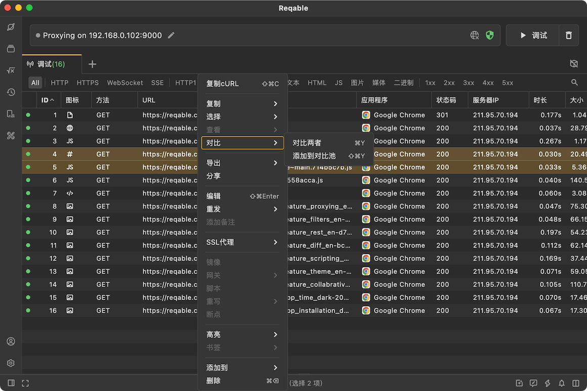
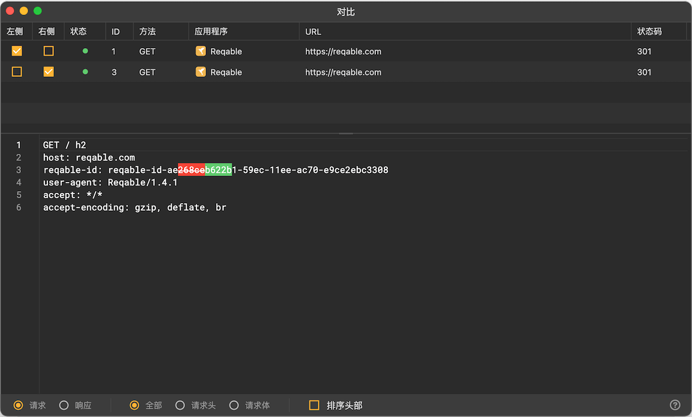

# 对比

import Shortcut from '@site/src/components/Shortcut';

在分析问题和定位BUG的时候，我们可能需要对一些请求或者响应内容进行比对。Reqable提供了内置的对比工具，辅助用户对请求或者响应数据进行Diff。

### 使用方式

选择两个请求后右键菜单`对比`，或者使用快捷键 <Shortcut>Control + Y</Shortcut>可以立即对这两个请求进行对比。

Reqable会自动弹出对比功能视图，用户可以自行选择需要比对的内容。

如果有多个请求的话，也可以加入到对比列表中，然后进行选择。同样的，对比列表中右键可以进行删除和清空等操作。