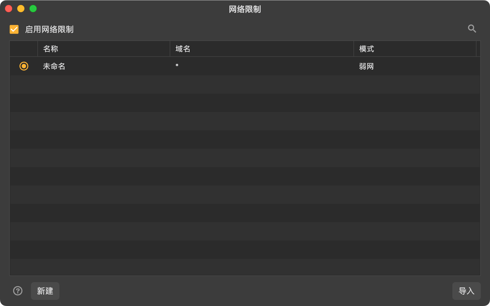
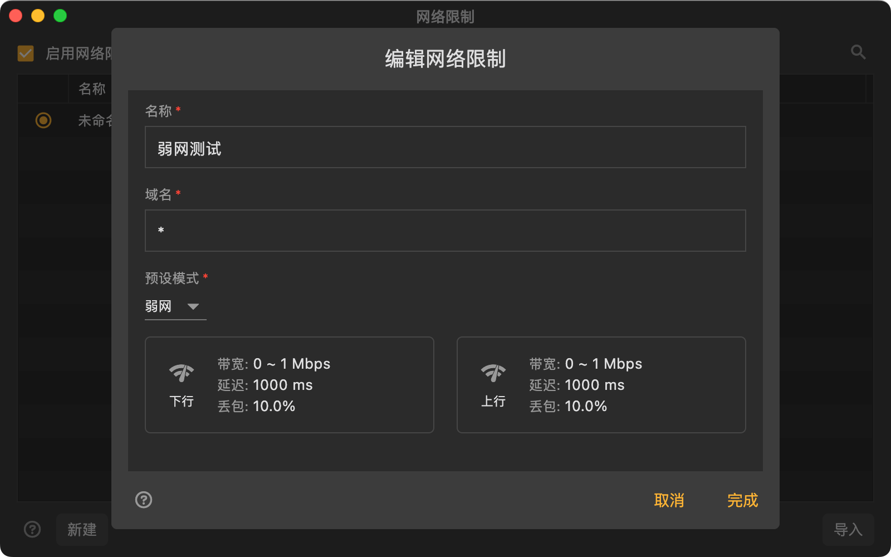

# 网络环境

Reqable支持设置对指定域名进行网络限制，模拟不同的网络环境，例如离线、弱网、2G等状况。

:::info
使用此功能需要更新Reqable到v2.23.0及以上版本。
:::

### 使用方式

从`工具`菜单中选择`网络限制`或者使用快捷键 `Alt` + `J` 来打开网络环境配置页面。

用户可以给不同的域名配置不同的网络环境，但同时只能启用一个网络环境配置。域名支持通配符`*`和`?`，也支持配置指定的端口号。

:::info
如果需要对全局配置网络环境，域名填写 `*` 即可。
:::

Reqable已经预设了常用的网络环境模式，暂时不支持用户自定义。预设的网络环境如下：

|   预设模式  |  上行带宽 |  下行带宽  |  延迟  |  丢包率  |
|    ----    | ----  | ----  | ----  | ----  |
|    离线    |   0 bps  |  0 bps  |  0 ms | 100% |
|    弱网    |0～1 Mbps|0～1 Mbps| 1000ms | 10% |
|    较慢    |1～5 Mbps|1～5 Mbps| 100ms | 0% |
|    较快    |5～20 Mbps|5～20 Mbps| 30ms | 0% |
|    2G    |0～240 kbps|0～200 kbps| 1200ms | 2.5% |
|    3G    |0～780 kbps|0～330 kbps| 400ms | 0% |
|    4G    |30～50 Mbps|5～10 Mbps| 50ms | 0% |
|    5G    |40～70 Mbps|7～15 Mbps| 0ms | 0% |
|    Wi-Fi    |25～40 Mbps|15～30 Mbps| 0ms | 0% |

- 上行带宽：影响数据上传的速度，实际带宽计算会在区间内取随机值。
- 下行带宽：影响数据下载的速度，实际带宽计算会在区间内取随机值。
- 延迟：处理每个数据包的最低延迟时间，如果带宽不够触发延迟，可能会导致实际延迟超过此值。
- 丢包率：模拟网络异常的情况，命中丢包则表示请求失败。
