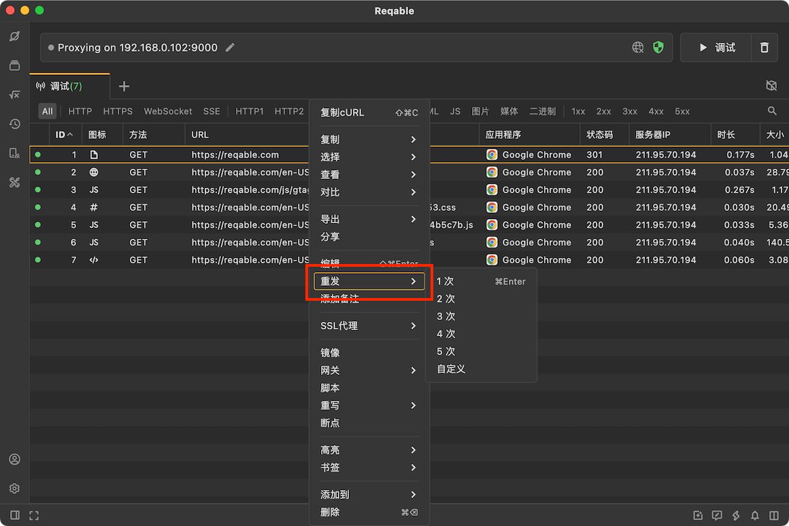
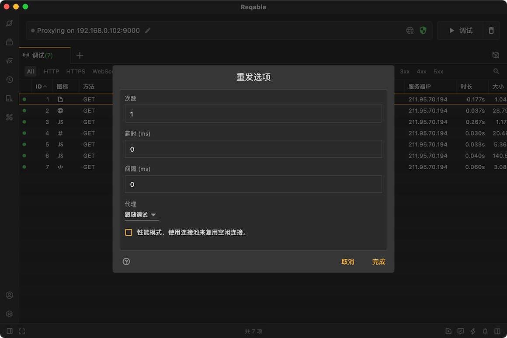

# 重放

import Shortcut from '@site/src/components/Shortcut';

Reqable支持对一个或者多个请求进行重发回放，选中需要重发的请求点击右键即可：



使用快捷键 <Shortcut>Control + Enter</Shortcut> 可以快速重发选中的请求各一次。

### 自定义重发

Reqable还支持对重发的请求进行自定义，包括次数、延时、间隔和代理配置。



- 次数：指请求发送的次数。
- 延时：表示点击重发后，多长时间后请求开始发送，单位毫秒。
- 间隔：对发送次数大于1生效，表示每次请求之间发送的时间间隔，单位毫秒。
- 代理：可以设定请求的代理配置，包括不使用代理，使用调试代理和使用系统代理。

举个简单例子：
```
小明在13:00:00这个时间点设定了重发https://www.test.com/get请求，
重发次数3次，延时3000ms，间隔10000ms。那么，
第一次请求发送的时间点为13:00:03，延时3s；
第二次请求发送的时间点为13:00:13，延时13s；
第三次请求发送的时间点为13:00:23，延时23s。
```

重发的请求是并发进行的，最多可以同时存在**255**个连接，超过此数量的重发请求需要排队。

:::caution 注意事项

- 如果希望重发的请求出现在抓包列表中，请把代理设置成**跟随调试**。
- 如果利用此功能对服务器进行压力测试，建议把代理设置成**不使用**。

:::
