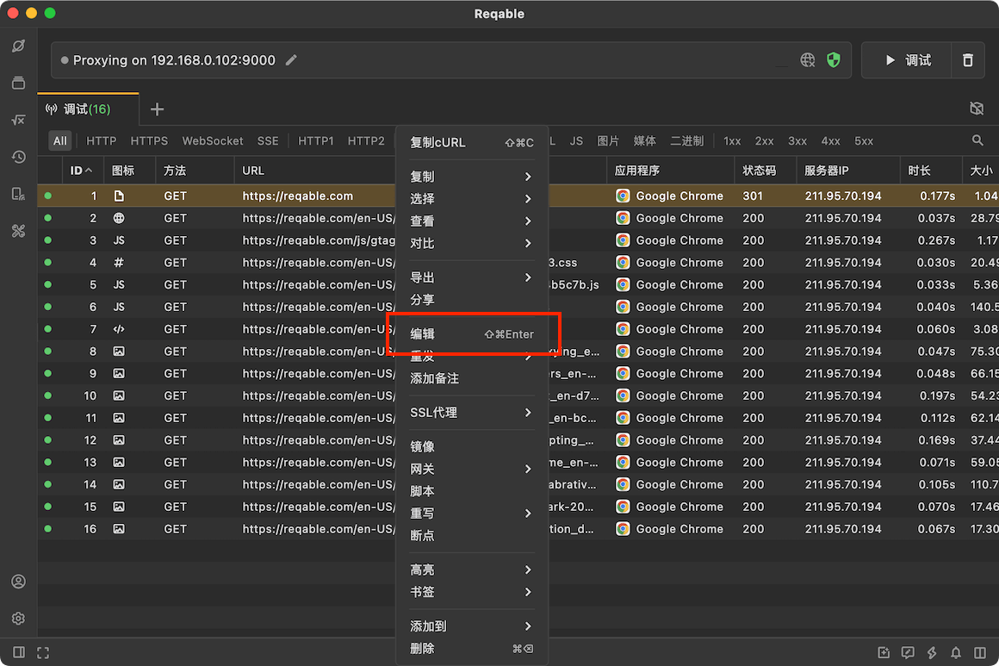
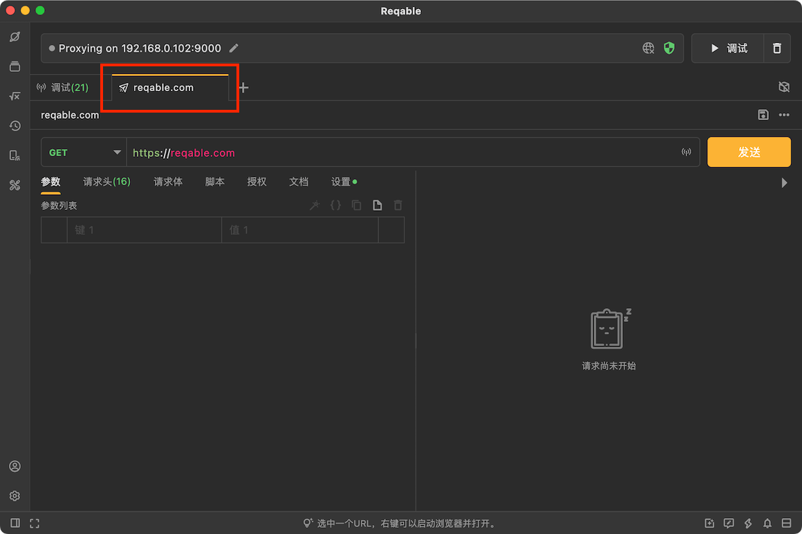

# 编辑

import Shortcut from '@site/src/components/Shortcut';

Reqable支持对调试列表中的API进行编辑测试，只需要选中一条记录，右键编辑（快捷键 <Shortcut>Control + Shift + Enter</Shortcut>）即可：

自动创建一个新的API会话，请求方法、请求协议、请求路径、请求参数、请求头部和请求体都会自动导入到API编辑器中。

