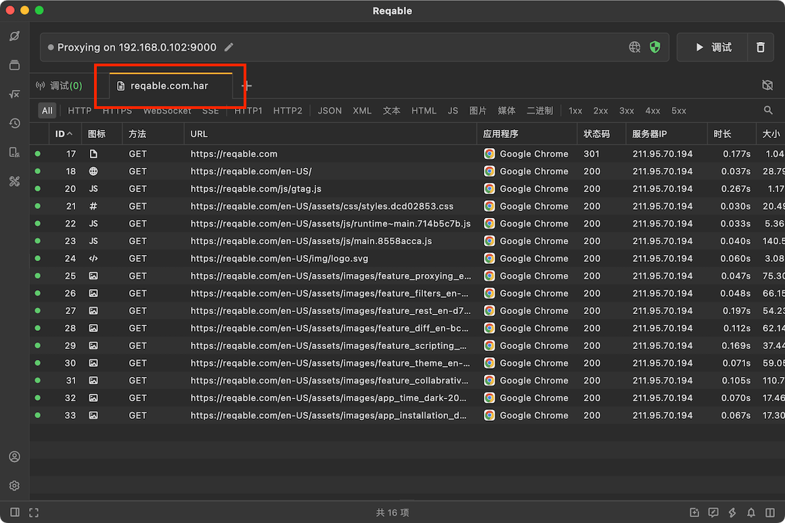
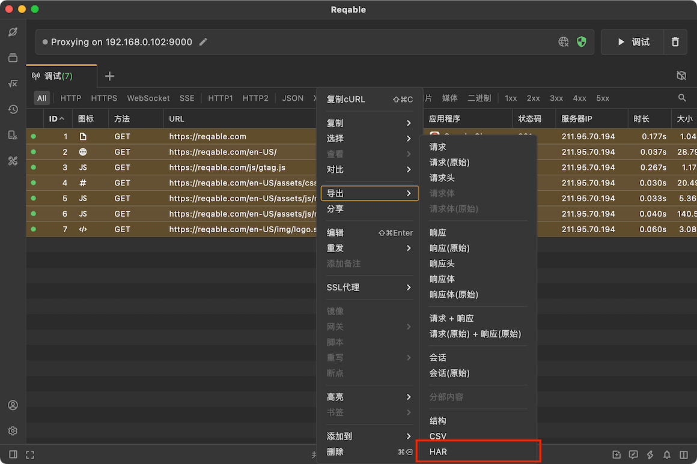

# HAR支持

import Shortcut from '@site/src/components/Shortcut';

Reqable会自动关联[HAR](https://en.wikipedia.org/wiki/HAR_(file_format))格式文件，支持打开和导出HAR格式文件。

打开HAR文件有三种方式：
- 应用菜单 -> 文件 -> 打开文件。
- 拖动HAR文件到Reqable程序窗口并释放。
- 快捷键 <Shortcut>Control + O</Shortcut>

我们还可以将调试列表内容保存为HAR文件，可以选中记录右键导出，或者右键Tab标签保存全部。

