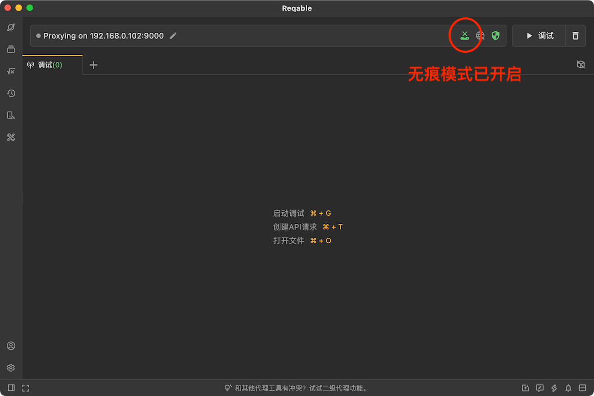
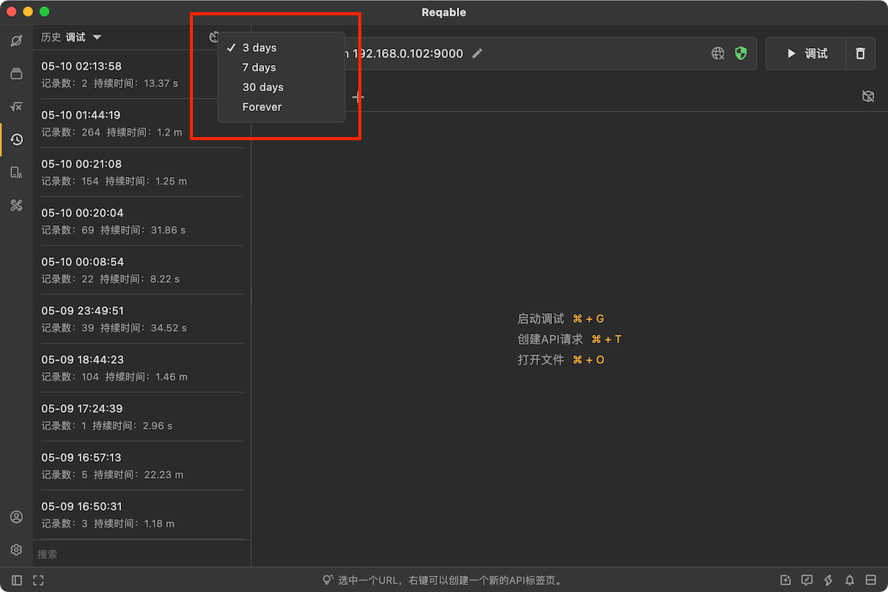

# 历史记录

Reqable会自动将调试数据保存到历史记录中，此功能默认为开启。如果您希望保护自己的隐私，可以选择手动开启无痕模式，此模式下所有的数据都不会被记录到历史中。

需要回溯的时候，在侧边栏历史记录中直接点击打开，或者右键选择打开、导出或者删除。

为了提高性能，Reqable会将流量数据存储到文件，包括历史记录内容。如果流量过大或者历史数据过多，可能会导致本地文件存储占用空间过大，需要用户手动进行删除清理。如果需要自动清理，可以设置一个合适的缓存时间。

:::caution
历史记录默认缓存时间是7天，但是由于历史原因，早期用户上的默认配置是永久，可能会导致数据一直不会自动清理，需要手动设置下。
:::