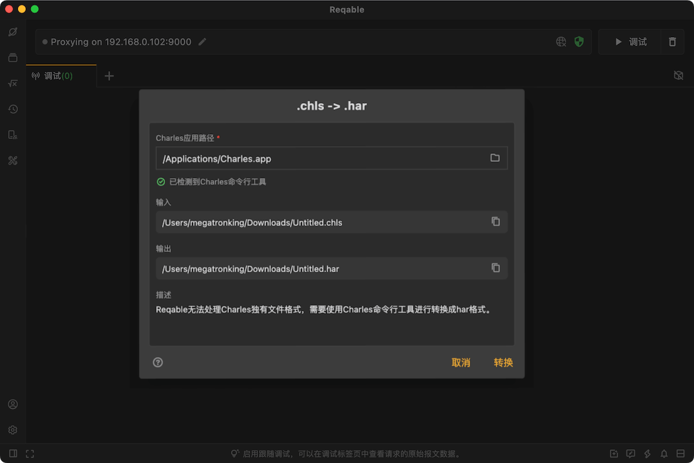

# Charles支持

Reqable支持查看Charles Session文件，但由于Charles Session文件是Charles应用独有的格式，Reqable无法直接读取，需要依赖Charles的命令行工具。当打开Charles Session文件的时候，Reqable会自动调用Charles命令行工具解析成`HAR`格式，只需要用户提前配置好Charles应用所在的目录即可。

如果未提前配置Charles应用所在的目录，当打开Charles Session文件时，会出现如下的弹窗：

配置完成后，点击`转换`即可.