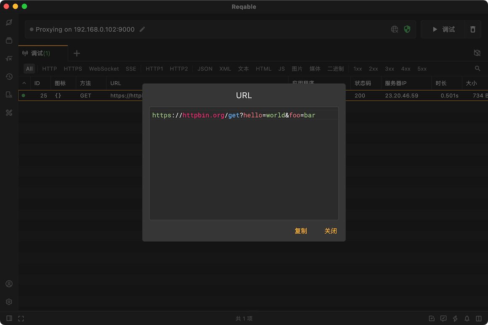
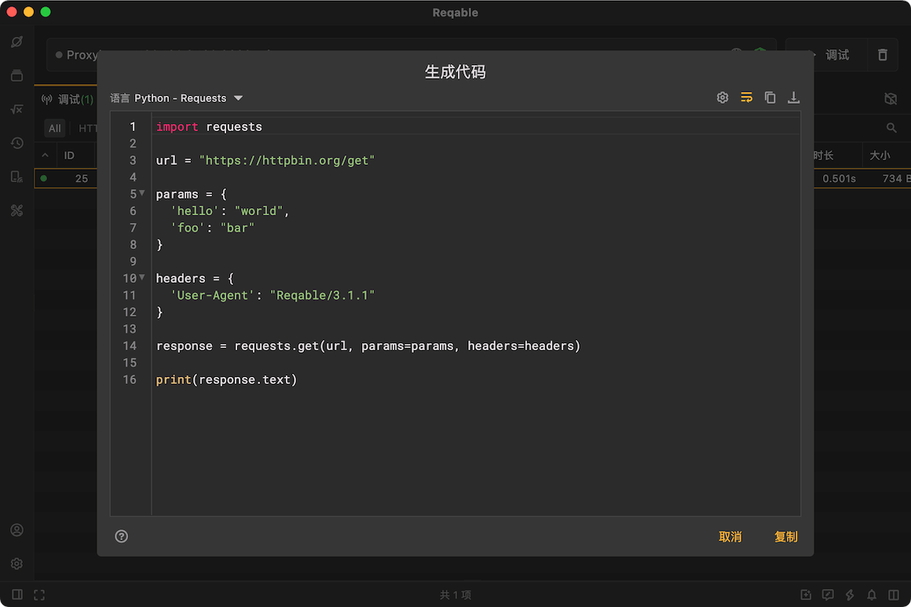
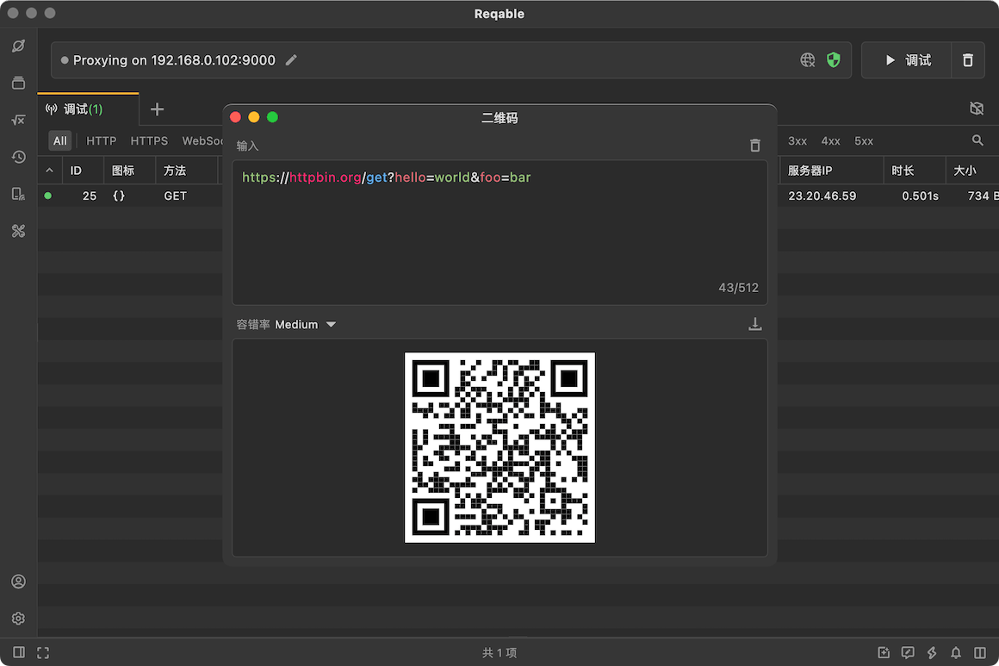

# 查看功能

import Shortcut from '@site/src/components/Shortcut';

Reqable提供了一些常用的查看功能，下面我们依次来介绍下。

### URL

较长的URL在流量列表中可能显示不全，Reqable提供了一个简单的URL查看（快捷键 <Shortcut>Control + U</Shortcut>）功能。选中指定请求后右键 -> 查看 -> URL，会打开一个URL内容弹窗。

### 生成代码

Reqable可以将请求直接转成代码，快捷键 <Shortcut>Alt + S</Shortcut> ，或者选中指定请求后右键 -> 查看 -> 生成代码，会打开一个代码生成弹窗。

Reqable目前支持下列语言和网络库的代码生成。

- C - cURL
- Go - Native
- Java - AsyncHttp
- Java - java.net.http
- Java - OkHttp
- Java - Unirest
- Javascript - Axios
- Javascript - Fetch
- Javascript - Jquery
- Javascript - XHR
- Kotlin - OkHttp
- NodeJS - Axios
- NodeJS - Fetch
- NodeJS - Native
- NodeJS - Request
- NodeJS - Unirest
- PHP - cURL
- PHP - Guzzle
- Python - http.client
- Python - Requests
- Shell - cURL

如果你有其他语言和网络库的需求，可以点击[这里](https://github.com/reqable/reqable-app/issues/new/choose)提交需求！

### 二维码

Reqable可以将请求URL转为二维码，方便移动设备扫码，快捷键 <Shortcut>Alt + U</Shortcut> ，或者选中指定请求后右键 -> 查看 -> 二维码，会打开二维码生成器。

### 应用目录

当检测到流量应用来源时，Reqable支持打开文件管理器并直接定位到应用所在目录。选中指定请求后右键 -> 查看 -> 应用目录。

:::info

- 此功能目前不支持Linux平台。
- 部分应用可能无法获取所在文件目录。

:::